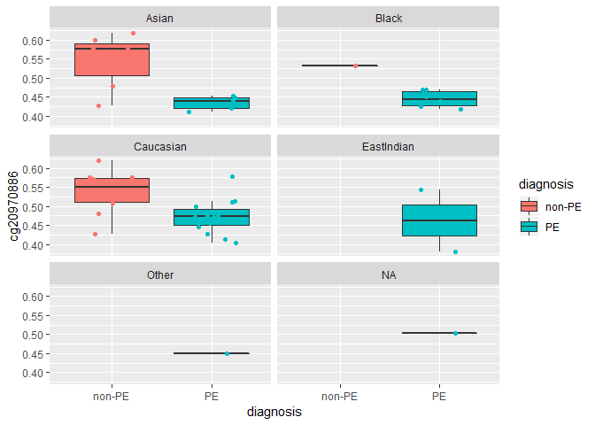

Who: Victor Yuan, [Trainee Omics Group (TOG)](https://bcchr-trainee-omics-group.github.io/)

What: Introduction to plotting in R with ggplot2

Where: BC Children's Hospital Research Institute

When: July 24, 2019

# Introduction 

## Who is this tutorial for?

Beginners in R, who have little to no experience with plotting in R. I've tailored this to the TOG 
study group by making common visualizations of omics data, but this tutorial is easily generalizable 
to other types of data.

## What is ggplot2?

* ggplot2 is an R package for data visualization using the 'Grammar of Graphics' system proposed by [Leland Wilkinson (2005)](#Sources) (**gg**plot2 = **G**rammar of **G**raphics)
*  which translates to an easy to learn syntax with very high customizability
* written by Hadley Whickham
* [ggplot2 documentation](https://ggplot2.tidyverse.org/)

What is a **Grammar of graphics**?

Paraphrased: A graphic is a mapping from data to **aesthetic** (color, shape, size) and **geometric** objects, (lines, points, bars). *-ggplot2 book*

# Essential components of a ggplot graph

There are several components of every ggplot2 graph. Every ggplot2 graph requires *at least* three components:

1. **Data**. A dataframe of variables to be visualized. Where your *variables are in columns* and *observations are in the rows*

2. **Aesthetics**. "Aesthetic mappings" are how we tell which variables in our data correspond to each component of the resulting graphic (e.g. x-axis, y-axis, color, shape, etc.)

3. **Geoms**. "Geometries" or geoms refer to the specific **geom**etric objects that are going to represent the data. For example, `geom_boxplot` creates a box plot, `geom_point` creates points on the graph, `geom_bar` creates bar plots, ..., etc. 

We will begin the workshop by exploring these components first, and then later we will look at other components of the ggplot2  system that allow for more complex graphs and finer customization.
 
# Workshop 

## Setup

For this workshop you need to install the following libraries:

Make sure you have a recent version of R.


```r
install.packages(c('ggplot2', 'readr', 'dplyr'))
```

Then to load it into an R session:


```r
library(ggplot2)
library(readr)
```

We will be working with a 48 sample dataset of studying molecular changes associated with preeclampsia (citation).

To read in this data:


```r
data <- read_csv('https://raw.githubusercontent.com/wvictor14/TOG/master/data/GSE98224.csv')
```

```
## Parsed with column specification:
## cols(
##   .default = col_double(),
##   expr_geo_id = col_character(),
##   meth_geo_id = col_character(),
##   diagnosis = col_character(),
##   tissue = col_character(),
##   maternal_ethnicity = col_character()
## )
```

```
## See spec(...) for full column specifications.
```

```r
data
```

```
## # A tibble: 48 x 159
##    expr_geo_id meth_geo_id diagnosis tissue maternal_age maternal_bmi
##    <chr>       <chr>       <chr>     <chr>         <dbl>        <dbl>
##  1 GSM1940495  GSM2589532  PE        Place~           37         19.5
##  2 GSM1940496  GSM2589533  PE        Place~           40         25.7
##  3 GSM1940499  GSM2589534  PE        Place~           37         25  
##  4 GSM1940500  GSM2589535  PE        Place~           38         26.2
##  5 GSM1940501  GSM2589536  PE        Place~           33         31.2
##  6 GSM1940502  GSM2589537  PE        Place~           26         31.2
##  7 GSM1940505  GSM2589538  PE        Place~           31         18.6
##  8 GSM1940506  GSM2589539  PE        Place~           37         25.2
##  9 GSM1940507  GSM2589540  non-PE    Place~           35         18.6
## 10 GSM1940508  GSM2589541  PE        Place~           32         26.6
## # ... with 38 more rows, and 153 more variables: maternal_ethnicity <chr>,
## #   ga_weeks <dbl>, ga_days <dbl>, transcript_8033795 <dbl>,
## #   transcript_8103881 <dbl>, transcript_7904014 <dbl>,
## #   transcript_8127692 <dbl>, transcript_7990031 <dbl>,
## #   transcript_8121144 <dbl>, transcript_8150846 <dbl>,
## #   transcript_7962246 <dbl>, transcript_7941890 <dbl>,
## #   transcript_7896644 <dbl>, transcript_7992897 <dbl>,
## #   transcript_7973002 <dbl>, transcript_7979800 <dbl>,
## #   transcript_8112007 <dbl>, transcript_8036686 <dbl>,
## #   transcript_8001325 <dbl>, transcript_8180328 <dbl>,
## #   transcript_8109283 <dbl>, transcript_8041223 <dbl>,
## #   transcript_8144703 <dbl>, transcript_7997556 <dbl>,
## #   transcript_7955896 <dbl>, transcript_7939897 <dbl>,
## #   transcript_8035078 <dbl>, transcript_8113094 <dbl>,
## #   transcript_7893397 <dbl>, transcript_8110708 <dbl>,
## #   transcript_8102610 <dbl>, transcript_8083407 <dbl>,
## #   transcript_8174592 <dbl>, transcript_7922299 <dbl>,
## #   transcript_7979269 <dbl>, transcript_8074593 <dbl>,
## #   transcript_7967810 <dbl>, transcript_8052562 <dbl>,
## #   transcript_7927775 <dbl>, transcript_8005601 <dbl>,
## #   transcript_8129974 <dbl>, transcript_8070295 <dbl>,
## #   transcript_7952795 <dbl>, transcript_8044743 <dbl>,
## #   transcript_7896053 <dbl>, transcript_7894489 <dbl>,
## #   transcript_8048889 <dbl>, transcript_7894063 <dbl>,
## #   transcript_8171539 <dbl>, transcript_8011396 <dbl>,
## #   transcript_7983157 <dbl>, transcript_8171848 <dbl>,
## #   transcript_8097443 <dbl>, cg04950931 <dbl>, cg21697851 <dbl>,
## #   cg20092728 <dbl>, cg12804791 <dbl>, cg11619216 <dbl>,
## #   cg07802350 <dbl>, cg13175060 <dbl>, cg25632577 <dbl>,
## #   cg11811391 <dbl>, cg20981848 <dbl>, cg14025883 <dbl>,
## #   cg25493658 <dbl>, cg01491071 <dbl>, cg03777414 <dbl>,
## #   cg20586124 <dbl>, cg16175792 <dbl>, cg25961733 <dbl>,
## #   cg13912117 <dbl>, cg27307465 <dbl>, cg23825057 <dbl>,
## #   cg17949440 <dbl>, cg04098985 <dbl>, cg16886987 <dbl>,
## #   cg22860917 <dbl>, cg21594328 <dbl>, cg23903035 <dbl>,
## #   cg14393923 <dbl>, cg25103160 <dbl>, cg04640920 <dbl>,
## #   cg01522692 <dbl>, cg23249922 <dbl>, cg15903956 <dbl>,
## #   cg10688297 <dbl>, cg07989490 <dbl>, cg16090790 <dbl>,
## #   cg01519765 <dbl>, cg18444702 <dbl>, cg16404259 <dbl>,
## #   cg12077460 <dbl>, cg22517735 <dbl>, cg01713086 <dbl>,
## #   cg16734734 <dbl>, cg00886182 <dbl>, cg07891440 <dbl>,
## #   cg15715892 <dbl>, cg21368161 <dbl>, cg03766264 <dbl>, ...
```

ggplot2 requires visualized data to be in a dataframe. This is somewhat of a drawback for genomic data, as the convention of most workflows is to keep the molecular data separate from the sample-specific data. The work-around for this is to add the specific molecular variables to sample data, when needing to visualize together. 


## Data, aesthetics, geometries

Next, we will go over the essential 3 components of every ggplot2 graph (data, aesthetics, and geometries) with an example.

Continuous variable x continuous variable


```r
# just data = blank page
ggplot(data = data)
```

<!-- -->

```r
# aesthetics = axes appear
ggplot(data = data, aes(x = ga_weeks, y = cg20970886))
```

<!-- -->

```r
# add geometry = complete graph
ggplot(data = data, aes(x = ga_weeks, y = cg20970886)) +
  geom_point()
```

<!-- -->

```r
# add additional geoms 
ggplot(data = data, aes(x = ga_weeks, y = cg20970886)) +
  geom_point() +
  geom_smooth(method = 'lm')
```

<!-- -->

```r
# can change default color 
ggplot(data = data, aes(x = ga_weeks, y = cg20970886)) +
  geom_point(color = 'blue') +
  geom_smooth(method = 'lm', color = 'black')
```

<!-- -->

```r
# assigning different aesthetics
ggplot(data = data, aes(x = ga_weeks, y = cg20970886, color = maternal_ethnicity)) +
  geom_point() +
  geom_smooth(method = 'lm')
```

```
## Warning in qt((1 - level)/2, df): NaNs produced
```

<!-- -->

```r
# same as
ggplot(data = data, aes(x = ga_weeks, y = cg20970886, color = maternal_ethnicity)) +
  geom_point(aes(x = ga_weeks, y = cg20970886, color = maternal_ethnicity)) +
  geom_smooth(method = 'lm',
              aes(x = ga_weeks, y = cg20970886, color = NULL))
```

<!-- -->

```r
# problem is too superfluous code, better solution:
ggplot(data = data, aes(x = ga_weeks, y = cg20970886)) +
  geom_point(aes(color = maternal_ethnicity)) +
  geom_smooth(method = 'lm')
```

<!-- -->

```r
# extra stuff: inside and outside of the aesthetics call
ggplot(data = data, aes(x = ga_weeks, y = cg20970886)) +
  geom_point(color = 'blue') +
  geom_smooth(method = 'lm')
```

<!-- -->

```r
ggplot(data = data, aes(x = ga_weeks, y = cg20970886)) +
  geom_point(aes(color = 'blue')) +
  geom_smooth(method = 'lm')
```

<!-- -->

## Scales, Themes, facets

Some components are not always required but are very often used to change the appearance of graphs:

4. **Layers - stats**. Certain statistical transformations can be specified using **stats** layers. For example, if we wanted ggplot2 to create a histogram over a continuous variable, we would need to indicate how big the bins are. 

5. **Scales**. **Scales** specify *how* data is mapped to the "aesthetics" of the graph. For example, if we wanted to color data points by *sex*, we can indicate what colors to use by using **scales**, otherwise ggplot2 will use a default color palette.

6. **Coordinate system**. Use this to flip axes, change to polar coordinates, or map to a geographical map (or any other image).

7. **Facets**. Graphs can be broken up into several subsets by using **facetting**

8. **Theme**. Changes the finer aspects of graphs, e.g. text size, grid lines, legend position. Sensible defaults are used.

Next we will look at some more advanced features of ggplot2 that allow for more complex and fine-tuned visualizations

We will also take this as an opportunity to explore visualizations for discrete by continuous graphs.

Here we look at case-control status (Preeclampsia vs control) and methylation


```r
table(data$diagnosis)
```

```
## 
## non-PE     PE 
##     18     30
```

```r
# 3 essential components
ggplot(data = data, aes(x = diagnosis, y = cg20970886)) +
  geom_boxplot()
```

<!-- -->

```r
# can edit as we did above
ggplot(data = data, aes(x = diagnosis, y = cg20970886)) +
  geom_boxplot(color = 'blue')
```

<!-- -->

```r
ggplot(data = data, aes(x = diagnosis, y = cg20970886)) +
  geom_boxplot(aes(fill = maternal_ethnicity))
```

<!-- -->

```r
# overlay jittered points
ggplot(data = data, aes(x = diagnosis, y = cg20970886, color = maternal_ethnicity)) +
  geom_boxplot() +
  geom_point(position = position_jitterdodge(dodge.width = 0.75, jitter.width = 0.1))
```

<!-- -->

We can use scales to change which colors we want to color the boxplots by.


```r
# named vector to map colors
fill_vector <- setNames(c('#ff6d45', '#66c24a'),  c('PE', 'non-PE') )
fill_vector
```

```
##        PE    non-PE 
## "#ff6d45" "#66c24a"
```

```r
# change fill color with scale_fill_manual
ggplot(data = data, aes(x = diagnosis, y = cg20970886, fill = diagnosis)) +
  geom_boxplot() +
  geom_point(position = position_jitterdodge(jitter.width = 0.5)) +
  scale_fill_manual(values = fill_vector)
```

<!-- -->

```r
# change x and y 
ggplot(data = data, aes(x = diagnosis, y = cg20970886, fill = diagnosis)) +
  geom_boxplot() +
  geom_point(position = position_jitterdodge(jitter.width = 0.5)) +
  scale_fill_manual(values = fill_vector) +
  scale_x_discrete(labels = c('Controls', 'Cases'), position = 'top') +
  scale_y_continuous(limits = c(0, 1), breaks = c(0, 0.5, 1), labels = c(0, 50, 100),
                     name = 'cg2097086 (%)') 
```

<!-- -->

The *theme* allows for a customization of the non-data components of a plot. Things like the title, labels, font size, gridlines, etc.


```r
## theme
ggplot(data = data, aes(x = diagnosis, y = cg20970886, fill = diagnosis)) +
  geom_boxplot() +
  geom_point(position = position_jitterdodge(jitter.width = 0.5)) +
  scale_fill_manual(values = fill_vector) +
  scale_x_discrete(labels = c('Controls', 'Cases'), position = 'top') +
  scale_y_continuous(limits = c(0, 1), breaks = c(0, 0.5, 1), labels = c(0, 50, 100),
                     name = 'cg2097086 (%)') +
  theme(axis.text = element_text(colour = 'blue'),
        legend.title = element_text(colour = 'blue'),
        panel.border = element_rect(linetype = 'dashed', fill = NA, colour = 'blue'),
        panel.grid.major.x  = element_line(colour = 'black')) 
```

<!-- -->

```r
ggplot(data = data, aes(x = diagnosis, y = cg20970886, fill = diagnosis)) +
  geom_boxplot() +
  geom_point(position = position_jitterdodge(jitter.width = 0.5)) +
  scale_fill_manual(values = fill_vector) +
  scale_x_discrete(labels = c('Controls', 'Cases'), position = 'top') +
  scale_y_continuous(limits = c(0, 1), breaks = c(0, 0.5, 1), labels = c(0, 50, 100),
                     name = 'cg2097086 (%)') +
  theme_bw()
```

<!-- -->

There are customized themes that have settings preset. You can use these as a 'base' and edit specific elements of the theme after them.


```r
ggplot(data = data, aes(x = diagnosis, y = cg20970886, fill = diagnosis)) +
  geom_boxplot() +
  geom_point(position = position_jitterdodge(jitter.width = 0.5)) +
  scale_fill_manual(values = fill_vector) +
  scale_x_discrete(labels = c('Controls', 'Cases'), position = 'top') +
  scale_y_continuous(limits = c(0, 1), breaks = c(0, 0.5, 1), labels = c(0, 50, 100),
                     name = 'cg2097086 (%)') +
  theme_bw() +
  theme(axis.text = element_text(colour = 'blue'))
```

<!-- -->

Sometimes it is useful to create several plots, each time plotting only certain data points by a grouping variable. This can be done with **facets**.


```r
ggplot(data = data, aes(x = diagnosis, y = cg20970886, fill = diagnosis)) +
  geom_boxplot(outlier.shape = NA) +
  geom_point(position = position_jitterdodge(jitter.width = 0.5), 
             aes(color = diagnosis), show.legend = F)  +
  facet_wrap(vars(maternal_ethnicity), nrow = 3)
```

<!-- -->

# Sources {#Sources}

[TOG at BCCHR](https://www.bcchr.ca/tog/)

[TOG homepage](https://bcchr-trainee-omics-group.github.io/)

Wilkinson, Leland. 2005. The Grammar of Graphics. 2nd ed. Statistics and Computing. Springer.

[ggplot2 cheatsheet](https://www.rstudio.com/wp-content/uploads/2015/03/ggplot2-cheatsheet.pdf)

[ggplot2 extensions](http://www.ggplot2-exts.org/gallery/)

[ggplot2 documentation](https://ggplot2.tidyverse.org/)

[r 4 data science data visualization chapter](https://r4ds.had.co.nz/data-visualisation.html)
