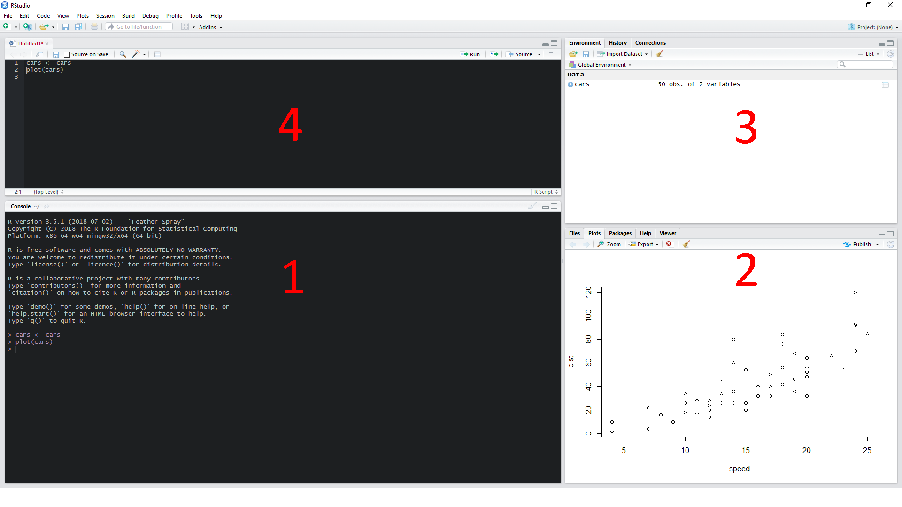
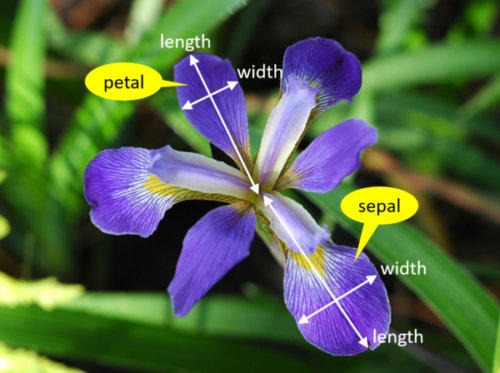

[BCCHR Trainee 'Omics Group](https://bcchr.ca/tog) R Study Group: Introduction to R Markdown for Reproducible Data Analysis

September 5, 2019

BC Children's Hospital Research Institute

By Giulia Del Gobbo


# Resources

A variety of resources were used in the creating of this tutorial, and are excellent resources to go back and check out:

  + R Markdown R Studio [Introduction to R Markdown](https://rmarkdown.rstudio.com/articles_intro.html)
  + [R Markdown Cheatsheet](https://rmarkdown.rstudio.com/lesson-15.html) 
  + [R Markdown: The Definitive Guide](https://bookdown.org/yihui/rmarkdown/) by Yihui Xie, J. J. Allaire, and Garrett Grolemund
  + [R for Data Science](https://r4ds.had.co.nz/) by Garrett Grolemund and Hadley Wickham
  
  
# Introduction to R Studio

First, let's briefly get acquainted with the R Studio interface.


**R Studio** is a very useful interface to use the program **R**, containing numerous functionalities not present if you were to use R directly from the console. We won't be covering this in too much detail today, just enough to understand using R Markdown in R Studio.


By default, there are 3-4 major "windows" in R Studio:



  1. **The R Console**: Functional R console, where your commands will be run. We can type code directly into the console to be run, or (as we'll see soon), send it to be run in the console using a file where we write and save our code.
  
  
  2. **Files/Plots/Packages/Help**: 
      + **Files** lets you see the files in our current *working directory*
      + **Plots** is where any plots generated by our R code will be displayed
      + **Packages** displays all packages present in your R library on your hard drive. Check marks indicate those that have been loaded into your working environment. You can manually load packages by clicking the check boxes, or do it in R directly using `library()`. 
      + **Help** is where the help pages of packages or functions can be displayed. If you need a description of a function or package in R, you can search it in the search box, or type `?` before it in the R console.
    
  3. **Environment/History**: Where you can visualize what objects you have loaded into your R environment. You can manually load data from this window using the *import dataset* button, though I suggest against using this. You can also toggle to see a history of the lines of code that have been run in the console during your current session.
  
  
  4. **Source**: Where we can create and modify R scripts and other documents, including .Rmd aka R Markdown documents
  
  
***

# Introduction to R Markdown


## What is R Markdown and how does it work?

**R Markdown** files (**.Rmd**) contain code that can be run in R, along with plain text  to explain and organize your code. They can be rendered into a report in HTML, PDF or Word doc format that contains all of the code and outputs, along with nicely formatted text showing your analysis. Being able to write, save, modify code, in addition to organizing it, adding explanations, and generating reports using .Rmd files is extremely useful to ensuring reproducibility of your work.


R Markdown files blends together two file types:

  + The **.R** R script: a file in which you write and edit lines of code to run in the R console. These keep track of the various manipulations and tests run in R, and can show how you got from point A to point B in an analysis. Ideally, if you were to provide this to another researcher along with the correct input data, they should be able to re-create your entire analysis.
  
  + The **.md** Markdown file: Markdown is a type of syntax that describes how to format text. It allows us to style plain text in a variety of ways, like making the text **bold** or *italic*, adding a ^superscript^ and MUCH more - we will investigate this a bit more later. A markdown file is a plain text file that can then be translated into formatted text.
  

The `rmarkdown` package uses `knitr` to execute embedded code in the.Rmd file and generate a new .md document, and then uses `pandoc` to render the markdown file into a desired file format, such as HTML, PDF, Word document etc. 


To generate this "knitted" report from a R Markdown document, `rmarkdown` runs the `render()` function to render the document using a new R session. This is an important feature for the reproducibility of the code, , because it is agnostic to any objects already loaded into your environment. It means that *only the code contained within the .Rmd document will be used to generate the report*. This is why loading packages and importing data must be done using code in R rather than the functionalities of R Studio if these are required for the analysis.


## What are the key components of an R Markdown document?


*Let's open up a new R Markdown document in R Studio to see*


### The metadata header

This is the section surrounded by `---` at the top of the file that defines metadata of the document, written in a different syntax, YAML. It tells `rmarkdown` how to render the document. You don't need to worry too much about this (unless you want to!), however there are a few useful modifications that can be made here to enhance your report.


### Code

R code is contained either within code chunks, which are sections defined by three backticks and `{r}`, where the `r` indicates the programming language to be used, followed by three more backticks at the end. 


You can also run code in line with text by using single backticks and `r` 


### Text

The text is everything else outside of the R code. It is written in plain text, and uses the markdown syntax to add formatting.


*Let's move on to learning more about using R Markdown documents for your coding in R by working through some examples*

***

# Using R Markdown 


## Code chunks

What will likely make up the bulk of your document is code chunks, which is where all of the R code for your work is contained. Code is written in the R chunks and then "sent" to be run in the console using `ctrl+enter` or `ctrl+shift+enter` depending on how your R Studio is set up. You can also run an entire chunk using the green "play" triangle. Let's try it. 


```r
print("Hello R")
```

```
## [1] "Hello R"
```

```r
print("It's nice to meet you")
```

```
## [1] "It's nice to meet you"
```


Today we'll work with the `iris` dataset, already pre-loaded in R, because it's small and easy to work with. Although you can just call on it without creating an object for the data, we will generate an object for it so that you can see it in the Global Environment. Let's make some code chunks to take a look into the data. We will use this code throughout and modify it as we learn how to organize our .Rmd to generate a nice report.


First, I want to load the libraries we'll be using. This can be done later when you use the functions from them, however I like to see all the packages I need up front. If you don't have these already downloaded to your library, run the function `install.packages()` first.


Load libraries

```r
library(knitr)
library(dplyr)
```

```
## 
## Attaching package: 'dplyr'
```

```
## The following objects are masked from 'package:stats':
## 
##     filter, lag
```

```
## The following objects are masked from 'package:base':
## 
##     intersect, setdiff, setequal, union
```

```r
library(ggplot2)
```

```
## Registered S3 methods overwritten by 'ggplot2':
##   method         from 
##   [.quosures     rlang
##   c.quosures     rlang
##   print.quosures rlang
```


next, we'll "load" the iris dataset and get familiar with it using a few functions:

```r
iris <- iris

#see the structure of the data
str(iris)
```

```
## 'data.frame':	150 obs. of  5 variables:
##  $ Sepal.Length: num  5.1 4.9 4.7 4.6 5 5.4 4.6 5 4.4 4.9 ...
##  $ Sepal.Width : num  3.5 3 3.2 3.1 3.6 3.9 3.4 3.4 2.9 3.1 ...
##  $ Petal.Length: num  1.4 1.4 1.3 1.5 1.4 1.7 1.4 1.5 1.4 1.5 ...
##  $ Petal.Width : num  0.2 0.2 0.2 0.2 0.2 0.4 0.3 0.2 0.2 0.1 ...
##  $ Species     : Factor w/ 3 levels "setosa","versicolor",..: 1 1 1 1 1 1 1 1 1 1 ...
```

```r
#get a preview of the first 5 rows and last 5 rows of the data
head(iris)
```

```
##   Sepal.Length Sepal.Width Petal.Length Petal.Width Species
## 1          5.1         3.5          1.4         0.2  setosa
## 2          4.9         3.0          1.4         0.2  setosa
## 3          4.7         3.2          1.3         0.2  setosa
## 4          4.6         3.1          1.5         0.2  setosa
## 5          5.0         3.6          1.4         0.2  setosa
## 6          5.4         3.9          1.7         0.4  setosa
```

```r
tail(iris)
```

```
##     Sepal.Length Sepal.Width Petal.Length Petal.Width   Species
## 145          6.7         3.3          5.7         2.5 virginica
## 146          6.7         3.0          5.2         2.3 virginica
## 147          6.3         2.5          5.0         1.9 virginica
## 148          6.5         3.0          5.2         2.0 virginica
## 149          6.2         3.4          5.4         2.3 virginica
## 150          5.9         3.0          5.1         1.8 virginica
```

```r
#tabulate N for each species
table(iris$Species)
```

```
## 
##     setosa versicolor  virginica 
##         50         50         50
```

```r
#summarize the data in each column
summary(iris)
```

```
##   Sepal.Length    Sepal.Width     Petal.Length    Petal.Width   
##  Min.   :4.300   Min.   :2.000   Min.   :1.000   Min.   :0.100  
##  1st Qu.:5.100   1st Qu.:2.800   1st Qu.:1.600   1st Qu.:0.300  
##  Median :5.800   Median :3.000   Median :4.350   Median :1.300  
##  Mean   :5.843   Mean   :3.057   Mean   :3.758   Mean   :1.199  
##  3rd Qu.:6.400   3rd Qu.:3.300   3rd Qu.:5.100   3rd Qu.:1.800  
##  Max.   :7.900   Max.   :4.400   Max.   :6.900   Max.   :2.500  
##        Species  
##  setosa    :50  
##  versicolor:50  
##  virginica :50  
##                 
##                 
## 
```


**Side note** on iris anatomy:




(accessed from https://www.integratedots.com/determine-number-of-iris-species-with-k-means/)


Check out the measurements for sepals: 

```r
#calculate means by species
iris %>% 
  group_by(Species) %>%  #group the data by each different species
  summarize(mean.length = mean(Sepal.Length),
            mean.width = mean(Sepal.Width)) #apply function (mean) to the columns by groups specified above
```

```
## # A tibble: 3 x 3
##   Species    mean.length mean.width
##   <fct>            <dbl>      <dbl>
## 1 setosa            5.01       3.43
## 2 versicolor        5.94       2.77
## 3 virginica         6.59       2.97
```

```r
#basic ggplot scatterplot of sepal length & width, coloured by species
ggplot(iris, aes(x = Sepal.Length, y = Sepal.Width, col = Species)) + 
  geom_point()
```

<!-- -->


Do the same for petal data:

```r
#means
iris %>% 
  group_by(Species) %>% 
  summarize(mean.length = mean(Petal.Length),
            mean.width = mean(Petal.Width))
```

```
## # A tibble: 3 x 3
##   Species    mean.length mean.width
##   <fct>            <dbl>      <dbl>
## 1 setosa            1.46      0.246
## 2 versicolor        4.26      1.33 
## 3 virginica         5.55      2.03
```

```r
#plot
ggplot(iris, aes(x = Petal.Length, y = Petal.Width, col = Species)) +
  geom_point()
```

<!-- -->

In of itself, the file we have now created is already useful. We have written out R code and can save this file, re-open it, re-run it, modify it etc, but we have a record of what we have done and can reproduce it.


Now let's knit this to see how our report looks! 


### Presenting data nicely

If you noticed, when we printed out data from the `iris` dataset, the raw R output is not the most organized/nicest to look at. There are several packages and functions that we can use to format R data into tables for your reports, including:

  + `knitr`'s `kable()` function
  + `xtable`
  + `stargazer`
  
  
The outputs look slightly different, you can test out which you prefer. Today we'll use `kable()` - let's put the function around the code we use to print out data and see what a difference it makes, like this example below:


```r
#raw R output
summary(iris)
```

```
##   Sepal.Length    Sepal.Width     Petal.Length    Petal.Width   
##  Min.   :4.300   Min.   :2.000   Min.   :1.000   Min.   :0.100  
##  1st Qu.:5.100   1st Qu.:2.800   1st Qu.:1.600   1st Qu.:0.300  
##  Median :5.800   Median :3.000   Median :4.350   Median :1.300  
##  Mean   :5.843   Mean   :3.057   Mean   :3.758   Mean   :1.199  
##  3rd Qu.:6.400   3rd Qu.:3.300   3rd Qu.:5.100   3rd Qu.:1.800  
##  Max.   :7.900   Max.   :4.400   Max.   :6.900   Max.   :2.500  
##        Species  
##  setosa    :50  
##  versicolor:50  
##  virginica :50  
##                 
##                 
## 
```

```r
#nice table format
kable(summary(iris))
```

      Sepal.Length    Sepal.Width     Petal.Length    Petal.Width          Species 
---  --------------  --------------  --------------  --------------  --------------
     Min.   :4.300   Min.   :2.000   Min.   :1.000   Min.   :0.100   setosa    :50 
     1st Qu.:5.100   1st Qu.:2.800   1st Qu.:1.600   1st Qu.:0.300   versicolor:50 
     Median :5.800   Median :3.000   Median :4.350   Median :1.300   virginica :50 
     Mean   :5.843   Mean   :3.057   Mean   :3.758   Mean   :1.199   NA            
     3rd Qu.:6.400   3rd Qu.:3.300   3rd Qu.:5.100   3rd Qu.:1.800   NA            
     Max.   :7.900   Max.   :4.400   Max.   :6.900   Max.   :2.500   NA            


## Code chunk options

We can modify how we want to see the output of a code chunk in the final knitted file using code chunk options. You can take a look at all of the options in the [R Markdown Cheatsheet](https://rmarkdown.rstudio.com/lesson-15.html).


`eval` tells the program whether or not to evaluate a code chunk, i.e. run it when knitting, and by default is set to `TRUE`. Setting it to `FALSE` can be useful in cases where you want to show the code that you used, but do not want it to be re-run every time you knit because it may be a time consuming step.


```r
ggplot(iris, aes(x = Petal.Length, y = Petal.Width, col = Species)) +
  geom_point()
```


`echo` determines whether the R code is printed in the knitted file or not. Sometimes you just want to show the output (ie a plot), but don't want all of the code used to generate it in your report.


Petal characteristics from the Iris dataset:

Species       mean.length   mean.width
-----------  ------------  -----------
setosa              1.462        0.246
versicolor          4.260        1.326
virginica           5.552        2.026

<!-- -->


`fig.width` and `fig.height` allow you to specify the dimensions (in inches) of plots within a code chunk in the knitted reports. We can make the previous plot bigger by altering these.


Same plot but larger:
<!-- -->


`warning` and `message` will specify whether we want to display any warnings or messages from running code.

You can also name your code chunks by writing the name after the `r` but before the `,` specifying the rest of the chunk options. This is mostly just useful in R Studio as you can navigate to different chunks using the guide at the bottom left of the Source screen. We can see this if we add some names to the chunks we made. *Beware*: you must use unique names for every code chunk in the document, otherwise you will get errors when trying to knit.


### Global chunk options

If the same options will be used for many of your code chunks, we can set up global options that will apply to all chunks in the document


```r
knitr::opts_chunk$set(fig.width = 8)
```


## In-line R code

If you ever want to run code within a line of text, like for example, I want to say in my report that the standard deviation in petal width in the setosa species of the iris dataset is 0.1053856. 


Similar to code chunk, if we type `Ctrl+Enter` on the line of code, we can run it in the console.


R Markdown will not show the code used to generate the output for in-line code, and the output will be formatted so that it looks exactly like text.


## Text formatting 

Adding formatted text to an R Markdown document allows you to annotate what you are doing, summarize/organize findings, and give additional information. Everything outside of a code chunk is text, and it can be formatted following markdown rules. See the [R Markdown Cheatsheet](https://rmarkdown.rstudio.com/lesson-15.html) for a summary of useful formatting guidelines. Some common useful functonalities:


### Headers


Using `#` defines headings, and these can be organized into subheadings using `##`, `###` and so on. These are extremely useful for organizing your code/analysis into sections. Let's add some organization to our iris file using the following headers: 

  * Set-up
    + Load libraries
    + Load data
    + Explore the dataset
  * Explore Iris data by species
    + Sepal measurements
    + Petal measurements


Additionally, for the html report output, you can also specify in certain sections to have subheadings appear as tabs using the `{.tabset}` option. For example, When we add this to the "Explore Iris data by species" section, the individual sepal and petal summaries/plots appear as tabs:

#### Explore Iris data by species {.tabset}

##### Sepal measurements

Species       mean.length   mean.width
-----------  ------------  -----------
setosa              5.006        3.428
versicolor          5.936        2.770
virginica           6.588        2.974

<!-- -->


##### Petal measurements

Species       mean.length   mean.width
-----------  ------------  -----------
setosa              1.462        0.246
versicolor          4.260        1.326
virginica           5.552        2.026

<!-- -->


### Text edits

There are a number of other ways to format text, all summarized in the cheatsheet, including:

  * `*i* or _i_` to *italicize* and `**b** or __b__` to **bold** text
  * `^ss^` to create ^superscript^
  * `~~st~~` to ~~strikethrough~~
  

Block quotes are specified by adding a `>` before a new line of text.

> While generally for quotes, these can also be useful if you want to highlight something of importance


### Hyperlinks

Adding hyperlinks to text is a useful tool in R Markdown, particularly if in your report you would like to refer to external online sources (ie "I downloaded my data from XXX"). This is done by encasing the text you want in square brackets `[]` followed by the link encased in brackets `()` like this link to our [TOG website](https://bcchr.ca/tog)


### Lists & tables

Generating bulleted lists can be done using `tab` and `*` or `+`. Numbered lists are generated using numbers after the tab.

**For example: The `iris dataset contains measurements for three species:**
```
  + iris versicolor
  + iris virginica
  + iris setosa
      * sub-species A?
      * sub-species B?
```

becomes 

  + iris versicolor
  + iris virginica
  + iris setosa
      * sub-species A?
      * sub-species B?

OR

  1. iris versicolor
  2. iris virginica
  3. iris setosa
      * sub-species A?
      * sub-species B?

If you want to organize text into tables, use `|` to define the end of each cell (defines columns), `----` to define the header, and use enter to define every new line as a new row.

**For example, this table summarizing the N's for each species (using some in-line r code too!)**

```
Species | N
--------|-----
iris versicolor | 50
iris virginica | 50
iris setosa | 50
```

becomes:

Species | N
--------|-----
iris versicolor | 50
iris virginica | 50
iris setosa | 50

## Modifying the report using metadata


A few simple additions to the metadata section at the beginning of the .Rmd file can add/alter some features of the knitted output file to enhance your report. Be careful about the formatting when you add these in, as they have to appear in the correct order; the below options will all go below the `output: html:` option.


### Table of contents

You can add a table of contents in your knitted .rmd file by specifying `toc: true` in the medatata header. The TOC will be based off of the headers that you created throughtout in the .Rmd file. Let's see how it works in our current file by altering the metadata as such:

```
---
title: Intro to R markdown
output: 
  html_document:
    toc: true
---
```

We can also specify how many levels/subsections to display using `toc_depth: n`.


For the HTML outputs, you can also have the header "float", ie be visible as we scroll through the document, using `toc_float: true`.


### Section numbering

Adding `number_sections: true` specifies that the sections should be numbered in the output file.


### Figure formatting

In addition to setting it up in the global chunk options, you can also specify figure options (`fig_height`, `fig_width`, `fig_caption`) for the output file in the header. These are applicable for both the HTML and PDF output options.

### Themes

For HTML files, you can modify the theme of the output document using the `theme:` argument. The possible themes are pulled from the [Bootswatch](https://bootswatch.com/3/) theme library, or you can make your own. Let's test this out by changing our documents to one of the following theme examples (your choice, or test a few!): darkly, readable, sandstone, united. 

***

# Tips for writing reproducible R code

Before we wrap up today, I wanted to leave you with a few quick tips on writing reproducible R code. Not only is writing clear and concise code useful for yourself when you have to go back to see what you've done, or re-run an analysis with altered parameters; but it ensures that others are able to take your code and reproduce your analysis, which is crucial for open and transparent science. These are by no means the end-all, but are a few things to keep in mind, particularly for those beginning to write code and analyze data in R:


  1. **Clearly outline required inputs**: ensure you show which packages, input data etc. is required to perform the analysis, and load it using R commands rather than pressing buttons in R Studio.

  
  2. **Keep all your source/input files in the same directory**: It is helpful to keep all files related to your analysis in one directory. This is also useful for your code, as you can specify the working directory (using `setwd()`) early on in your code, and instead of always writing lengthly paths to files (ie `dat <- read.table(Z:/Giulia/Volunteering/TOG/StudyGroup_tutorials/input_data.txt)`), if I have already set my working directory to the `StudyGroup_tutorials` folder early on, I can just call on the file using its name (ie `dat <- read.table(input_data.txt)`)

  
  3. **Use descriptive and concise names**: When naming objects, make it clear what the object is, and use names that will be easy to call upon. For example, if I wanted to subset the `iris` data frame into three separate data frames for the three different species: using `d1`, `d2`, `d3` is not quite descriptive enough, while `iris_subset_setosa` etc. might get lenghthly to write out each time I use the data frame. Something simple like `setosa`, `virginica`, `versicolor` get the idea across clearly.
  

  4. **Keep everything in order**: Even though you can run various lines of code from anywhere in an .R script or .Rmd document, code is meant to be read/run from top to bottom. Especially when knitting a document, we want to ensure that all elements of our code are kept in order. 

  
  5. **Separate distinct sections of your code**: Separating out distinct parts of your code helps to organize your code so that it is easy for you and others to navigate through. You can do this using code chunks,  or `#` or `#---` within a code chunk.


  6. **Make your lines of code easy to read and follow**: A big part of having your code be reproducible by someone else is that they should be able to easily read it and understand what you did. Having long lines of code with various functions embedded within gets messy and confusing. Use indentation to separate out different aspects of the line of code and to keep it from getting too long. For example:
  

```r
#messy, long line of code:
iris %>% group_by(Species) %>% summarize(mean.petal.length = mean(Petal.Length), mean.petal.width = mean(Petal.Width), mean.sepal.length = mean(Sepal.Length), mean.sepal.width = mean(Sepal.Width))

#easier to read line, separated by functions and using indentation to keep from getting too long
iris %>%
  group_by(Species) %>% 
  summarize(mean.petal.length = mean(Petal.Length),
            mean.petal.width = mean(Petal.Width), 
            mean.sepal.length = mean(Sepal.Length), 
            mean.sepal.width = mean(Sepal.Width))
```
  
  
  7. **Don't save your session history!**: By default, R will ask if you want to save your current session to .RData. It is highly recommended not to do so. Instead, you should start with a new, clean environment every time you start a new R session. Not only can it be time consuming to load an old session if you are working with big data, but if you work with old objects in your environment, you could get different results when running your code!


*Does anyone have any other suggestions for tips that we can add to this list??*
