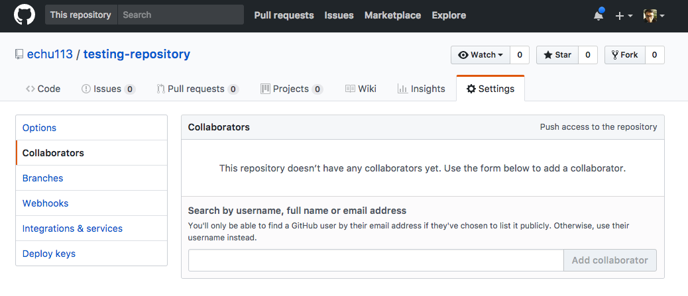

# STAT 540 - Seminar 1: Introduction to Git and GitHub

## Learning Objectives

By the end of this seminar, you should

* Have a conceptual understanding of what version control is and why it is important
* be able to describe the differences and relationships between Git, GitHub, and Git Client
* Have some familiarity with the GitHub browser interface and be able to use some of its basic features such as navigating the contents of a repository and creating issues
* Have your environment set up for using Git and GitHub
* Have practical experience with the routine Git workflow: Create, Clone, Stage, Commit, Push, and Pull

## Part 1: What is Version Control? Git? GitHub? Git Client? 

All these terms might seem a little daunting at first, but don't worry, all these things were invented to make things easier for you. There is a bit of a learning curve if you have no previous experience, but rest assured, this seminar has been carefully designed to walk you through everythng you need to know. 

### Git Basics

Version control is one of the key tools in the software engineer's toolbox. According to [The Guardian](https://www.theguardian.com/technology/blog/2008/aug/19/howmanypeoplemakewindows7), >900 developers contributed to the development of Microsoft's Windows 7. When you have that many people working on a single project, imagine how many times the code base would be changed within a single day, or even a single hour? And by who? And for what? What happens if more than two developers change a single file at the same time? Or even a single line of code?

A version control system provides a structured way for maintaining a clean and easily accessible track record of how a directory of files (most commonly the source code of some software application) evolves through time. It also provides important mechanisms for resolving issues when they arise, such as when two developers try to make conflicting changes to a single file. 

Git is just one of many version control systems out there, albeit a (very) popular one. Others include [Mercurial](https://www.mercurial-scm.org/), [Perforce](https://www.perforce.com/), [Subversion](https://subversion.apache.org/), etc. 

Watch this [video](https://git-scm.com/video/what-is-version-control) for some Git Basics.

### Why Git? (excerpt from [section 1.1 of Happy Git and GitHub for the useR](http://happygitwithr.com/big-picture.html#why-git))

Git is a version control system. Its original purpose was to help groups of developers work collaboratively on big software projects. Git manages the evolution of a set of files – called a repository – in a sane, highly structured way. If you have no idea what I’m talking about, think of it as the “Track Changes” features from Microsoft Word on steroids.

Git has been re-purposed by the data science community. In addition to using it for source code, we use it to manage the motley collection of files that make up typical data analytical projects, which often consist of data, figures, reports, and, yes, source code.


### Why GitHub? (excerpt from [section 1.2 of Happy Git and GitHub for the useR](http://happygitwithr.com/big-picture.html#why-github))

This is where hosting services like GitHub, Bitbucket, and GitLab come in. They provide a home for your Git-based projects on the internet. If you have no idea what I’m talking about, think of it as DropBox but much, much better. The remote host acts as a distribution channel or clearinghouse for your Git-managed project. It allows other people to see your stuff, sync up with you, and perhaps even make changes. These hosting providers improve upon traditional Unix Git servers with well-designed web-based interfaces. 

But be careful, while GitHub and many other services are great for tracking files, they may not always have the capacity to store large amounts of data. GiHhub recommends that repositories are under the size of 1GB (see this github [help](https://help.github.com/articles/what-is-my-disk-quota/) page). More importantly, GitHub doesn't allow for files larger than 100MB in size (see [Working with large files](https://help.github.com/articles/working-with-large-files/)).

Even for private solo projects, it’s a good idea to push your work to a remote location for peace of mind. Why? Because it’s fairly easy to screw up your local Git repository, especially when you’re new at this. The good news is that often only the Git infrastructure is borked up. Your files are just fine! Which makes your Git pickle all the more frustrating. There are official Git solutions to these problems, but they might require expertise and patience you can’t access at 3a.m. If you’ve recently pushed your work to GitHub, it’s easy to grab a fresh copy, patch things up with the changes that only exist locally, and get on with your life.

We target GitHub – not Bitbucket or GitLab – for the sake of specificity. However, all the big-picture principles and even some mechanics will carry over to these alternative hosting platforms.


### Wait, so what is what, exactly? 

**_Version control_** is the general term used to refer to software systems that helps you "manage" your files, most commonly being code bases. As already mentioned, Git is just one of many version control systems out there. Other examples include [Mercurial](https://www.mercurial-scm.org/), [Perforce](https://www.perforce.com/), [Subversion](https://subversion.apache.org/), etc.

**_Git_** is THE version control software. Both the GitHub server and your computer run it. It is what enables your laptop to talk with the remote repository stored on GitHub, and enables version control features like pushing and pulling code changes, keeping history, etc. 

**_GitHub_** is the service in the cloud that stores your remote repository. When you're working in a group, you and your collaborators will independently interact with GitHub in order to pull/publish your latest code changes. It will hold the most up-to-date "truth" of your project directory with each of you working away on your local machines. 

**_Git Client_** is a piece of software that provides a graphical user interface that facilitates your interaction with Git. In our case, **we will be using RStudio's built-in Git Client**. Other options include [SourceTree](https://www.sourcetreeapp.com/) and [GitHub Desktop](https://desktop.github.com/). And of course, the terminal is the most powerful (also the most difficult) way to use Git. 


## Part 2: Set up your environment

Before we can start using Git, your computer must be equipped with the appropriate softwares. In this section, we will walk you through: 1. Installing Git, 2. Registering for a GitHub account, 3. Setting up an SSH key, 4. Talking to Git via RStudio. 

### 1. Install Git (contains excerpts from [Ch. 7 of Happy Git and GitHub for the useR](http://happygitwithr.com/install-git.html))

You need Git, so you can use it at the command line and so RStudio can call it. If there’s any chance it’s installed already, verify that, rejoice, and skip this step. Otherwise, find installation instructions below for your operating system.

#### Git already installed?

Open the shell (terminal / command line). Type in "git --version", no quotation, press enter.

```{r eval = FALSE}
git --version
## git version 2.11.0 (Apple Git-81)
```

If you are successful, that’s great! You have Git already. No need to install! Move on.

If, instead, you see something more like git: command not found, keep reading.

#### Install Git for Windows people

Install [Git for Windows](https://git-for-windows.github.io/), previously known as msysgit or “Git Bash”, to get Git in addition to some other useful tools, such as the Bash shell. Yes, all those names are totally confusing. You may accept all the default settings during installation.

* This approach leaves the Git executable in a conventional location, which will help you and other programs, e.g. RStudio, find it and use it. This also supports a transition to more expert use, because the Bash shell will be useful as you venture outside of R/RStudio.
* This also leaves you with a Git client, though not a very good one. 
* RStudio for windows likes for git to be in the Files(x86) folder. If not in this location, RStudio may not detect it, and may cause headaches for you later.


#### Install Git for Mac people

Install the Xcode command line tools (not all of Xcode), which includes Git by opening a terminal and typing in the following and press enter. Follow prompts. 

```{r eval = FALSE}
xcode-select --install
```

Verify that Xcode command line tools has been installed by typing the following into the terminal and press enter.

```{r eval = FALSE}
xcode-select --version
## xcode-select version 2347.
```

Enter one of these commands to elicit an offer to install developer command line tools:

```{r eval = FALSE}
git --version
git config
```

Accept the offer! Click on “Install”.

#### Install Git for Linux people

Install Git via your distro’s package manager.

Ubuntu or Debian Linux:

```{r eval = FALSE}
sudo apt-get install git
```

Fedora or RedHat Linux:

```{r eval = FALSE}
sudo yum install git
```

[A comprehensive list](https://git-scm.com/download/linux) for various Linux and Unix package managers.


### 2. Register for a GitHub account (contains excerpts from [Ch. 5 of Happy Git and GitHub for the useR](http://happygitwithr.com/install-git.html))

I hope by this point in the course, you all have a GitHub account already. If not, register for one at [GitHub](https://github.com). It's free!

A few tips on selecting a username, which sadly tend to contradict each other:

* Incorporate your actual name! People like to know who they’re dealing with. Also makes your username easier for people to guess or remember.
* Reuse your username from other contexts, e.g., Twitter or Slack. But, of course, someone with no GitHub activity will probably be squatting on that.
* Pick a username you will be comfortable revealing to your future boss.
* Shorter is better than longer.
* Be as unique as possible in as few characters as possible. In some settings GitHub auto-completes or suggests usernames.
* Make it timeless. Don’t highlight your current university, employer, or place of residence.
* Avoid words laden with special meaning in programming. In my first inept efforts to script around the GitHub API, I assigned lots of issues to the guy with username NA because my vector of GitHub usernames contained missing values. A variant of Little Bobby Tables.

You can change your username later, but better to get this right the first time.

* [Changing your GitHub username](https://help.github.com/articles/changing-your-github-username/)
* [What happens when I change my username?](https://help.github.com/articles/what-happens-when-i-change-my-username/)


### 3. Introduce yourself to Git and setup up an SSH key (contains excerpts from Chs. [8](http://happygitwithr.com/hello-git.html) and [12](http://happygitwithr.com/ssh-keys.html) of [Happy Git and GitHub for the useR](http://happygitwithr.com/))

First, you want to introduce yourself to Git. The information you enter here will constitute the user stamp for each commit you make. That way, Git can trace back code changes to their authors. 

In the shell:

```{r eval = FALSE}
git config --global user.name 'Eric Chu'
git config --global user.email 'eric.chu@msl.ubc.ca'
git config --global --list
## user.name=Eric Chu
## user.email=eric.chu@msl.ubc.ca
```

substituting your email associated with your GitHub account.

Next, we need to set up a SSH key so that you won't have to repeatedly type in your GitHub username and password with every GitHub repository interaction. 

SSH keys provide a more secure way of logging into a server than using a password alone. While a password can eventually be cracked with a brute force attack, SSH keys are nearly impossible to decipher by brute force alone. Generating a key pair provides you with two long strings of characters: a public and a private key. You can place the public key on any server, and then unlock it by connecting to it with a client that already has the private key. When the two match up, the system unlocks without the need for a password. You can increase security even more by protecting the private key with a passphrase.


#### Check for existing keys

Go to the shell.

List existing keys (at least, those in the default location):

```{r eval = FALSE}
ls -al ~/.ssh 
```

If you see a pair of files like id_rsa.pub and id_rsa, **you have a key pair already**. You can skip to the section about adding a key to the ssh-agent.

If you are told .ssh doesn’t exist, you don’t have SSH keys! Keep reading to create them.

#### Create SSH key pair

Create the key pair by entering this, but substitute the email address associated with your GitHub account:

```{r eval = FALSE}
$ ssh-keygen -t rsa -b 4096 -C "jenny@stat.ubc.ca"
```

Accept the proposal to save the key in the default location, i.e., just press Enter here:

```{r eval = FALSE}
Enter file in which to save the key (/Users/jenny/.ssh/id_rsa):
```
You have the option to protect the key with a passphrase. If you take it, you will want to configure something called the ssh-agent to manage this for you (more below).

So either enter a passphrase (and store in your favorite password manager!) or decline by leaving this empty.

Enter passphrase (empty for no passphrase):

The process should complete now and should have looked like this:

```{r eval = FALSE}

jenny@2015-mbp ~ $ ssh-keygen -t rsa -b 4096 -C "jenny@stat.ubc.ca"
Generating public/private rsa key pair.
Enter file in which to save the key (/Users/jenny/.ssh/id_rsa):     
Enter passphrase (empty for no passphrase): 
Enter same passphrase again: 
Your identification has been saved in /Users/jenny/.ssh/id_rsa.
Your public key has been saved in /Users/jenny/.ssh/id_rsa.pub.
The key fingerprint is:
SHA256:ki0TNHm8qIvpH7/c0qQmdv2xxhYHCwlpn3+rVhKVeDo jenny@stat.ubc.ca
The key's randomart image is:
+---[RSA 4096]----+
|      o+   . .   |
|     .=.o . +    |
|     ..= + +     |
|      .+* E      |
|     .= So =     |
|    .  +. = +    |
|   o.. = ..* .   |
|  o ++=.o =o.    |
| ..o.++o.=+.     |
+----[SHA256]-----+

```

#### Add key to ssh-agent

Tell your ssh-agent about the key and, especially, set it up to manage the passphrase, if you chose to set one.

Make sure ssh-agent is enabled:

```{r eval = FALSE}

jenny@2015-mbp ~ $ eval "$(ssh-agent -s)"
Agent pid 95727

```

Add your key. If you set a passphrase, you’ll be challenged for it here. Give it.

```{r eval = FALSE}

jenny@2015-mbp ~ $ ssh-add ~/.ssh/id_rsa
Enter passphrase for /Users/jenny/.ssh/id_rsa: 
Identity added: /Users/jenny/.ssh/id_rsa (/Users/jenny/.ssh/id_rsa)

```


#### Provide public key to GitHub - Almost there, yay!

This is the step where you tell GitHub to recognize your computer.

Copy the public key onto your clipboard. Open `~/.ssh/id_rsa.pub` in an editor and copy the contents to your clipboard or do one of the following at the command line:

Mac OS: `pbcopy < ~/.ssh/id_rsa.pub`

Windows: `clip < ~/.ssh/id_rsa.pub`

Linux: `xclip -sel clip < ~/.ssh/id_rsa.pub`. If needed, install via `apt-get` or `yum`. For example, `sudo apt-get install xclip`.

In the top right corner of any page on GitHub, click your profile photo, then click Settings.

In the user settings sidebar, click SSH and GPG keys.

Click New SSH key.

In the “Title” field, add a descriptive label for the new key. For example, if you’re using a personal Mac, you might call this key “Personal MacBook Air”.

Paste your key into the “Key” field.

Click Add SSH key.

Confirm the action by entering your GitHub password.


## part 3: Create, Clone, Stage, Commit, Push, Pull!

Now, we're ready to start using Git.

The six verbs in the title will likely encompass 90% of everything you will do with Git. We will now walk through each one to give a brief explanation and demo. 

Note that everything that can be done using RStudio (or any other Git Client), can also be done via the shell. Here we provide instructions for RStudio environment for a more guided experience. 

If you're interested, check out [this post](http://dont-be-afraid-to-commit.readthedocs.io/en/latest/git/commandlinegit.html) on using Git in the shell. It is definitely a worthwhile learning experience if you want to dive deeper into the Git world.

### Overview

The very first thing we will do is create a repository. A repository is simply a directory for your project. It is no different from any other directories on your laptop, except that Git knows about it and keeps a complete historical record of every change that has been "committed". 

When a repository is stored on GitHub, it is called the "remote" repository. You can then "clone" this repository onto your laptop. The copy on your laptop is then called the "local" repository. "Pushing" and "pulling" are operations for keeping the local and remote repositories in sync with each other. 

For example, You can modify codes in your "local" repository and then, when ready, "push" your changes to the "remote" repository on GitHub. Your group members can then "pull"" the most up-to-date version of the "remote" repository from GitHub into their "local" repositories and continue to work on the project. 

Don't worry if you don't understand every detail of the workflow just yet. Just get the overall picture for now. You'll gain a much deeper understanding once we start trying things out for real, starting now!

### Create

To create a repository, go to [GitHub](https://github.com/). If you're logged in, you should see a "New repository" button on your home screen. Click it. 

On the "Create a new repository" page, make sure your GitHub account has been selected as the owner. Give your repository a name. I gave mine "testing-repository". Enter a description if you like. Choose public for now. Don't worry about initializing the README file; we will add that in later manually. 

Click "Create repository". If you see this (screenshot), things are going well. This is the web page of your new repository on Github. Using the GitHub website, you will be able to browse your files directly inside of an internet browser. 

Congratulations!


If you cannot create a repository, get help from one of the TAs. 

### Clone

Next, we want to clone this repository into your laptop so that you have a local copy of the repository. This is how you can make changes to the repository on your machine. 

Make sure you have the latest version of RStudio before you start. 

In RStudio, start a new Project:

* File > New Project > Version Control > Git. In the “repository URL” paste the URL of your new GitHub repository. It will be something like this git@github.com:echu113/testing-repository.git. 


You can obtain this URL from your GitHub repository website. See below. Make sure you copy the SSH option as we have setup the SSH keys for authentication. 


Do you NOT see an option to get the Project from Version Control? Go to [chapter 14 of Happy Git and GitHub for the useR](http://happygitwithr.com/rstudio-see-git.html) for tips on how to help RStudio find Git.

Take charge of – or at least notice! – the local directory for the Project. A common rookie mistake is to have no idea where you are saving files or what your working directory is. Pay attention. Be intentional. Personally, I would do this in ~/Desktop/git_temp.

Check "Open in new session" so that RStudio will open your new project in a new window. 

Click “Create Project”.

Confirm that a new directory has been created with the project directory name you specified. The directory now contains a .Rproj file. This is the RStudio project file. We will subsequently push this file to the remote repository. 

There is also a .gitignore file. Ignore this for now, we will talk about it later (ignore .gitignore, ha! It's okay, you don't have to laugh). 


Also note that a new RStudio window has been opened for you as a workspace. Notice the "Git" tab in your RStudio window. 


Congratulations, again! You have cloned the Git repository onto your local machine. Well done!

Notice that the project directory current contains nothing (except the automatically generated .Rproj and .gitignore file), which is not very exciting at all. So let's add something. 

The first thing you should add to every directory you create is README.md, and you will soon see why. This is something that integrates very well into the GitHub user interface; GitHub always detects your README files automatically and displays it right on the repository web page, giving information about the repository. 

Go ahead and create a new file in your project directory, and name it README.md. Open it inside RStudio. Add the line "This is a line from RStudio". Save your changes. 

Next, we want to publish this change on GitHub so that it becomes a permanent change with a record and that your group members can access it. The process is a little awkward to start with so we'll take it one step at a time.

### Stage

First, we need to stage the change. This is basically "telling" GitHub about this new change. Nothing can be committed without first being staged. 

Stage the README.md file by going to the "Git" tab on top right of the RStudio window and check "staged". Also stage the .Rproj file while you're at it. 

Great, that was easy. Git now knows about these new changes you want to submit. 

### Commit

Next, we want to commit these changes. By committing, you effectively create a new record to remember the current state of the directory. This is something you don't get from only staging the files. 

You can commit by clicking RStudio > Git > Commit. Enter a commit message to describe your change. I put "Add README.md and the RStudio project file to repository" for mine. All your staged files will be included in this commit. Click "Commit" and "Close". 

Go to your repository page on [GitHub](https://github.com/). Notice that the new files are not yet on GitHub. Surprised? 

**The changes are NOT on GitHub yet. They have NOT been published. Commit is an operation that happens solely on your local repository.** This allows you to create a record of changes while being offline. This also shields you from complications that may arise when merging with the remote repository (until you decide to push). This is something that confuses a lot of beginners. Take a moment to think about this. If in doubt, grab a TA and clarify.

### Push

Push is the operation to bring the remote repository hosted on GitHub up to date with your local changes. Normally, you might have accumulated one or more commits in your local repository that you're ready to publish. All of these commits can be pushed with one "push" operation. 

Now we will push the one commit we made with the addition of the README.md and .Rproj files. 

Do this by clicking RStudio > Git > Push. 

You should see this pop-up in RStudio. 

``` 
>>> git push origin refs/heads/master
To github.com:echu113/testing-repository.git
 * [new branch]      master -> master
```

Now, go back to your repository page on [GitHub](https://github.com/). This is what you should see. 


Notice that the content of README.md is displayed directly on the repository's home page. 

Take a moment to browse through GitHub's user interface. You can navigate through the files and their contents. You can also look at the commit history by clicking on "commits". In addition, GitHub supports a range of project management features including issues, wiki pages, and contribution statistics. You will inevitably learn more and you gain more experience!

Take note of the "Clone or download" green button on the upper right corner of the file list. This is where you can obtain the URL to this repository in case another group member needs to clone your repository. Keep in mind that the owner of this repository must first add the group member to the collaborators list in order for them to have access. See below. 




### Pull


Finally, we want to demo the pull operation. We will make a change directly on GitHub. This way we generate a file change that is absent from your local machine. This simulates the situation where your group member pushes a new change that you don't currently have. In order to sync up, you'll perform a "pull" from the remote repository into your local repository. 

To make a change directly on GitHub, go to your repository page, click on the file README.md. On top right of the file, there should be a pencil icon. 


Click on the pencil. Add this line to README.md: "This change was made directly on GitHub.". Put in a commit message and commit directly to the "master branch." Now you should see this. 


Check that your local version of the file still only contains the single line: "This is a line from RStudio". 


Click RStudio > Git > Pull. And..... Voila!


**IMPORTANT** - Note that we recommend against making extensive changes directly on GitHub. The browser is an unreliable environment compared to RStudio's built-in text editor. In addition, this is an easy way to introduce code conflicts in case you have uncommitted changes in your local repository. This was done here only for the sake of demonstration. So don't do it!


### About .gitignore

Oh yeah, that .gitignore file that we have ignored so far. 

Go ahead and take a look at the content of this file now. You should see the following:

```{r eval = FALSE}
.Rproj.user
.Rhistory
.RData
.Ruserdata
```

This is basically telling Git to ignore all these files in the list. This may come in handy when you start working on your project. The datasets that you will work with may be >100 MB in size, which exceeds GitHub's per file limit. You may still want to keep the data files inside your project directory for easy access. In this case, you can add those files to .gitignore so that Git doesn't bug you about these "unstaged changes". GitHub keeps up a set of commonly used .gitignore files as well as more information about their usage [here](https://github.com/github/gitignore).

## part 4: Deliverables

* Show a TA your GitHub repository page to get checked off for completion!

## Final notes and some additional resources

Final recommendations (excerpt from [Ch. 26 of Happy Git and GitHub for the useR](http://happygitwithr.com/burn.html)):

* Commit early and often.
* Push to a remote, like GitHub, often.
* The state of things on GitHub is your new “worst case scenario”.
* If you really screw things up locally, copy all the files (or the ones that have changed) to a safe place.
* Usually your files are JUST FINE. But it is easy to goof up the Git infrastructure when you’re new at this. And it can be hard to get that straightened out on your own.
* Rename the existing local repo as a temporary measure, i.e. before you do something radical, like delete it.
* Clone the repo from GitHub to your local machine. You are back to a happy state.
* Copy all relevant files back over from your safe space. The ones whose updated state you need to commit.
* Stage and commit. Push.
* Carry on with your life.

Here are some resources in case you want to learn more. 

* [Happy Git and GitHub for the useR](http://happygitwithr.com/) by [Dr. Jenny Bryan](https://github.com/jennybc)
* [Git Documentations](https://git-scm.com/documentation)


## Attributions

This seminar was developed by [Eric Chu](https://github.com/echu113) with materials adapted from [Happy Git and GitHub for the useR](http://happygitwithr.com/) by [Dr. Jenny Bryan](https://github.com/jennybc).
