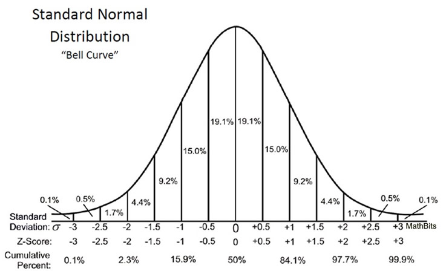

This tutorial will show you how to make heatmaps and perform Principal Component Analysis in R. This tutorial assumes that you have preprocessed your data. The preprocessing method will strongly depend on your data type (RNA seq, DNA methylation, metagenomics, ...) but usually involves alignment of reads, removal of low quality/abundance variables and normalization. Please do not generate heatmaps or PCA plots from raw data, they will be meaningless.

# Resources
We unfortunately don't have enough time to go into the theory behind these analyses. Below are listed some resources where you can learn more:

[UBC's STAT540 class](https://stat540-ubc.github.io/subpages/lectures.html) has lectures on PCA and clustering analyses

Checkout [StatQuest's tutorial on Youtube](https://www.youtube.com/watch?v=FgakZw6K1QQ)

Take a look at the [vignette for the PCAtools package](https://bioconductor.org/packages/release/bioc/vignettes/PCAtools/inst/doc/PCAtools.html#introduction) we are using today.

For more advances analyses, you may find the [MixOmics package](http://mixomics.org/) useful.

There are many helpful cheat sheets for making pretty graphs in R: Search online for the cheat sheets for ggplot2 and R colours.

# Getting started 

To follow along this tutorial, you need to have R and R studio installed. You can then run the commands from R studio. If you need an introduction to R studio, take a look at [Amy's great presentation](https://github.com/BCCHR-trainee-omics-group/StudyGroup/tree/master/workshops/2019-10-31_R_not_so_scary) from last year.

First, we need to load the packages that contain the functions for our analyses today. You may not have used all of these packages before, in which case you need to install them first. You can use the code below by removing the # sign before install.packages.

```{r}
#install.packages("pheatmap") #if you have not used the package pheatmap before
library(pheatmap)
#install.packages("ggplot2") #if you have not used the package ggplot2 before
library(ggplot2)
#install.packages('BiocManager') #if you have not used BiocManager before
#BiocManager::install('PCAtools') #if you have not used PCAtools before 
library(PCAtools)
```

## Setting up the data set
We will use the iris data set that is preloaded in R for this tutorial. Let's load the data and take a quick look at it.

```{r}
iris <- iris
str(iris)
head(iris)
```

The iris data set contains measurements of sepal and petal length and widths for different iris flowers. 150 flowers from three different species were measured. The measurements (the data) is in the first 4 columns. The 5th column contains information about the data points (meta data). Let's make a data and a meta data object. We will also add rownames to simplify the input for some functions later.

```{r}
rownames(iris) <- paste0("row_", seq(nrow(iris)))
data <- iris[,1:4]
meta <- as.data.frame(iris[5])
```

# Heatmaps

Heatmaps are a commonly used data visualization tool in bioinformatics. They allow easy visualiztion of multiple parameters for several samples simultaneously. 

## Generating heatmaps using the pheatmap package

There are many different packages availables in R to generate heatmaps. Today, we will use the pheatmap package as it allows easy annotation and customization of the plots.

```{r}
pheatmap(data)
```

We can see a heatmap where each row corresponds to one of the samples (a flower) and each column corresponds to one type of measurement (length or width of the sepal and petals). Let's change the heatmap to a more conventional layout with measurements as rows and samples as columns. t() transposes ("flips") the orientation of a data frame.

```{r}
pheatmap(t(data))
```

Let's take a look at the colour scheme: The legend gives us an indication that the colours represent the measurements (lengths and widths) in centimeters as they appear in our original dataframe. Red represents longer measurements and blue shorter pieces. We can see the sepal lengths are larger than the petal widths. This is most often not what we are interested in. We want to know, how the samples compare to each other. For that, the values in a heatmap are usually normalized and represented as a Z score. Now you might wonder: what is a Z score?
Let's take a look at this graph:



Image downloaded from [https://mathbitsnotebook.com/Algebra2/Statistics/STzScores.html](https://mathbitsnotebook.com/Algebra2/Statistics/STzScores.html)

The Z score indicates how far away a values is from the mean. A z score of 0 means that the data point's value is equal to the mean of all the data points in that group. A z score of 1 indicates that the data point's value is 1 standard deviation away from the group's average and so forth. 
Now, let's apply Z score normalization ("scaling") to our data for the heatmap:
=======
The Z score indicates how far away a values is from the mean. A z score of 0 means that the data point's value is equal to the mean of all the data points in that group. A z score of 1 indicates that the data point's value is 1 standard deviation away from the group's average.

```{r}
pheatmap(t(data), scale = "row")
```

Note that we are choosing to scale by row, meaning the Z score will be calculated for each row based on all the samples in that row. If you your dataframe has a different orientation (or if we would use "data" instead of "t(data)"), we would need to scale by column.

Now let's take a look at how the clustering dendograms on the rows and columns are generated: We can indicate whether we want to cluster the rows and/or columns by using the Booleans TRUE or FALSE. Note that they have to be written in capital letters. You can also abbreviate using T and F. For the clustering method, we have many options available, such as single or complete clustering. Personally, I like to use Ward's criterion for clustering. If you are interested in learning more about the clustering methods and their advantages and disadvantages, you can check out the UBC STAT540 lecture on Cluster Analysis.

=======
Now let's take a look at how the clustering dendograms on the rows and columns are generated:
```{r}
pheatmap(t(data), scale = "row",
         cluster_rows = FALSE, cluster_cols = TRUE, 
         clustering_method = "ward.D2")
```

Now, it would be nice to know which column corresponds to which sample and whether the species cluster together or separately. The column names are added but since we have 150 samples, they are hard to read. Let's remove the labels and instead add their species by colour code on top:
We can indicate whether we want to cluster the rows and/or columns by using the Booleans TRUE or FALSE. Note that they have to be written in capital letters. You can also abbreviate using T and F. For the clustering method, we have many options available, such as single or complete clustering. Personally, I like to use Ward's criterion for clustering. If you are interested in learning more about the clustering methods and their advantages and disadvantages, you can check out the UBC STAT540 lecture on Cluster Analysis.

Now, it would be nice to know which column corresponds to which sample and whether the species cluster together or separately. We could add the column names but since we hav 150 samples, they would be hard to read. Instead, lets add their species by colour code on top:
```{r}
pheatmap(t(data), scale = "row",
         cluster_rows = FALSE, cluster_cols = TRUE, 
         clustering_method = "ward.D2",
         show_rownames = T, show_colnames = F, #if you want to add/remove names
         annotation_col = meta)
```

Let's specify the colours for our annotation to make the plot more visually appealing:
```{r}
ann_colors <- list(Species=c(setosa="red", versicolor="gold", virginica="navy"))
pheatmap(t(data), scale = "row",
         cluster_rows = FALSE, cluster_cols = TRUE, 
         clustering_method = "ward.D2",
         show_rownames = T, show_colnames = F, #if you want to add/remove names
         annotation_col = meta, annotation_colors = ann_colors)
```


As a last exercise, let's change the colours used in the heatmap: Here, weuse colorRampPalette to create our own gradient. We specify colours for the lowest, mean and highest value and create 77 "levels". This number is a bit arbitrary, it just has to be high enough to create the impression of a smooth gradient. Using an odd number ensures that the gradient will be centered at the Z score of 0.

As a last exercise, let's change the colours used in the heatmap: 
```{r}
pheatmap(t(data), scale = "row",
         cluster_rows = TRUE, cluster_cols = TRUE, 
         clustering_method = "ward.D2",
         show_rownames = T, show_colnames = F, #if you want to add/remove names
         annotation_col = meta, annotation_colors = ann_colors,
         color =  colorRampPalette(c("navy","white","red"))(77))
```

If you need inspiration for the colour schemes, search for the R color palette cheatsheet - you will find many options for preset scales and colour choices. Please refrain from using green to red colour schemes as they are not colour blind friendly.

There are many other ways you can customize this heatmap. Use ?pheatmap to see which arguments can be passed on.


# Principal Component Analysis (PCA)

Often, we have many more variables than shown in this example. Think for example of an RNA-Seq experiment where you have several 10,000 genes. This would be quite difficult to visualize in a heatmap (side note: it is of course possible, you can simply decrease the cell height). A better way to visualize our data might be to perform a principal component analysis. It will help us to get an idea about the variability in our samples and what is driving the variability. 

Before looking at how to make our own PCA plot, let's quickly discuss what a principal component analysis does. As the name suggests, it identifies components in your data and orders them by importance. Imagine that you have stimulated and unstimulated cells and then look at their gene expression with RNA Seq. Instead of visualizing each gene one by one, we could group genes based on their expression pattern. For example, there may be many genes that change with the stimulation. Then there may be a group of genes that is constant across all the samples, another group of genes may not change with stimulation but be different across the samples based on the age of the donor. 

Instead of manually grouping genes based on known factors, principal component analysis identifies pattern in the data and groups variables into components. The sum of the components explains all the variance in the data. By definition, principal component 1 is the most important one. This will become clearer in our plots below. 

## Performing PCA using the prcomp function

Prcomp() is a base function in R that performs principal component analysis:

```{r}
pca <- prcomp(data, center=TRUE, scale=TRUE)
```

Note that we specify to center and scale. While the default is set to FALSE, it is generally recommended to set these parameters to TRUE. The idea is the same as scaling the rows in the heatmap as described above. If we do not scale, variables that have generally higher values do contribute more than variables with low average values, regardless of whether they are driving variability in the data.

Let's take a look at our prcomp object using View()
x has the coordinates for the different PCs for each sample. Let's plot the first two PCs:

```{r}
plot(pca$x)
```

Alright, we see two main clusters of samples that are nicely separated. But which samples do they correspond to? Let's modify the plot: 

```{r}
pca.data <- as.data.frame(pca$x)
pca.data$Species <- meta$Species
pca.plot <- ggplot(pca.data, aes(x=PC1, y=PC2, color=Species)) + 
  geom_point() + theme_bw()
pca.plot
```

Here, we can see that setosa cluster quite separately from the versicolor and virginica species. Expectedly, this is very similar to our heatmap clustering.

If you want to learn more about ggplot and how to use it, check out [Victor's awesome tutorial](https://github.com/BCCHR-trainee-omics-group/StudyGroup/blob/master/workshops/2019-07-24_intro_to_ggplot2/2019-07-24_ggplot2.md) on our website.

As a side note: if you prefer making the PCA plot using another software (GraphPad Prism, Excel, ...), you can export the results of the PCA and load them into your favorite program:
```{r}
#write.table(pca$x, "iris.pca.txt")
```

## The PCAtools package

Often, it is interesting to see what meta data is correlating with the different PCs. In this examples, we only have one meta variable (Species), so the analysis is not very exciting but imagine if you have sex, age, treatment type, duration of treatment etc. for different patients or mice. To look at this in more detail, we will use the package PCAtools that creates these plots easily. 

The PCA function in PCAtools has a similar structure to the prcomp call. Note however that we need to transpose the data. In addition, we are supplying our metadata: 
```{r}
p <- pca(t(data), metadata = meta, center=TRUE, scale=TRUE)
```

Now let's plot the first two PCs using biplot() from the PCAtools package. Note how we can easily color our data points using our meta data using the colby argument. biplot() will automatically label each data point with its row name. As we have 150 samples, the figure will look quite crowded so we are setting lab to NULL.
```{r}
biplot(p, colby = "Species", legendPosition = 'right', lab = NULL)
```

The package PCAtools also offers many other helpful plots:
A screeplot visualizes the importance of each PC:
```{r}
screeplot(p)
```

The pairsplot can show multiple PCs in a layout. By default, it will show the first five PCs. As we only have four variables in our dataset and hence only four PCs, we need to set the components plotted to 4 to avoid error messages. Note that you can omit the components argument whne using your own data.
```{r}
pairsplot(p, components = getComponents(p, c(1:4)), colby = "Species")
```

We can also take a look which variables are driving each PC. With only four variables in our dataset this is quite simplistic but the loadings plot can be extremely useful when you have thousands of variables.
```{r}
plotloadings(p, components = getComponents(p, c(1:4)))
```

Often, we are also interested in knowing which meta variables are correlating with the different PCs. In the iris data set, we only have one meta variable but imagine having a lot of clinical variables (sex, age, tumor type, etc) or treatment variables (dose, time, cell type, etc.). Of course, you can change the colour and shape of the symbols in the biplot for all the meta variables but that is quite cumbersome and the readout is subjective. Instead we can perform a correlation analysis.

All the meta data needs to be numeric to perform correlation analyses, so we will first reformat out Species column.
```{r}
meta$Species.num <- as.numeric(meta$Species)
p <- pca(t(data), metadata = meta, center=TRUE, scale=TRUE)
eigencorplot(p, metavars = "Species.num", components = getComponents(p, seq_len(4)))
```


We can see a strong, statistically significant correlation between Species and principal component one. This should not be surprising as we clearly saw the separation in our PC plot.

You can supply more arguments to eigencorplot() to for example set cut-offs for statistical significance or perform correction for multiple testing. Take a look at their vignette (linked above in the Resources section).

Keep in mind that not only experimental factors (stimulation type or dose) can drive the variability in your data but also underlying biological or technical factors. For example, age or sex of the donor can have a major impact but if you don't have that data available, you can not test for it, and some PCs might have high contribution with seemingly "no" explanation based on your meta data. More importantly, technical variability is a major issue in omics research. Ideally, experimental design should minimize this but that is not always happening. Even with the best possible experimnetal design, it is a good idea to include technical factors (e.g. sequencing batch) in your meta data and see how it correlates with your PCs. This kind of analysis can give you an idea which variables you need to correct for in your downstream analyses.

There are many other packages that generate pretty PCA plots or offer more advanced analyses, for example if you have repeated measures. Many of these packages have tutorials available online, so go ahead and check them out. 
