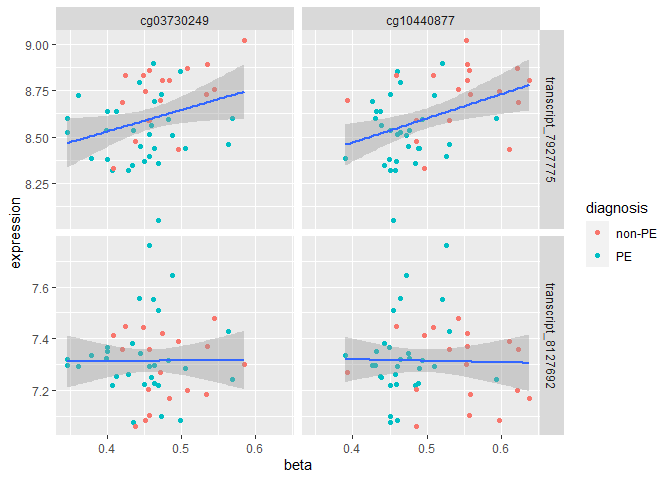

# Setup

First we need to install pacakges (if you haven't already) and load libraries and data


```r
library(tidyverse) # install.packages('tidyverse')

pdat <- read_csv('https://raw.githubusercontent.com/BCCHR-trainee-omics-group/StudyGroup/master/workshops/2020-08-20_reshaping-data/pdat.csv')

meth <- read_csv('https://raw.githubusercontent.com/BCCHR-trainee-omics-group/StudyGroup/master/workshops/2020-08-20_reshaping-data/meth.csv')

expr <- read_csv('https://raw.githubusercontent.com/BCCHR-trainee-omics-group/StudyGroup/master/workshops/2020-08-20_reshaping-data/expr.csv')
```

# Introduction

Data (especially genomic) can be orghanized in many ways

However, functions in R (and in other software) will expect your data to be in organized in a very specific way

Therefore, it's essential for anyone working with genomic data to be able to comfortably manipulate data into different organizations / shapes

## Some conventions in genomic analysis

In genomic data especially, because our data is so large, there are conventions on how data is usually "stored"

Usually, genomic data is kept separate from phenotypic information

In our case, we have a `pdat`, `meth`, and `expr` dataframes.

1. `pdat` is our **phenotype data frame**

It contains sample-level information: 

expr_geo_id - the GEO id accession for the expression data
meth_geo_id - the GEO id accession for the methylation data
diagnosis - preeclampsia or non-preeclampsia pregnancy
tissue - all placental
maternal_age - mom's age
...

Take a look:


```r
pdat
```

```
## # A tibble: 48 x 9
##    expr_geo_id meth_geo_id diagnosis tissue maternal_age maternal_bmi
##    <chr>       <chr>       <chr>     <chr>         <dbl>        <dbl>
##  1 GSM1940495  GSM2589532  PE        Place~           37         19.5
##  2 GSM1940496  GSM2589533  PE        Place~           40         25.7
##  3 GSM1940499  GSM2589534  PE        Place~           37         25  
##  4 GSM1940500  GSM2589535  PE        Place~           38         26.2
##  5 GSM1940501  GSM2589536  PE        Place~           33         31.2
##  6 GSM1940502  GSM2589537  PE        Place~           26         31.2
##  7 GSM1940505  GSM2589538  PE        Place~           31         18.6
##  8 GSM1940506  GSM2589539  PE        Place~           37         25.2
##  9 GSM1940507  GSM2589540  non-PE    Place~           35         18.6
## 10 GSM1940508  GSM2589541  PE        Place~           32         26.6
## # ... with 38 more rows, and 3 more variables: maternal_ethnicity <chr>,
## #   ga_weeks <dbl>, ga_days <dbl>
```

2. `meth` 

**Genomic data is usually stored where the variables, in this case the methylation cpg sites, are organized as rows, and samples are columns.**


```r
meth
```

```
## # A tibble: 100 x 49
##    cpg   GSM2589532 GSM2589533 GSM2589534 GSM2589535 GSM2589536 GSM2589537
##    <chr>      <dbl>      <dbl>      <dbl>      <dbl>      <dbl>      <dbl>
##  1 cg04~      0.309      0.355      0.380      0.267      0.318      0.440
##  2 cg21~      0.408      0.258      0.393      0.299      0.355      0.375
##  3 cg20~      0.577      0.643      0.528      0.509      0.488      0.621
##  4 cg12~      0.276      0.121      0.135      0.169      0.182      0.408
##  5 cg11~      0.569      0.606      0.488      0.499      0.509      0.649
##  6 cg07~      0.381      0.426      0.504      0.499      0.472      0.472
##  7 cg13~      0.601      0.527      0.561      0.525      0.393      0.599
##  8 cg25~      0.475      0.479      0.438      0.409      0.431      0.526
##  9 cg11~      0.593      0.569      0.576      0.473      0.527      0.674
## 10 cg20~      0.664      0.657      0.663      0.703      0.696      0.704
## # ... with 90 more rows, and 42 more variables: GSM2589538 <dbl>,
## #   GSM2589539 <dbl>, GSM2589540 <dbl>, GSM2589541 <dbl>, GSM2589542 <dbl>,
## #   GSM2589543 <dbl>, GSM2589544 <dbl>, GSM2589545 <dbl>, GSM2589546 <dbl>,
## #   GSM2589547 <dbl>, GSM2589548 <dbl>, GSM2589549 <dbl>, GSM2589550 <dbl>,
## #   GSM2589551 <dbl>, GSM2589552 <dbl>, GSM2589553 <dbl>, GSM2589554 <dbl>,
## #   GSM2589555 <dbl>, GSM2589556 <dbl>, GSM2589557 <dbl>, GSM2589558 <dbl>,
## #   GSM2589559 <dbl>, GSM2589560 <dbl>, GSM2589561 <dbl>, GSM2589562 <dbl>,
## #   GSM2589563 <dbl>, GSM2589564 <dbl>, GSM2589565 <dbl>, GSM2589566 <dbl>,
## #   GSM2589567 <dbl>, GSM2589568 <dbl>, GSM2589569 <dbl>, GSM2589570 <dbl>,
## #   GSM2589571 <dbl>, GSM2589572 <dbl>, GSM2589573 <dbl>, GSM2589574 <dbl>,
## #   GSM2589575 <dbl>, GSM2589576 <dbl>, GSM2589577 <dbl>, GSM2589578 <dbl>,
## #   GSM2589579 <dbl>
```

3. `expr`

The expression data is organized in the same manner, with transcripts organized in rows, samples in columns.

```r
expr
```

```
## # A tibble: 50 x 49
##    transcript GSM1940495 GSM1940496 GSM1940499 GSM1940500 GSM1940501 GSM1940502
##    <chr>           <dbl>      <dbl>      <dbl>      <dbl>      <dbl>      <dbl>
##  1 transcrip~       8.01       7.90       7.88       7.78       7.91       7.99
##  2 transcrip~       8.14       7.21       7.26       7.30       7.26       7.48
##  3 transcrip~       3.33       3.33       3.60       3.36       3.39       3.12
##  4 transcrip~       7.29       7.34       7.22       7.22       7.35       7.32
##  5 transcrip~       4.79       4.85       4.90       4.89       4.78       4.83
##  6 transcrip~       8.21       8.02       8.65       7.55       8.05       8.53
##  7 transcrip~       7.76       7.55       7.93       7.54       7.66       7.84
##  8 transcrip~       5.52       6.05       5.73       5.81       6.06       5.88
##  9 transcrip~       6.99       7.32       7.22       7.09       7.39       7.02
## 10 transcrip~       8.56       9.09       8.82       9.00       9.26       9.09
## # ... with 40 more rows, and 42 more variables: GSM1940505 <dbl>,
## #   GSM1940506 <dbl>, GSM1940507 <dbl>, GSM1940508 <dbl>, GSM1940509 <dbl>,
## #   GSM1940518 <dbl>, GSM1940519 <dbl>, GSM1940520 <dbl>, GSM1940524 <dbl>,
## #   GSM1940534 <dbl>, GSM1940535 <dbl>, GSM1940542 <dbl>, GSM1940545 <dbl>,
## #   GSM1940547 <dbl>, GSM1940548 <dbl>, GSM1940549 <dbl>, GSM1940553 <dbl>,
## #   GSM1940556 <dbl>, GSM1940576 <dbl>, GSM1940582 <dbl>, GSM1940583 <dbl>,
## #   GSM1940586 <dbl>, GSM1940589 <dbl>, GSM1940593 <dbl>, GSM1940594 <dbl>,
## #   GSM1940602 <dbl>, GSM1940603 <dbl>, GSM1940606 <dbl>, GSM1940607 <dbl>,
## #   GSM1940608 <dbl>, GSM1940614 <dbl>, GSM1940618 <dbl>, GSM1940621 <dbl>,
## #   GSM1940622 <dbl>, GSM1940623 <dbl>, GSM1940625 <dbl>, GSM1940626 <dbl>,
## #   GSM1940630 <dbl>, GSM1940638 <dbl>, GSM1940642 <dbl>, GSM1940644 <dbl>,
## #   GSM1940645 <dbl>
```

There are a number reasons why it is often easier to keep genomic data separate:

- We can take advantage of more efficient ways of storing genomic data, if it's in it's own object (e.g. matrix, sparse matrix)

- Often it is convenient to have ready access to the phenotypic data. If it was combined with genomic data, it might be more difficult/cumbersome to access often.

**However,**

There are situations where you will need to be flexible with how your data is organized

## genomic data + ggplot2

`ggplot2`, which is a very powerful plotting tool in r, requires all data to be used in a plot, to be in the same data frame. Not only that, but the data needs to be in a particular format

We will go through a common situation where we will visualize the expression and methylation of several cpgs and transcripts, across different types of samples.

**Some motivation**

Your supervisor believes that the expression at a locus is controlled by a group of methylation sites. In particular we think two methylation sites are important, and in our data we have expression measured on two transcripts from this locus. The expression of these transcripts  has also been reported to be associated with preeclampsia pregnancies. We want to produce a single graphic that explores these relationships.

To do this, we need to combine the specific transcripts and methylation sites with pdat into a single dataframe, in order to visualize with ggplot2.

We're going to walk through this problem together.

Let's start by filtering to the methylation sites, and then joining this data to our `pdat` dataframe.

# Filtering methylation data

The 2 CpGs we are interested in is "cg03730249" and "cg10440877"


```r
meth %>% 
  filter(cpg %in% c("cg03730249", "cg10440877"))
```

```
## # A tibble: 2 x 49
##   cpg   GSM2589532 GSM2589533 GSM2589534 GSM2589535 GSM2589536 GSM2589537
##   <chr>      <dbl>      <dbl>      <dbl>      <dbl>      <dbl>      <dbl>
## 1 cg03~      0.505      0.445      0.469      0.407      0.400      0.482
## 2 cg10~      0.490      0.475      0.484      0.450      0.431      0.493
## # ... with 42 more variables: GSM2589538 <dbl>, GSM2589539 <dbl>,
## #   GSM2589540 <dbl>, GSM2589541 <dbl>, GSM2589542 <dbl>, GSM2589543 <dbl>,
## #   GSM2589544 <dbl>, GSM2589545 <dbl>, GSM2589546 <dbl>, GSM2589547 <dbl>,
## #   GSM2589548 <dbl>, GSM2589549 <dbl>, GSM2589550 <dbl>, GSM2589551 <dbl>,
## #   GSM2589552 <dbl>, GSM2589553 <dbl>, GSM2589554 <dbl>, GSM2589555 <dbl>,
## #   GSM2589556 <dbl>, GSM2589557 <dbl>, GSM2589558 <dbl>, GSM2589559 <dbl>,
## #   GSM2589560 <dbl>, GSM2589561 <dbl>, GSM2589562 <dbl>, GSM2589563 <dbl>,
## #   GSM2589564 <dbl>, GSM2589565 <dbl>, GSM2589566 <dbl>, GSM2589567 <dbl>,
## #   GSM2589568 <dbl>, GSM2589569 <dbl>, GSM2589570 <dbl>, GSM2589571 <dbl>,
## #   GSM2589572 <dbl>, GSM2589573 <dbl>, GSM2589574 <dbl>, GSM2589575 <dbl>,
## #   GSM2589576 <dbl>, GSM2589577 <dbl>, GSM2589578 <dbl>, GSM2589579 <dbl>
```

Great, we got our two cpgs out. Now we have to add this data to the pdat, so that we can visualize this data with the `diagnosis` variable.

But consider that our methylation data is organized as *features (cpgs) in rows* and *observations (samples) in columns*

Whereas, our pdat is organized as *observations (samples) in rows* and *features (phenotype data) in columns*:


```r
pdat
```

```
## # A tibble: 48 x 9
##    expr_geo_id meth_geo_id diagnosis tissue maternal_age maternal_bmi
##    <chr>       <chr>       <chr>     <chr>         <dbl>        <dbl>
##  1 GSM1940495  GSM2589532  PE        Place~           37         19.5
##  2 GSM1940496  GSM2589533  PE        Place~           40         25.7
##  3 GSM1940499  GSM2589534  PE        Place~           37         25  
##  4 GSM1940500  GSM2589535  PE        Place~           38         26.2
##  5 GSM1940501  GSM2589536  PE        Place~           33         31.2
##  6 GSM1940502  GSM2589537  PE        Place~           26         31.2
##  7 GSM1940505  GSM2589538  PE        Place~           31         18.6
##  8 GSM1940506  GSM2589539  PE        Place~           37         25.2
##  9 GSM1940507  GSM2589540  non-PE    Place~           35         18.6
## 10 GSM1940508  GSM2589541  PE        Place~           32         26.6
## # ... with 38 more rows, and 3 more variables: maternal_ethnicity <chr>,
## #   ga_weeks <dbl>, ga_days <dbl>
```

We need to reshape one of these dataframes before we can join them together. We're going to reshape the methylation data frame because the pdata is actually in the correct organization for ggplot2 already.

Introduce `pivot_longer`

# pivot_longer

This function will allow us to turn information that's in the columns (methylation geo IDs) and move that information into a column itself.

Another way to think of this operation is that we are making our data "longer" (less columns, more rows)

This is what the input of our `pivot_longer` operation looks like:


```r
meth %>%
  filter(cpg %in% c("cg03730249", "cg10440877")) 
```

```
## # A tibble: 2 x 49
##   cpg   GSM2589532 GSM2589533 GSM2589534 GSM2589535 GSM2589536 GSM2589537
##   <chr>      <dbl>      <dbl>      <dbl>      <dbl>      <dbl>      <dbl>
## 1 cg03~      0.505      0.445      0.469      0.407      0.400      0.482
## 2 cg10~      0.490      0.475      0.484      0.450      0.431      0.493
## # ... with 42 more variables: GSM2589538 <dbl>, GSM2589539 <dbl>,
## #   GSM2589540 <dbl>, GSM2589541 <dbl>, GSM2589542 <dbl>, GSM2589543 <dbl>,
## #   GSM2589544 <dbl>, GSM2589545 <dbl>, GSM2589546 <dbl>, GSM2589547 <dbl>,
## #   GSM2589548 <dbl>, GSM2589549 <dbl>, GSM2589550 <dbl>, GSM2589551 <dbl>,
## #   GSM2589552 <dbl>, GSM2589553 <dbl>, GSM2589554 <dbl>, GSM2589555 <dbl>,
## #   GSM2589556 <dbl>, GSM2589557 <dbl>, GSM2589558 <dbl>, GSM2589559 <dbl>,
## #   GSM2589560 <dbl>, GSM2589561 <dbl>, GSM2589562 <dbl>, GSM2589563 <dbl>,
## #   GSM2589564 <dbl>, GSM2589565 <dbl>, GSM2589566 <dbl>, GSM2589567 <dbl>,
## #   GSM2589568 <dbl>, GSM2589569 <dbl>, GSM2589570 <dbl>, GSM2589571 <dbl>,
## #   GSM2589572 <dbl>, GSM2589573 <dbl>, GSM2589574 <dbl>, GSM2589575 <dbl>,
## #   GSM2589576 <dbl>, GSM2589577 <dbl>, GSM2589578 <dbl>, GSM2589579 <dbl>
```

This is the output: 


```r
meth_long <- meth %>% 
  filter(cpg %in% c("cg03730249", "cg10440877")) %>%
  pivot_longer(cols = -cpg,
               names_to = 'meth_geo_id',
               values_to = 'beta')
meth_long
```

```
## # A tibble: 96 x 3
##    cpg        meth_geo_id  beta
##    <chr>      <chr>       <dbl>
##  1 cg03730249 GSM2589532  0.505
##  2 cg03730249 GSM2589533  0.445
##  3 cg03730249 GSM2589534  0.469
##  4 cg03730249 GSM2589535  0.407
##  5 cg03730249 GSM2589536  0.400
##  6 cg03730249 GSM2589537  0.482
##  7 cg03730249 GSM2589538  0.346
##  8 cg03730249 GSM2589539  0.457
##  9 cg03730249 GSM2589540  0.585
## 10 cg03730249 GSM2589541  0.460
## # ... with 86 more rows
```


It takes 3 necessary arguments:

1. `cols` - which columns do you want to apply this function to. Can use select helpers

2. `names_to` - what is the new variable name where the existing column names of 1. will go to

3. `values_to` - what is the new variable name for the existing contents of 1. will go to

*note* previous versions of `pivot_longer` and `pivot_wider` were called `gather` and `spread`. Previous to `dplyr`, there were equivalent base-r functions called `melt` and `cast`. I would suggest learning `pivot_longer` and `pivot_wider` as they have more functionality and are going to be maintained and improved on in the future.

## expression data

Let's do the same thing for expression data. 

This is what the expression data looks like, after filtering to the specific two transcript of interest:


```r
expr %>%
  filter(transcript %in% c("transcript_7927775", "transcript_8127692")) 
```

```
## # A tibble: 2 x 49
##   transcript GSM1940495 GSM1940496 GSM1940499 GSM1940500 GSM1940501 GSM1940502
##   <chr>           <dbl>      <dbl>      <dbl>      <dbl>      <dbl>      <dbl>
## 1 transcrip~       7.29       7.34       7.22       7.22       7.35       7.32
## 2 transcrip~       8.44       8.45       8.36       8.32       8.64       8.60
## # ... with 42 more variables: GSM1940505 <dbl>, GSM1940506 <dbl>,
## #   GSM1940507 <dbl>, GSM1940508 <dbl>, GSM1940509 <dbl>, GSM1940518 <dbl>,
## #   GSM1940519 <dbl>, GSM1940520 <dbl>, GSM1940524 <dbl>, GSM1940534 <dbl>,
## #   GSM1940535 <dbl>, GSM1940542 <dbl>, GSM1940545 <dbl>, GSM1940547 <dbl>,
## #   GSM1940548 <dbl>, GSM1940549 <dbl>, GSM1940553 <dbl>, GSM1940556 <dbl>,
## #   GSM1940576 <dbl>, GSM1940582 <dbl>, GSM1940583 <dbl>, GSM1940586 <dbl>,
## #   GSM1940589 <dbl>, GSM1940593 <dbl>, GSM1940594 <dbl>, GSM1940602 <dbl>,
## #   GSM1940603 <dbl>, GSM1940606 <dbl>, GSM1940607 <dbl>, GSM1940608 <dbl>,
## #   GSM1940614 <dbl>, GSM1940618 <dbl>, GSM1940621 <dbl>, GSM1940622 <dbl>,
## #   GSM1940623 <dbl>, GSM1940625 <dbl>, GSM1940626 <dbl>, GSM1940630 <dbl>,
## #   GSM1940638 <dbl>, GSM1940642 <dbl>, GSM1940644 <dbl>, GSM1940645 <dbl>
```

Your turn,


```r
expr_long <- expr %>%
  filter(transcript %in% c("transcript_7927775", "transcript_8127692")) %>%
  pivot_longer(cols = -transcript,
               names_to = 'expr_geo_id',
               values_to = 'expression')
expr_long
```

```
## # A tibble: 96 x 3
##    transcript         expr_geo_id expression
##    <chr>              <chr>            <dbl>
##  1 transcript_8127692 GSM1940495        7.29
##  2 transcript_8127692 GSM1940496        7.34
##  3 transcript_8127692 GSM1940499        7.22
##  4 transcript_8127692 GSM1940500        7.22
##  5 transcript_8127692 GSM1940501        7.35
##  6 transcript_8127692 GSM1940502        7.32
##  7 transcript_8127692 GSM1940505        7.30
##  8 transcript_8127692 GSM1940506        7.29
##  9 transcript_8127692 GSM1940507        7.30
## 10 transcript_8127692 GSM1940508        7.25
## # ... with 86 more rows
```


Great, now that our expression and methylation data are in the same organization as our pdat, we can join this data together.


# _join functions

When we join data, it is common for beginners to simply "glue" two data frames together. This works, but only makes sense if the two pieces of data are ordered the same. 

E.g. sample 1 is in row 1 in dataframe A and B, sample 2 is in row 2 in dataframe A and B, ... etc.

This approach is prone to error, because it relies on the user to determine if the data frames are matching. 

Instead, using "_join" operations ensure that the two data frames are always joined in the correct order.

_join functions require that there is a common index column between two data frames. In our case, this is `expr_geo_id` for the expression data, and `meth_geo_id` for the methylation data. Both of these variables are in our `pdat` dataframe.


```r
pdat_join <- pdat %>%
  
  # we're going to only use the columns necessary for joining, and the diagnosis column
  select(meth_geo_id, expr_geo_id, diagnosis) %>%
  
  # join methylation data
  left_join(meth_long, by = 'meth_geo_id') %>%
  
  # join expression data
  left_join(expr_long, by = 'expr_geo_id')

pdat_join
```

```
## # A tibble: 192 x 7
##    meth_geo_id expr_geo_id diagnosis cpg        beta transcript       expression
##    <chr>       <chr>       <chr>     <chr>     <dbl> <chr>                 <dbl>
##  1 GSM2589532  GSM1940495  PE        cg037302~ 0.505 transcript_8127~       7.29
##  2 GSM2589532  GSM1940495  PE        cg037302~ 0.505 transcript_7927~       8.44
##  3 GSM2589532  GSM1940495  PE        cg104408~ 0.490 transcript_8127~       7.29
##  4 GSM2589532  GSM1940495  PE        cg104408~ 0.490 transcript_7927~       8.44
##  5 GSM2589533  GSM1940496  PE        cg037302~ 0.445 transcript_8127~       7.34
##  6 GSM2589533  GSM1940496  PE        cg037302~ 0.445 transcript_7927~       8.45
##  7 GSM2589533  GSM1940496  PE        cg104408~ 0.475 transcript_8127~       7.34
##  8 GSM2589533  GSM1940496  PE        cg104408~ 0.475 transcript_7927~       8.45
##  9 GSM2589534  GSM1940499  PE        cg037302~ 0.469 transcript_8127~       7.22
## 10 GSM2589534  GSM1940499  PE        cg037302~ 0.469 transcript_7927~       8.36
## # ... with 182 more rows
```

Joining dataframes is a very common operation in any data analysis workflow. Learning the different types of possible joins is out of the scope of this tutorial but here are some resources that you can look at on your own:

- [STAT 545 join chapter](https://stat545guidebook.netlify.app/tibble-joins.html)

- [dplyr join vignette](https://cran.r-project.org/web/packages/dplyr/vignettes/two-table.html)

- [fuzzyjoin for joining on genomic coordinates](https://github.com/dgrtwo/fuzzyjoin)

# plotting the results


```r
pdat_join %>%
  ggplot(aes(x = beta, y = expression)) +
  geom_point(aes(color = diagnosis)) +
  geom_smooth(method = 'lm') +
  facet_grid(transcript~cpg, scales = 'free_y')
```

```
## `geom_smooth()` using formula 'y ~ x'
```

<!-- -->

# pivot_wider

We went from 48 rows to 192 rows. Why? Because our methylation data contained two cpgs and our expression data contained two transcripts. When we converted this data into "long" format, we produced four rows for each sample, one for each cpg and transcript (48 * 4 = 192). 

For computation, this type of organization is going to be easier, which is why ggplot2 (and other packages) require it. However, for reporting / reading by hand, it is usually easier to read the data where each cpg and transcript is in it's separate column.

So let's say you now want to share this data with your supervisor. We should try to make the data more "friendly" for reading. In other words, we're going to do the opposite of what we just did, and put the two cpgs and two transcripts into their own columns.

Doing this, we will be going from "long" data to "wide" data. We will use the function `pivot_wider`

Let's see it in action:


```r
# "long" data to be made wider
pdat_join
```

```
## # A tibble: 192 x 7
##    meth_geo_id expr_geo_id diagnosis cpg        beta transcript       expression
##    <chr>       <chr>       <chr>     <chr>     <dbl> <chr>                 <dbl>
##  1 GSM2589532  GSM1940495  PE        cg037302~ 0.505 transcript_8127~       7.29
##  2 GSM2589532  GSM1940495  PE        cg037302~ 0.505 transcript_7927~       8.44
##  3 GSM2589532  GSM1940495  PE        cg104408~ 0.490 transcript_8127~       7.29
##  4 GSM2589532  GSM1940495  PE        cg104408~ 0.490 transcript_7927~       8.44
##  5 GSM2589533  GSM1940496  PE        cg037302~ 0.445 transcript_8127~       7.34
##  6 GSM2589533  GSM1940496  PE        cg037302~ 0.445 transcript_7927~       8.45
##  7 GSM2589533  GSM1940496  PE        cg104408~ 0.475 transcript_8127~       7.34
##  8 GSM2589533  GSM1940496  PE        cg104408~ 0.475 transcript_7927~       8.45
##  9 GSM2589534  GSM1940499  PE        cg037302~ 0.469 transcript_8127~       7.22
## 10 GSM2589534  GSM1940499  PE        cg037302~ 0.469 transcript_7927~       8.36
## # ... with 182 more rows
```

First, we will expand the cpg data:


```r
pdat_join %>%
  pivot_wider(id_cols = -c(cpg, beta),
              names_from = cpg,
              values_from = beta)
```

```
## # A tibble: 96 x 7
##    meth_geo_id expr_geo_id diagnosis transcript expression cg03730249 cg10440877
##    <chr>       <chr>       <chr>     <chr>           <dbl>      <dbl>      <dbl>
##  1 GSM2589532  GSM1940495  PE        transcrip~       7.29      0.505      0.490
##  2 GSM2589532  GSM1940495  PE        transcrip~       8.44      0.505      0.490
##  3 GSM2589533  GSM1940496  PE        transcrip~       7.34      0.445      0.475
##  4 GSM2589533  GSM1940496  PE        transcrip~       8.45      0.445      0.475
##  5 GSM2589534  GSM1940499  PE        transcrip~       7.22      0.469      0.484
##  6 GSM2589534  GSM1940499  PE        transcrip~       8.36      0.469      0.484
##  7 GSM2589535  GSM1940500  PE        transcrip~       7.22      0.407      0.450
##  8 GSM2589535  GSM1940500  PE        transcrip~       8.32      0.407      0.450
##  9 GSM2589536  GSM1940501  PE        transcrip~       7.35      0.400      0.431
## 10 GSM2589536  GSM1940501  PE        transcrip~       8.64      0.400      0.431
## # ... with 86 more rows
```

Notice we now have 96 rows, and that we have two new columns that are named after the two cpgs.

Let's explain what's going on. There are three essential arguments to `pivot_wider`:

- `id_cols`: refers to the columns that are not being made "wider" (which in this example, is our `cpg` and `beta` columns)

- `names_from`: refers to the column that contains the new column names (e.g. cpg identifiers)

- `values_from`: refers to the column that contains the values for the new columns (e.g. the beta values)

Let's apply `pivot_wider` to expand the transcript data into their own columns. We'll just add on to our previous code:


```r
pdat_join %>%
  
  # methylation data
  pivot_wider(id_cols = -c(cpg, beta),
              names_from = cpg,
              values_from = beta) %>%
  
  # expression data
  pivot_wider(id_cols = -c(transcript, expression),
              names_from = transcript,
              values_from = expression)
```

```
## # A tibble: 48 x 7
##    meth_geo_id expr_geo_id diagnosis cg03730249 cg10440877 transcript_8127~
##    <chr>       <chr>       <chr>          <dbl>      <dbl>            <dbl>
##  1 GSM2589532  GSM1940495  PE             0.505      0.490             7.29
##  2 GSM2589533  GSM1940496  PE             0.445      0.475             7.34
##  3 GSM2589534  GSM1940499  PE             0.469      0.484             7.22
##  4 GSM2589535  GSM1940500  PE             0.407      0.450             7.22
##  5 GSM2589536  GSM1940501  PE             0.400      0.431             7.35
##  6 GSM2589537  GSM1940502  PE             0.482      0.493             7.32
##  7 GSM2589538  GSM1940505  PE             0.346      0.430             7.30
##  8 GSM2589539  GSM1940506  PE             0.457      0.459             7.29
##  9 GSM2589540  GSM1940507  non-PE         0.585      0.553             7.30
## 10 GSM2589541  GSM1940508  PE             0.460      0.438             7.25
## # ... with 38 more rows, and 1 more variable: transcript_7927775 <dbl>
```

Now we're back to 48 rows, one for each sample, and we have columns for each cpg and transcript. 

# Extra exercise

## plot list of differentially methylated cpgs

You've finished a differential expression analysis and now have a list of differentially expressed transcripts between preeclampsia (PE) and non-preeclampsia (non-PE) placentas. You want to plot the top 10 of these to show you to your supervisor.


```r
# let's say these are your top 10 differentially expressed transcripts
top10 <- meth$cpg[c(1,5,10,15,20,25,30,35,40,45)]

# reshape 
top10_long <- meth %>%
  filter(cpg %in% top10) %>%
  pivot_longer(
    
     # another way to select all sample name columns
    cols = contains('GSM'),
    
    names_to = 'meth_geo_id',
    values_to = 'beta')

top10_long
```

```
## # A tibble: 480 x 3
##    cpg        meth_geo_id  beta
##    <chr>      <chr>       <dbl>
##  1 cg04950931 GSM2589532  0.309
##  2 cg04950931 GSM2589533  0.355
##  3 cg04950931 GSM2589534  0.380
##  4 cg04950931 GSM2589535  0.267
##  5 cg04950931 GSM2589536  0.318
##  6 cg04950931 GSM2589537  0.440
##  7 cg04950931 GSM2589538  0.327
##  8 cg04950931 GSM2589539  0.413
##  9 cg04950931 GSM2589540  0.387
## 10 cg04950931 GSM2589541  0.282
## # ... with 470 more rows
```

Now join to pdat


```r
pdat_join_top10 <- pdat %>%
  left_join(top10_long)
```

```
## Joining, by = "meth_geo_id"
```

```r
pdat_join_top10
```

```
## # A tibble: 480 x 11
##    expr_geo_id meth_geo_id diagnosis tissue maternal_age maternal_bmi
##    <chr>       <chr>       <chr>     <chr>         <dbl>        <dbl>
##  1 GSM1940495  GSM2589532  PE        Place~           37         19.5
##  2 GSM1940495  GSM2589532  PE        Place~           37         19.5
##  3 GSM1940495  GSM2589532  PE        Place~           37         19.5
##  4 GSM1940495  GSM2589532  PE        Place~           37         19.5
##  5 GSM1940495  GSM2589532  PE        Place~           37         19.5
##  6 GSM1940495  GSM2589532  PE        Place~           37         19.5
##  7 GSM1940495  GSM2589532  PE        Place~           37         19.5
##  8 GSM1940495  GSM2589532  PE        Place~           37         19.5
##  9 GSM1940495  GSM2589532  PE        Place~           37         19.5
## 10 GSM1940495  GSM2589532  PE        Place~           37         19.5
## # ... with 470 more rows, and 5 more variables: maternal_ethnicity <chr>,
## #   ga_weeks <dbl>, ga_days <dbl>, cpg <chr>, beta <dbl>
```

Now plot


```r
pdat_join_top10 %>%
  ggplot(aes(x = diagnosis, y = beta, fill = diagnosis)) +
  geom_boxplot() +
  facet_wrap(~cpg, nrow = 2) +
  theme_classic() +
  theme(axis.ticks = element_blank(),
        axis.text.x = element_blank()) +
  labs(x = '')
```

<!-- -->
 
 
