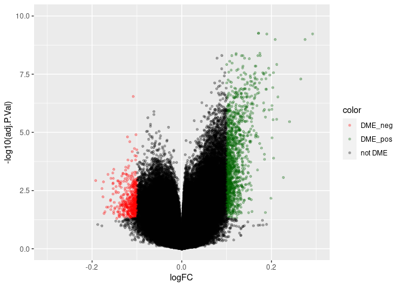

EOPE EWAS Visualization
================
William Casazza
April 8, 2020

    ## Loading required package: Biobase

    ## Loading required package: BiocGenerics

    ## Loading required package: parallel

    ## 
    ## Attaching package: 'BiocGenerics'

    ## The following objects are masked from 'package:parallel':
    ## 
    ##     clusterApply, clusterApplyLB, clusterCall, clusterEvalQ,
    ##     clusterExport, clusterMap, parApply, parCapply, parLapply,
    ##     parLapplyLB, parRapply, parSapply, parSapplyLB

    ## The following objects are masked from 'package:stats':
    ## 
    ##     IQR, mad, sd, var, xtabs

    ## The following objects are masked from 'package:base':
    ## 
    ##     anyDuplicated, append, as.data.frame, basename, cbind, colnames,
    ##     dirname, do.call, duplicated, eval, evalq, Filter, Find, get, grep,
    ##     grepl, intersect, is.unsorted, lapply, Map, mapply, match, mget,
    ##     order, paste, pmax, pmax.int, pmin, pmin.int, Position, rank,
    ##     rbind, Reduce, rownames, sapply, setdiff, sort, table, tapply,
    ##     union, unique, unsplit, which, which.max, which.min

    ## Welcome to Bioconductor
    ## 
    ##     Vignettes contain introductory material; view with
    ##     'browseVignettes()'. To cite Bioconductor, see
    ##     'citation("Biobase")', and for packages 'citation("pkgname")'.

    ## Setting options('download.file.method.GEOquery'='auto')

    ## Setting options('GEOquery.inmemory.gpl'=FALSE)

    ## 
    ## Attaching package: 'limma'

    ## The following object is masked from 'package:BiocGenerics':
    ## 
    ##     plotMA

## Dataset from wilson et al 2016

Download from
[GEO](https://ftp.ncbi.nlm.nih.gov/geo/series/GSE100nnn/GSE100197/matrix/GSE100197_series_matrix.txt.gz)

``` r
eset <- getGEO(file="GSE100197_series_matrix.txt.gz",)
```

    ## Parsed with column specification:
    ## cols(
    ##   .default = col_double(),
    ##   ID_REF = col_character()
    ## )

    ## See spec(...) for full column specifications.

    ## File stored at:

    ## /tmp/RtmpQdJPh3/GPL13534.soft

    ## Warning: 65 parsing failures.
    ##    row     col           expected     actual         file
    ## 485513 SPOT_ID 1/0/T/F/TRUE/FALSE rs10796216 literal data
    ## 485514 SPOT_ID 1/0/T/F/TRUE/FALSE rs715359   literal data
    ## 485515 SPOT_ID 1/0/T/F/TRUE/FALSE rs1040870  literal data
    ## 485516 SPOT_ID 1/0/T/F/TRUE/FALSE rs10936224 literal data
    ## 485517 SPOT_ID 1/0/T/F/TRUE/FALSE rs213028   literal data
    ## ...... ....... .................. .......... ............
    ## See problems(...) for more details.

``` r
metadata <- pData(eset)
colnames(metadata)<- gsub(":ch1| ","",colnames(metadata))
metadata <- metadata[!metadata$pathologygroup == "REPLICATE",]
metadata$gestationalage <- as.numeric(metadata$gestationalage)
metadata$int_grp <- paste0(metadata$pathologygroup,metadata$fetalsex)
metadata$status <- sapply( metadata$pathologygroup, function(x)if(x== "Term" | x == "PreT"){return("CONTROL")} else{return(x)})
methy <- exprs(eset)
matched <- match(rownames(metadata),colnames(methy))
methy <- methy[,matched]
```

## Fit linear model and relevant contrasts

``` r
model <- model.matrix(~ 0+ pathologygroup + fetalsex, data=metadata)
fit <- lmFit(methy, model)
fit <- eBayes(fit)
contrasts <- makeContrasts(
preTEOPE=pathologygroupPreT-pathologygroupEOPE,
preTLOPE=pathologygroupPreT-pathologygroupLOPE,
preTIUGR=pathologygroupPreT-pathologygroupIUGR,
termEOPE=pathologygroupTerm-pathologygroupEOPE,
termLOPE=pathologygroupTerm-pathologygroupLOPE,
termIUGR=pathologygroupTerm-pathologygroupIUGR,
sex=fetalsexMALE,levels=model)
fitCont <- contrasts.fit(fit,contrasts)
fitCont <- eBayes(fitCont)
```

## Extract stats from relevant comparisons

``` r
eope_stats <- topTable(fitCont,coef = "preTEOPE", adjust.method = "BH", p.value = 0.05, lfc = 0.1, number = Inf)
nrow(eope_stats)
```

    ## [1] 1689

``` r
eope_sex <- topTable(fitCont,coef = "sex", adjust.method = "BH", p.value = 0.05, lfc = 0.1, number = Inf)
nrow(eope_sex)
```

    ## [1] 155

Published data

``` r
pub_dme <- read.csv(
  "ddx391_ST1_PersistentHits599_GeneInfo_2017.csv", 
  stringsAsFactors = F)
pub_dme <- pub_dme[pub_dme$Probe %in% rownames(eope_stats),]
```

## Plots

### Correlation

``` r
shared_hits_df <- as.data.frame(cbind(pub_dme,eope_stats[pub_dme$Probe,]))
corr <- cor.test(-log10(shared_hits_df$adj.P.Val),-log10(shared_hits_df$EOPE.vs.Pre.term.p.value..Discovery.Cohort),method="pearson")
corr2 <-cor.test(shared_hits_df$EOPE.Δβ..Discovery.Cohort,shared_hits_df$logFC, method = "pearson")
ggplot(shared_hits_df, aes(-log10(EOPE.vs.Pre.term.p.value..Discovery.Cohort),-log10(adj.P.Val))) + 
  geom_point()+  
  coord_cartesian(xlim=c(0,15),ylim=c(0,15))+
  geom_abline(slope = 1,intercept = c(0,0))+
  ggtitle(sprintf("R:%0.3f",corr$estimate))
```

<!-- -->

``` r
ggplot(shared_hits_df, aes(EOPE.Δβ..Discovery.Cohort,logFC)) + 
  geom_point()+  
  geom_abline(slope = 1,intercept = c(0,0))+
  ggtitle(sprintf("R:%0.3f",corr2$estimate))
```

<!-- -->

``` r
plot_stats <- function(cont){
all_eope_stats <- topTable(fitCont,coef = cont, adjust.method = "BH",number = Inf)
all_eope_stats$color <- ifelse(
  all_eope_stats$adj.P.Val <0.05,
  ifelse(
    all_eope_stats$logFC > 0.1,
    "DME_pos",
    ifelse(all_eope_stats$logFC < -0.1,
      "DME_neg",
      "not DME"
    )),
  "not DME")
p <- ggplot(all_eope_stats, aes(logFC,-log10(adj.P.Val),color=color)) + 
  geom_point(size=1,alpha=0.3)+
  scale_color_manual(values = c("DME_pos"="dark green","DME_neg"="red","not DME"="black"))+
  coord_cartesian(xlim=c(-0.3,0.3),ylim=c(0,10))
print(p)
return(all_eope_stats)
}
eope_all_stat <-plot_stats("preTEOPE")
```

<!-- -->

``` r
lope_all_stat<- plot_stats("termLOPE")
```

<!-- -->

``` r
sum(abs(eope_all_stat$logFC) >0.1& eope_all_stat$adj.P.Val <0.05)
```

    ## [1] 1689

``` r
sum(abs(lope_all_stat$logFC) > 0.1 & lope_all_stat$adj.P.Val <0.05)
```

    ## [1] 6
