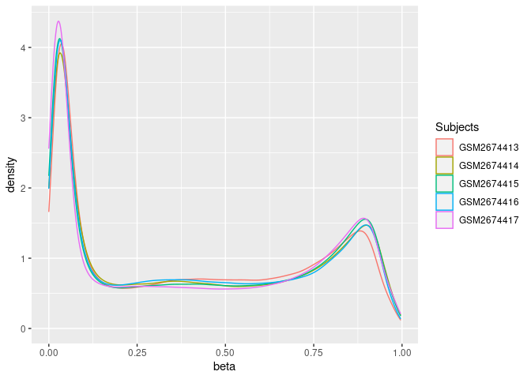
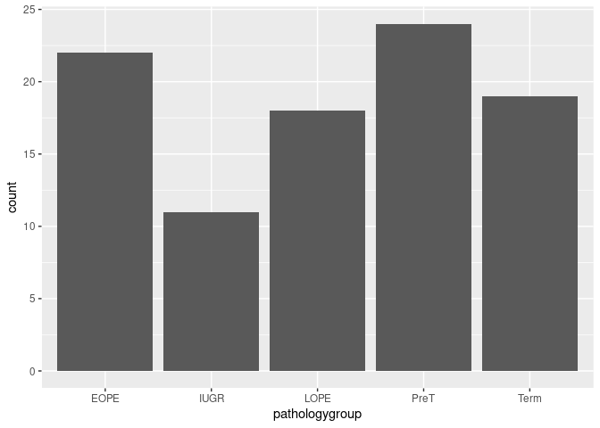
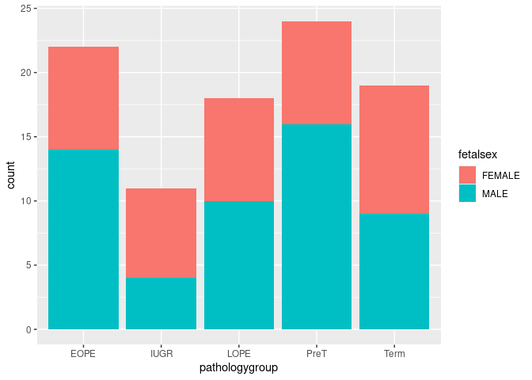
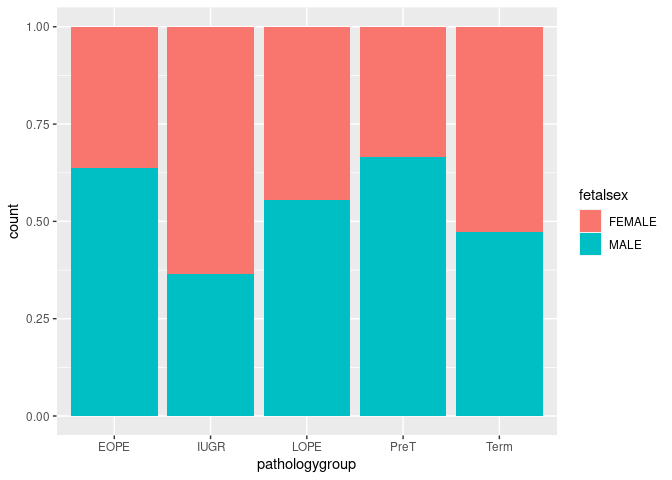
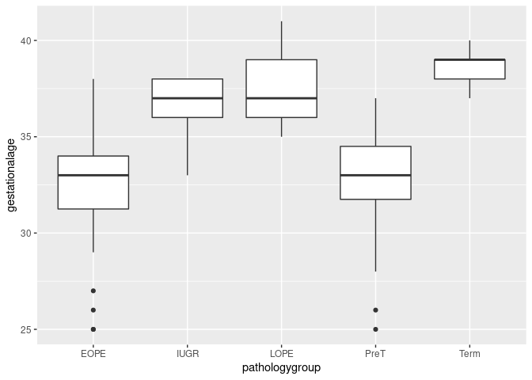
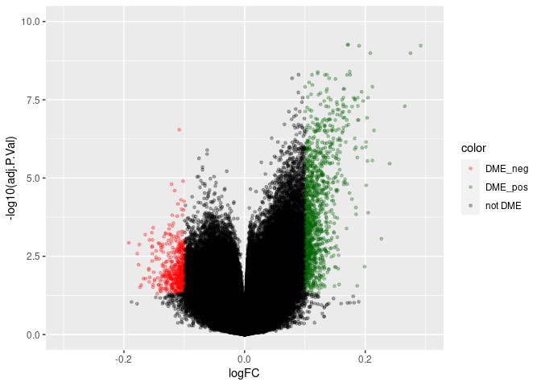
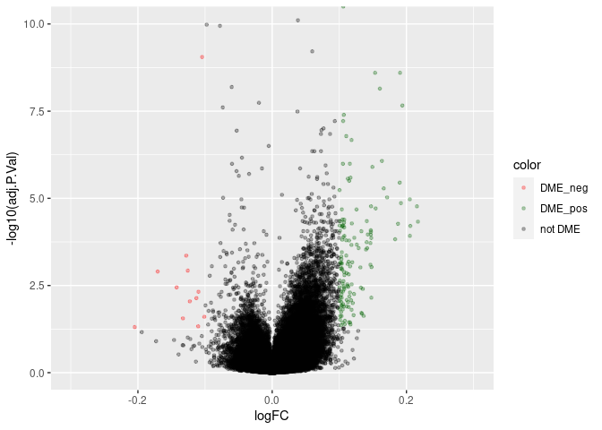

EOPE EWAS Visualization
================
William Casazza
October 29, 2020

# Running an Epigenome Wide Association Study on Data from GEO

## Introduction

Welcome all to the first in a three part series on working with publicly
available data from the 450K array\! This worksheet will walk you
through the oddities of downloading data from the Gene Expression
Omnibus (GEO), all the way to running some linear models to detect sites
that are differentially methylated between case and control groups\!

### The data

We will be repeating an analysis using processed data from Illumina’s
450k DNA methylation array. The samples were taken from placenta, where
subjects had different complications during birth, including early and
late onset pre-eclampsia (EOPE and LOPE), as well as intrauterine growth
restriction (IUGR) . For more information on this study please refer to
[Wilson et
al, 2016](https://doi-org.ezproxy.library.ubc.ca/10.1093/hmg/ddx391).

### R packages and set-up

The following packages will be required for this tutorial, if you have
not already done so you can install them by pasting the following
commands into your R console:

``` r
install.packages("BiocManager")
BiocManager::install(c(
  "GEOquery", # For loading data from GEO
  "Biobase", # For changing the format of data from GEO
  "limma", # For running differential methylation analysis
  "ggplot2" # For making nice plots,
  "reshape2" # For changing data formats
))
```

Once these packages have been installed, you can run the code chunk
below to load them for your current R session:

    ## Loading required package: Biobase

    ## Loading required package: BiocGenerics

    ## Loading required package: parallel

    ## 
    ## Attaching package: 'BiocGenerics'

    ## The following objects are masked from 'package:parallel':
    ## 
    ##     clusterApply, clusterApplyLB, clusterCall, clusterEvalQ,
    ##     clusterExport, clusterMap, parApply, parCapply, parLapply,
    ##     parLapplyLB, parRapply, parSapply, parSapplyLB

    ## The following objects are masked from 'package:stats':
    ## 
    ##     IQR, mad, sd, var, xtabs

    ## The following objects are masked from 'package:base':
    ## 
    ##     anyDuplicated, append, as.data.frame, basename, cbind, colnames,
    ##     dirname, do.call, duplicated, eval, evalq, Filter, Find, get, grep,
    ##     grepl, intersect, is.unsorted, lapply, Map, mapply, match, mget,
    ##     order, paste, pmax, pmax.int, pmin, pmin.int, Position, rank,
    ##     rbind, Reduce, rownames, sapply, setdiff, sort, table, tapply,
    ##     union, unique, unsplit, which, which.max, which.min

    ## Welcome to Bioconductor
    ## 
    ##     Vignettes contain introductory material; view with
    ##     'browseVignettes()'. To cite Bioconductor, see
    ##     'citation("Biobase")', and for packages 'citation("pkgname")'.

    ## Setting options('download.file.method.GEOquery'='auto')

    ## Setting options('GEOquery.inmemory.gpl'=FALSE)

    ## 
    ## Attaching package: 'limma'

    ## The following object is masked from 'package:BiocGenerics':
    ## 
    ##     plotMA

## Step 1: Downloading and formatting the data

The datasets requried for this tutorial can be downloaded
[here](https://ftp.ncbi.nlm.nih.gov/geo/series/GSE100nnn/GSE100197/matrix/GSE100197_series_matrix.txt.gz).
Place this `GSE100197_series_matrix.txt.gz` file in the same folder as
`eope_ewas_workflow.Rmd`, and proceed by running code in the
`eope_ewas_workflow.Rmd` file.

Data from GEO is stored as a special `series_matrix.txt.gz` file. This
file typically contains processed count or methylation data, *in
addition to* phenotypic information like disease status, sex, and
age.\[1\].

The `getGEO` function loads in this data as a special *object* and we
can access phenotypes and methylation tables from this dataset using the
`pData` and `exprs` function respectively:

### Loading the GEO object:

``` r
eset <- getGEO(file="GSE100197_series_matrix.txt.gz")
```

    ## Parsed with column specification:
    ## cols(
    ##   .default = col_double(),
    ##   ID_REF = col_character()
    ## )

    ## See spec(...) for full column specifications.

    ## File stored at:

    ## /tmp/RtmphbG2Ek/GPL13534.soft

    ## Warning: 65 parsing failures.
    ##    row     col           expected     actual         file
    ## 485513 SPOT_ID 1/0/T/F/TRUE/FALSE rs10796216 literal data
    ## 485514 SPOT_ID 1/0/T/F/TRUE/FALSE rs715359   literal data
    ## 485515 SPOT_ID 1/0/T/F/TRUE/FALSE rs1040870  literal data
    ## 485516 SPOT_ID 1/0/T/F/TRUE/FALSE rs10936224 literal data
    ## 485517 SPOT_ID 1/0/T/F/TRUE/FALSE rs213028   literal data
    ## ...... ....... .................. .......... ............
    ## See problems(...) for more details.

``` r
# alternatively uncomment and run the command below:
# eset <- getGEO("GSE100197")
eset
```

    ## ExpressionSet (storageMode: lockedEnvironment)
    ## assayData: 441093 features, 102 samples 
    ##   element names: exprs 
    ## protocolData: none
    ## phenoData
    ##   sampleNames: GSM2674413 GSM2674414 ... GSM2674514 (102 total)
    ##   varLabels: title geo_accession ... subject id:ch1 (49 total)
    ##   varMetadata: labelDescription
    ## featureData
    ##   featureNames: cg00000029 cg00000108 ... ch.9.991104F (441093 total)
    ##   fvarLabels: ID Name ... SPOT_ID (37 total)
    ##   fvarMetadata: Column Description labelDescription
    ## experimentData: use 'experimentData(object)'
    ##   pubMedIds: 29092053 
    ## Annotation: GPL13534

From the above printout, we can see that the object contains an “assay”
stored under `assayData` and variables stored under `phenoData`. These
functions can be used for neatly viewing the data, but for our purposes
we will need to get them as a `matrix`.

### Formatting the metadata (all data that *isn’t* DNA methylation)

We can use `pData` to get the phenotypes of our subjects as a matrix:

``` r
metadata <- pData(eset)
head(metadata)
```

    ##                                            title geo_accession
    ## GSM2674413  genomic DNA from PL130 EOPE placenta    GSM2674413
    ## GSM2674414 genomic DNA from PL131 EOPE  placenta    GSM2674414
    ## GSM2674415 genomic DNA from PM116 EOPE  placenta    GSM2674415
    ## GSM2674416   genomic DNA from PM12 EOPE placenta    GSM2674416
    ## GSM2674417 genomic DNA from PM129 EOPE  placenta    GSM2674417
    ## GSM2674418 genomic DNA from PM138 EOPE  placenta    GSM2674418
    ##                           status submission_date last_update_date    type
    ## GSM2674413 Public on May 11 2018     Jun 19 2017      May 11 2018 genomic
    ## GSM2674414 Public on May 11 2018     Jun 19 2017      May 11 2018 genomic
    ## GSM2674415 Public on May 11 2018     Jun 19 2017      Mar 25 2019 genomic
    ## GSM2674416 Public on May 11 2018     Jun 19 2017      Mar 25 2019 genomic
    ## GSM2674417 Public on May 11 2018     Jun 19 2017      Mar 25 2019 genomic
    ## GSM2674418 Public on May 11 2018     Jun 19 2017      Mar 25 2019 genomic
    ##            channel_count source_name_ch1 organism_ch1 characteristics_ch1
    ## GSM2674413             1   EOPE_placenta Homo sapiens   subject id: PL130
    ## GSM2674414             1   EOPE_placenta Homo sapiens   subject id: PL131
    ## GSM2674415             1   EOPE_placenta Homo sapiens   subject id: PM116
    ## GSM2674416             1   EOPE_placenta Homo sapiens    subject id: PM12
    ## GSM2674417             1   EOPE_placenta Homo sapiens   subject id: PM129
    ## GSM2674418             1   EOPE_placenta Homo sapiens   subject id: PM138
    ##            characteristics_ch1.1 characteristics_ch1.2 characteristics_ch1.3
    ## GSM2674413 pathology group: EOPE       fetal sex: MALE   gestational age: 33
    ## GSM2674414 pathology group: EOPE     fetal sex: FEMALE   gestational age: 34
    ## GSM2674415 pathology group: EOPE       fetal sex: MALE   gestational age: 32
    ## GSM2674416 pathology group: EOPE       fetal sex: MALE   gestational age: 32
    ## GSM2674417 pathology group: EOPE       fetal sex: MALE   gestational age: 37
    ## GSM2674418 pathology group: EOPE       fetal sex: MALE   gestational age: 34
    ##                     characteristics_ch1.4      characteristics_ch1.5
    ## GSM2674413 sample tissue: Chorionic Villi 450k plate: WG0009065-MSA4
    ## GSM2674414 sample tissue: Chorionic Villi  450k plate: WG000907-MSA4
    ## GSM2674415 sample tissue: Chorionic Villi 450k plate: WG0003252-MSA2
    ## GSM2674416 sample tissue: Chorionic Villi 450k plate: WG0003252-MSA2
    ## GSM2674417 sample tissue: Chorionic Villi 450k plate: WG0003252-MSA2
    ## GSM2674418 sample tissue: Chorionic Villi  450k plate: WG000907-MSA4
    ##                  characteristics_ch1.6         characteristics_ch1.7
    ## GSM2674413 450k sentrix_id: 7970368097 450k sentrix_position: R05C02
    ## GSM2674414 450k sentrix_id: 7970368023 450k sentrix_position: R06C02
    ## GSM2674415 450k sentrix_id: 6042324020 450k sentrix_position: R04C02
    ## GSM2674416 450k sentrix_id: 6042308147 450k sentrix_position: R01C02
    ## GSM2674417 450k sentrix_id: 6042324020 450k sentrix_position: R05C02
    ## GSM2674418 450k sentrix_id: 7973201026 450k sentrix_position: R02C01
    ##            molecule_ch1
    ## GSM2674413  genomic DNA
    ## GSM2674414  genomic DNA
    ## GSM2674415  genomic DNA
    ## GSM2674416  genomic DNA
    ## GSM2674417  genomic DNA
    ## GSM2674418  genomic DNA
    ##                                                                                                                 extract_protocol_ch1
    ## GSM2674413 genomic DNA was extracted by standard salt method and purified using Qiagen DNeasy Kit according to standard instructions
    ## GSM2674414 genomic DNA was extracted by standard salt method and purified using Qiagen DNeasy Kit according to standard instructions
    ## GSM2674415 genomic DNA was extracted by standard salt method and purified using Qiagen DNeasy Kit according to standard instructions
    ## GSM2674416 genomic DNA was extracted by standard salt method and purified using Qiagen DNeasy Kit according to standard instructions
    ## GSM2674417 genomic DNA was extracted by standard salt method and purified using Qiagen DNeasy Kit according to standard instructions
    ## GSM2674418 genomic DNA was extracted by standard salt method and purified using Qiagen DNeasy Kit according to standard instructions
    ##              label_ch1         label_protocol_ch1 taxid_ch1
    ## GSM2674413 Cy5 and Cy3 Standard Illumina Protocol      9606
    ## GSM2674414 Cy5 and Cy3 Standard Illumina Protocol      9606
    ## GSM2674415 Cy5 and Cy3 Standard Illumina Protocol      9606
    ## GSM2674416 Cy5 and Cy3 Standard Illumina Protocol      9606
    ## GSM2674417 Cy5 and Cy3 Standard Illumina Protocol      9606
    ## GSM2674418 Cy5 and Cy3 Standard Illumina Protocol      9606
    ##                                                                                                                                                     hyb_protocol
    ## GSM2674413 bisulphite converted DNA was amplified, fragmented and hybridised to Illumina Infinium Human Methylation450 Beadchip using standard Illumina protocol
    ## GSM2674414 bisulphite converted DNA was amplified, fragmented and hybridised to Illumina Infinium Human Methylation450 Beadchip using standard Illumina protocol
    ## GSM2674415 bisulphite converted DNA was amplified, fragmented and hybridised to Illumina Infinium Human Methylation450 Beadchip using standard Illumina protocol
    ## GSM2674416 bisulphite converted DNA was amplified, fragmented and hybridised to Illumina Infinium Human Methylation450 Beadchip using standard Illumina protocol
    ## GSM2674417 bisulphite converted DNA was amplified, fragmented and hybridised to Illumina Infinium Human Methylation450 Beadchip using standard Illumina protocol
    ## GSM2674418 bisulphite converted DNA was amplified, fragmented and hybridised to Illumina Infinium Human Methylation450 Beadchip using standard Illumina protocol
    ##                                                                                            scan_protocol
    ## GSM2674413 Arrays were imaged using BeadArray Reader using standard recommended Illumina scanner setting
    ## GSM2674414 Arrays were imaged using BeadArray Reader using standard recommended Illumina scanner setting
    ## GSM2674415 Arrays were imaged using BeadArray Reader using standard recommended Illumina scanner setting
    ## GSM2674416 Arrays were imaged using BeadArray Reader using standard recommended Illumina scanner setting
    ## GSM2674417 Arrays were imaged using BeadArray Reader using standard recommended Illumina scanner setting
    ## GSM2674418 Arrays were imaged using BeadArray Reader using standard recommended Illumina scanner setting
    ##            data_processing
    ## GSM2674413 R version 3.2.5
    ## GSM2674414 R version 3.2.5
    ## GSM2674415 R version 3.2.5
    ## GSM2674416 R version 3.2.5
    ## GSM2674417 R version 3.2.5
    ## GSM2674418 R version 3.2.5
    ##                                                                                      data_processing.1
    ## GSM2674413 The matrix_signal_Wilson_PEIUGR.csv contains Unmethylated and methylated signal intensities
    ## GSM2674414 The matrix_signal_Wilson_PEIUGR.csv contains Unmethylated and methylated signal intensities
    ## GSM2674415 The matrix_signal_Wilson_PEIUGR.csv contains Unmethylated and methylated signal intensities
    ## GSM2674416 The matrix_signal_Wilson_PEIUGR.csv contains Unmethylated and methylated signal intensities
    ## GSM2674417 The matrix_signal_Wilson_PEIUGR.csv contains Unmethylated and methylated signal intensities
    ## GSM2674418 The matrix_signal_Wilson_PEIUGR.csv contains Unmethylated and methylated signal intensities
    ##            platform_id    contact_name           contact_email
    ## GSM2674413    GPL13534 Wendy,,Robinson wprobinsonlab@gmail.com
    ## GSM2674414    GPL13534 Wendy,,Robinson wprobinsonlab@gmail.com
    ## GSM2674415    GPL13534 Wendy,,Robinson wprobinsonlab@gmail.com
    ## GSM2674416    GPL13534 Wendy,,Robinson wprobinsonlab@gmail.com
    ## GSM2674417    GPL13534 Wendy,,Robinson wprobinsonlab@gmail.com
    ## GSM2674418    GPL13534 Wendy,,Robinson wprobinsonlab@gmail.com
    ##            contact_laboratory contact_department              contact_institute
    ## GSM2674413           Robinosn   Medical Genetics University of British Columbia
    ## GSM2674414           Robinosn   Medical Genetics University of British Columbia
    ## GSM2674415           Robinosn   Medical Genetics University of British Columbia
    ## GSM2674416           Robinosn   Medical Genetics University of British Columbia
    ## GSM2674417           Robinosn   Medical Genetics University of British Columbia
    ## GSM2674418           Robinosn   Medical Genetics University of British Columbia
    ##            contact_address contact_city contact_state contact_zip/postal_code
    ## GSM2674413  950 W 28th Ave    Vancouver            BC                 V5Z 4H4
    ## GSM2674414  950 W 28th Ave    Vancouver            BC                 V5Z 4H4
    ## GSM2674415  950 W 28th Ave    Vancouver            BC                 V5Z 4H4
    ## GSM2674416  950 W 28th Ave    Vancouver            BC                 V5Z 4H4
    ## GSM2674417  950 W 28th Ave    Vancouver            BC                 V5Z 4H4
    ## GSM2674418  950 W 28th Ave    Vancouver            BC                 V5Z 4H4
    ##            contact_country
    ## GSM2674413          Canada
    ## GSM2674414          Canada
    ## GSM2674415          Canada
    ## GSM2674416          Canada
    ## GSM2674417          Canada
    ## GSM2674418          Canada
    ##                                                                                                     supplementary_file
    ## GSM2674413 ftp://ftp.ncbi.nlm.nih.gov/geo/samples/GSM2674nnn/GSM2674413/suppl/GSM2674413_7970368097_R05C02_Grn.idat.gz
    ## GSM2674414 ftp://ftp.ncbi.nlm.nih.gov/geo/samples/GSM2674nnn/GSM2674414/suppl/GSM2674414_7970368023_R06C02_Grn.idat.gz
    ## GSM2674415 ftp://ftp.ncbi.nlm.nih.gov/geo/samples/GSM2674nnn/GSM2674415/suppl/GSM2674415_6042324020_R04C02_Grn.idat.gz
    ## GSM2674416 ftp://ftp.ncbi.nlm.nih.gov/geo/samples/GSM2674nnn/GSM2674416/suppl/GSM2674416_6042308147_R01C02_Grn.idat.gz
    ## GSM2674417 ftp://ftp.ncbi.nlm.nih.gov/geo/samples/GSM2674nnn/GSM2674417/suppl/GSM2674417_6042324020_R05C02_Grn.idat.gz
    ## GSM2674418 ftp://ftp.ncbi.nlm.nih.gov/geo/samples/GSM2674nnn/GSM2674418/suppl/GSM2674418_7973201026_R02C01_Grn.idat.gz
    ##                                                                                                   supplementary_file.1
    ## GSM2674413 ftp://ftp.ncbi.nlm.nih.gov/geo/samples/GSM2674nnn/GSM2674413/suppl/GSM2674413_7970368097_R05C02_Red.idat.gz
    ## GSM2674414 ftp://ftp.ncbi.nlm.nih.gov/geo/samples/GSM2674nnn/GSM2674414/suppl/GSM2674414_7970368023_R06C02_Red.idat.gz
    ## GSM2674415 ftp://ftp.ncbi.nlm.nih.gov/geo/samples/GSM2674nnn/GSM2674415/suppl/GSM2674415_6042324020_R04C02_Red.idat.gz
    ## GSM2674416 ftp://ftp.ncbi.nlm.nih.gov/geo/samples/GSM2674nnn/GSM2674416/suppl/GSM2674416_6042308147_R01C02_Red.idat.gz
    ## GSM2674417 ftp://ftp.ncbi.nlm.nih.gov/geo/samples/GSM2674nnn/GSM2674417/suppl/GSM2674417_6042324020_R05C02_Red.idat.gz
    ## GSM2674418 ftp://ftp.ncbi.nlm.nih.gov/geo/samples/GSM2674nnn/GSM2674418/suppl/GSM2674418_7973201026_R02C01_Red.idat.gz
    ##            data_row_count relation 450k plate:ch1 450k sentrix_id:ch1
    ## GSM2674413         441093          WG0009065-MSA4          7970368097
    ## GSM2674414         441093           WG000907-MSA4          7970368023
    ## GSM2674415         441093          WG0003252-MSA2          6042324020
    ## GSM2674416         441093          WG0003252-MSA2          6042308147
    ## GSM2674417         441093          WG0003252-MSA2          6042324020
    ## GSM2674418         441093           WG000907-MSA4          7973201026
    ##            450k sentrix_position:ch1 fetal sex:ch1 gestational age:ch1
    ## GSM2674413                    R05C02          MALE                  33
    ## GSM2674414                    R06C02        FEMALE                  34
    ## GSM2674415                    R04C02          MALE                  32
    ## GSM2674416                    R01C02          MALE                  32
    ## GSM2674417                    R05C02          MALE                  37
    ## GSM2674418                    R02C01          MALE                  34
    ##            pathology group:ch1 sample tissue:ch1 subject id:ch1
    ## GSM2674413                EOPE   Chorionic Villi          PL130
    ## GSM2674414                EOPE   Chorionic Villi          PL131
    ## GSM2674415                EOPE   Chorionic Villi          PM116
    ## GSM2674416                EOPE   Chorionic Villi           PM12
    ## GSM2674417                EOPE   Chorionic Villi          PM129
    ## GSM2674418                EOPE   Chorionic Villi          PM138

``` r
# Rename weird columns
colnames(metadata) <- gsub(":ch1| ","",colnames(metadata))

# Select just the variables we want to analyse
metadata <- metadata[,c("pathologygroup","fetalsex","gestationalage")]
head(metadata)
```

    ##            pathologygroup fetalsex gestationalage
    ## GSM2674413           EOPE     MALE             33
    ## GSM2674414           EOPE   FEMALE             34
    ## GSM2674415           EOPE     MALE             32
    ## GSM2674416           EOPE     MALE             32
    ## GSM2674417           EOPE     MALE             37
    ## GSM2674418           EOPE     MALE             34

We can now do the following:

1.  Remove Replicate samples

2.  Make sure age is encoded as a NUMBER

<!-- end list -->

``` r
# Step 1
metadata <- metadata[!metadata$pathologygroup == "REPLICATE",] 

# Step 2
metadata$gestationalage <- as.numeric(metadata$gestationalage) 

head(metadata)
```

    ##            pathologygroup fetalsex gestationalage
    ## GSM2674413           EOPE     MALE             33
    ## GSM2674414           EOPE   FEMALE             34
    ## GSM2674415           EOPE     MALE             32
    ## GSM2674416           EOPE     MALE             32
    ## GSM2674417           EOPE     MALE             37
    ## GSM2674418           EOPE     MALE             34

### Re-ordering our methylation data

Now that we’ve removed some samples based on our phenotype data, we
should load in our methylation data using the `exprs` function, and then
use the `match` function to match the samples in our `metadata` matrix
to those in our methylation matrix:

``` r
methy <- exprs(eset)
methy[1:5,1:5]
```

    ##            GSM2674413 GSM2674414 GSM2674415 GSM2674416 GSM2674417
    ## cg00000029 0.07330516 0.07052873 0.05558345 0.05018896 0.04320441
    ## cg00000108 0.92319429 0.93025061 0.93145884 0.94220902 0.92775669
    ## cg00000109 0.84318153 0.75778393 0.87411812 0.87868939 0.85713039
    ## cg00000165 0.70694821 0.56648355 0.53227554 0.46992275 0.74377100
    ## cg00000236 0.79110581 0.80135172 0.80832100 0.84663831 0.81543150

``` r
dim(methy)
```

    ## [1] 441093    102

``` r
matched <- match(rownames(metadata),colnames(methy))
methy <- methy[,matched]
dim(methy)
```

    ## [1] 441093     94

``` r
all(colnames(methy) == rownames(metadata))
```

    ## [1] TRUE

## Step 2: Data visualization

Visualizing data can be a good way to make sure that we 1) understand
the format of our data exactly and 2) haven’t made any unexpected
mistakes in processing.

For example, we can visualize DNA methylation for several samples to
make sure that the distribution of \(\beta\) values is what we expect.
In placenta, we expect for most CpG sites that DNA methylation will be
low or high. However, an interesting quirk of placental DNA methylation
is that many sites will show intermediate levels of methylation as well,
giving our density distribution a characteristic “three-hump” shape.

Let’s plot the distribution of all \(\beta\) values for the first 5
subjects:

``` r
# First reformat data for ggplot
to_plot <- melt(
  methy[,1:5],
  value.name = "beta",
  varnames = c("Probes","Subjects") # c(rownames,colnames)
)

head(to_plot)
```

    ##       Probes   Subjects       beta
    ## 1 cg00000029 GSM2674413 0.07330516
    ## 2 cg00000108 GSM2674413 0.92319429
    ## 3 cg00000109 GSM2674413 0.84318153
    ## 4 cg00000165 GSM2674413 0.70694821
    ## 5 cg00000236 GSM2674413 0.79110581
    ## 6 cg00000289 GSM2674413 0.57904848

``` r
ggplot(to_plot,aes(x=beta,color=Subjects)) +
  geom_density()
```

<!-- -->

Lets also look at the phenotypic characteristics of our data:

``` r
ggplot(metadata,aes(pathologygroup)) + geom_bar()
```

<!-- -->

``` r
ggplot(metadata,aes(x=pathologygroup, fill=fetalsex)) + 
  geom_bar() 
```

<!-- -->

``` r
ggplot(metadata,aes(x=pathologygroup, fill=fetalsex)) + 
  geom_bar(position="fill")
```

<!-- -->

``` r
ggplot(metadata,aes(x=pathologygroup, y=gestationalage)) + 
  geom_boxplot() 
```

<!-- -->

## Step 3: Fit linear model and relevant contrasts

Now it’s time to test whether there is differential DNA methylation
between groups. Using *linear modeling*, we can examine this
relationship at each CpG.

You might remember learning the formula *y = mx + b* in math class,
where “m” represents the slope, and “b” represents the intercept. We can
model the relationship between CpG methylation and our variable of
interest in the same way.

We consider “y” to be the level of DNA methylation, or beta value, and
we consider “x” to be our variable of interest, in this case the
pathology group.


However, each CpG site might have a different relationship between
methylation and pathology group. For example, methylation levels at CpGs
located in genes related to fetal growth might have a stronger
relationship with pathology (a larger “m” value, or slope), whereas
methylation levels at CpGs located outside of genes or in genes with
totally unrelated functions could have no relationship with pathology
(m=0).


In differential DNA methylation analysis, we will *run a linear model
across each CpG* to evaluate its relationship with with pathology. To
accomplish this, we will use the R package *limma* (Smyth et al., 2002).
Limma will fit the model across every CpG, and return statistics
including the coeffificent (slope) for the association between DNAm and
pathology, and p-values indiciating whether the association is
statistically significant. Then, we can narrow down the list to our
“hits”, or only the CpG sites which are differentially methylated (p
\< 0.05 for association between DNAm and pathology).

### Designing your model

In this study, there are multiple pathology groups, and data on other
variables such as fetal sex and gestational age. It’s important to
*define your research question* before designing your model, so that we
can compare the right groups to each other.

For this example, we hypothesized that pathology group and fetal sex
will each affect placental DNAm patterns. We can look at the effects of
pathology group and fetal sex using one formula, with the function
*model.matrix()* in limma.

``` r
model <- model.matrix(~ 0+ pathologygroup + fetalsex, data=metadata)
head(model)
```

    ##            pathologygroupEOPE pathologygroupIUGR pathologygroupLOPE
    ## GSM2674413                  1                  0                  0
    ## GSM2674414                  1                  0                  0
    ## GSM2674415                  1                  0                  0
    ## GSM2674416                  1                  0                  0
    ## GSM2674417                  1                  0                  0
    ## GSM2674418                  1                  0                  0
    ##            pathologygroupPreT pathologygroupTerm fetalsexMALE
    ## GSM2674413                  0                  0            1
    ## GSM2674414                  0                  0            0
    ## GSM2674415                  0                  0            1
    ## GSM2674416                  0                  0            1
    ## GSM2674417                  0                  0            1
    ## GSM2674418                  0                  0            1

The object “model” consists of a table detailing which samples belong to
which pathology group as well as the fetal sex. Since there are only two
sexes, there is one column for whether the fetal sex is male (yes/no).
Since there are five pathology groups, each group has its own column,
with a yes/no indiciating whether the sample is part of that group.

Feeding this table into the *lmFit()* function, along with an object
containing our DNAm data, will ask limma to examine the relationship
between DNA methylation and each of the five pathology groups one by
one, as well as the relationship between DNA methylation and fetal sex.
*eBayes()* will derive statistics such as p-values from this fit.

``` r
fit <- lmFit(methy, model)
fit <- eBayes(fit)
```

### Extracting comparisons of interest

What if we want to compare DNAm between two different pathology groups
instead of looking at them individually? To do this, we create a
*contrast matrix*, which is a table that tells limma which two groups to
compare to one another.

Here, we will contrast placentas from mothers with preterm infants
against placentas from mothers with early onset pre-eclampsia,
late-onset pre-eclampsia, and intrauterine growth restriction. We’ll do
the same contrasts for term infants. We will leave sex alone, to look at
the effect of sex across all the groups at the same time.

``` r
contrasts <- makeContrasts(
preTEOPE=pathologygroupPreT-pathologygroupEOPE,
preTLOPE=pathologygroupPreT-pathologygroupLOPE,
preTIUGR=pathologygroupPreT-pathologygroupIUGR,
termEOPE=pathologygroupTerm-pathologygroupEOPE,
termLOPE=pathologygroupTerm-pathologygroupLOPE,
termIUGR=pathologygroupTerm-pathologygroupIUGR,
sex=fetalsexMALE,levels=model)
head(contrasts)
```

    ##                     Contrasts
    ## Levels               preTEOPE preTLOPE preTIUGR termEOPE termLOPE termIUGR sex
    ##   pathologygroupEOPE       -1        0        0       -1        0        0   0
    ##   pathologygroupIUGR        0        0       -1        0        0       -1   0
    ##   pathologygroupLOPE        0       -1        0        0       -1        0   0
    ##   pathologygroupPreT        1        1        1        0        0        0   0
    ##   pathologygroupTerm        0        0        0        1        1        1   0
    ##   fetalsexMALE              0        0        0        0        0        0   1

Each comparison is indicated in a column of the contrast matrix, with
“1” indicating the reference group, and “-1” indicating the group we
are comparing against the reference. For example, the column “preTEOPE”
compares preterm placentas against early onset pre-eclampsia placentas,
where preterm placentas are the reference group. Looking at the rows,
the “pathologygroupPreT” has a value of “1”, whereas the
“pathologygroupEOPE” has a value of “-1”. The “0” in the other rows
indicates those groups are not part of this comparison.

Next, we use the function *contrasts.fit()* to fit our methylation data
to these comparisons, and run *eBayes()* again to derive statistics:

``` r
fitCont <- contrasts.fit(fit,contrasts)
fitCont <- eBayes(fitCont)
```

## Extract stats from relevant comparisons

Let’s take a closer look at the results from two of the above contrasts:
“preTEOPE” and “sex”. This is equivalent to asking the following
research questions:

1)  *Are there DNAm differences between placentas from mothers with
    preterm infants (PreT) and mothers with early onset pre-eclampsia
    (EOPE)?*

2)  *Are there DNAm differences between placentas from mothers who gave
    birth to male versus female infants?*

The function *topTable()* lets us extract detailed statistics
information for a single contrast of interest. We can set cutoffs for
significance and effect size such that only the information for
significant CpG sites is returned. Here, we will use an adjusted p-value
cutoff of \<0.05 and a log fold change cutoff of \>0.1.

``` r
eope_stats <- topTable(fitCont,coef = "preTEOPE", adjust.method = "BH", p.value = 0.05, lfc = 0.1, number = Inf)
nrow(eope_stats)
```

    ## [1] 1689

``` r
eope_sex <- topTable(fitCont,coef = "sex", adjust.method = "BH", p.value = 0.05, lfc = 0.1, number = Inf)
nrow(eope_sex)
```

    ## [1] 155

## Step 4: Plotting results from our EWAS

### Volcano plot

’Omics association study results are typically visualized using a
*volcano plot*, where the effect size is on the x axis and the -log
p-value is on the y-axis. This makes a “volcano” shape such that
significant hits look like they are “erupting” out into the top corners
of the plot.

The below code also categorizes hits by if they are significant with
increased methylation (DME\_pos), significant with decreased methylation
(DME\_neg), or non-significant (not DME). This allows us to colour these
points by category for easier visualization of hits.

``` r
plot_stats <- function(cont){
all_eope_stats <- topTable(fitCont,coef = cont, adjust.method = "BH",number = Inf)
all_eope_stats$color <- ifelse(
  all_eope_stats$adj.P.Val <0.05,
  ifelse(
    all_eope_stats$logFC > 0.1,
    "DME_pos",
    ifelse(all_eope_stats$logFC < -0.1,
      "DME_neg",
      "not DME"
    )),
  "not DME")
p <- ggplot(all_eope_stats, aes(logFC,-log10(adj.P.Val),color=color)) + 
  geom_point(size=1,alpha=0.3)+
  scale_color_manual(values = c("DME_pos"="dark green","DME_neg"="red","not DME"="black"))+
  coord_cartesian(xlim=c(-0.3,0.3),ylim=c(0,10))
print(p)
return(all_eope_stats)
}
eope_all_stat <-plot_stats("preTEOPE")
```

<!-- -->

``` r
lope_all_stat<- plot_stats("sex")
```

<!-- -->

1.  If you instead need to work from *raw* data from a methylation array
    (in the form of an `.idat` file), please look into the package
    `minfi`. A nice tutorial on processing this type of data by the
    maintainer of `minfi` is available
    [here](https://www.bioconductor.org/help/course-materials/2015/BioC2015/methylation450k.html).
