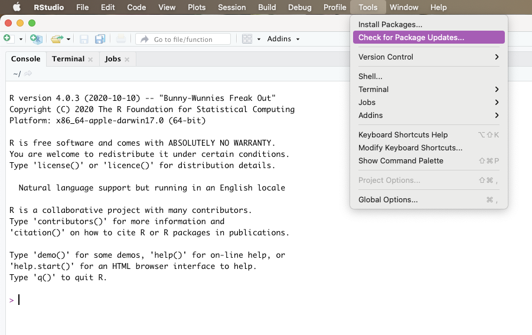
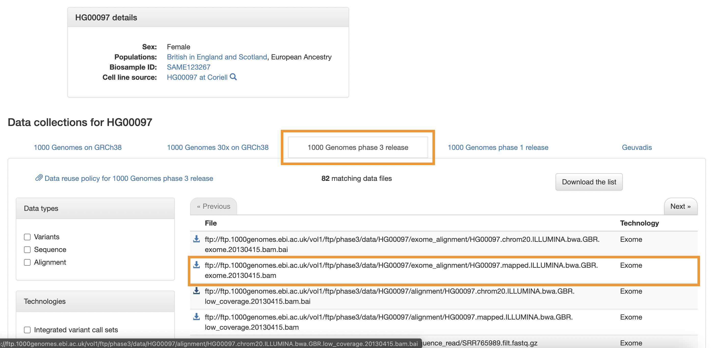

---
title: "TOG RNA-seq Workshop To-Dos" 
author: Nikita Telkar 
date: June 2021
output: 
  html_document:  
    keep_md: yes  
    toc: true  
    toc_depth: 4
    theme: flatly   
    highlight: pygments
---  


***  

### **Pre-Workshop To-Dos**  

In order to make sure that the workshop progresses as smoothly as possible (given that we have a number of steps to cover), please do complete the following to-dos before the workshop.  

***  

### **1.0 Update R and RStudio**  

1. Download the latest version of `R` [here](https://mirror.rcg.sfu.ca/mirror/CRAN/)  
2. Download the latest version of `RStudio` [here](https://www.rstudio.com/products/rstudio/download/#download)  

<br>  

#### **1.1 Update all packages**  

Once you have updated R and RStudio to their latest versions, open RStudio and select the Tools option from the menu bar.  
*Note: Do not open any R script when performing this step - choose the option as soon as you open RStudio.*  

   
<br>  

#### **1.2 Install these packages**  

Here's the list of all the packages you will need for this workshop. You can simply copy and paste the following into your RStudio console.  


```r
install.packages(c("tidyverse", "here", "rmarkdown", "knitr", "kableExtra", "janitor", "scales", "ggpubr",
    "pheatmap", "reshape2"))
    
install.packages("BiocManager")

BiocManager::install(c("clusterProfiler", "biomaRt", "edgeR", "limma", "Rsubread"))

remotes::install_github("wvictor14/plomics")
```

<br>  

#### **1.3 Create a New Project**  

Create a new project in RStudio with the following folders:  

1. data  
2. scripts  

`project_folder.Rproj` *(I've called mine TOG_RNAseq_Workshop_2021)*  
|  
|__ `data`  
|  
|__ `scripts`  

<br>  

#### **1.4 Download Expression and Phenotype files**  

Navigate to the [data folder at our workshop repo](https://github.com/BCCHR-trainee-omics-group/StudyGroup/tree/master/workshops/RNA-seq-Workshop-2021/data) on our GitHub, and download the following two files we'll be using to your `data` folder:    

1. `GSE157103_formatted_eDat.txt`  
2. `GSE157103_formatted_pDat.txt`  
3. `BAM_R_obj.RDS`  

To download, click on the file name, and it will diaplay a message saying *Sorry about that, but we can’t show files that are this big right now* with a **View Raw** link. Click on the link, wait for the browser to stop loading, and `right click + Save As...`. For any files not ending with the  `.txt` extension, make sure to remove the *.txt* suffix at the end while saving the file.  

For ease of usage, I've edited the raw files released on GEO to a [tidier](https://r4ds.had.co.nz/tidy-data.html) format, specifically for this workshop. To find out how I formatted these two files, you can download the `.Rmd` file titled `0_GSE157103_Data_Formatting.Rmd`.

***  

### **2.0 Brush up on your Stats**  

As we'll be going through a number of steps required for data processing and analysis, we won't have enough time to get into explanation of the statistical tests used, as well as when/why they're used for particular types of data. A few examples of the methods that we're going to apply are:  

- Linear Modelling  
- PCA  
- Normalization 
  
Here are a few resources that you might want to go through joining the workshop:  

- [Types of statistical tests](https://www.scribbr.com/statistics/statistical-tests/)   
- [Statistics definitions](https://terenceshin.medium.com/week-2-52-stats-cheat-sheet-ae38a2e5cdc6)  
- [The BCCHR Summer Statistics Video Series](https://bcchr.ca/summerprogram/statistical-videos)  

***  

### **3.0 Download BAM file or the corresponding R object**  

One of the steps we'll look at is converting BAM files to an expression count matrix.  

However, because the conversion form FASTQ (raw sequencing files) to BAM (aligned sequence files) requires time, as well as substantial computer memory and storage, I'll be directly demonstrating how to extract sequence/gene counts from an already generated BAM file.  

We'll be using the BAM file of a participant from Phase 3 of the Human Genome Project.  

If you want to conduct this step in real-time during the workshop (and your computer has enough storage space), download the file (557 Mb) [here](https://www.internationalgenome.org/data-portal/sample/HG00097), and save it to your `data` folder. If low on space, download the `BAM_R_obj.RDS` which is essentially the output we get after loadin in the BAM file (don't worry, we'll go through the command required to load in BAM files reagrdless!) 

  
  
***  

### **4.0 Skim through Journal Article**

Download the associated journal article for this data titled *Overmyer_2021.pdf* from the [GitHub repo](https://github.com/BCCHR-trainee-omics-group/StudyGroup/tree/master/workshops/RNA-seq-Workshop-2021).  

***  
  
   
    
     
      
       
        
        


