---
title: "TOG RNA-seq Workshop 2021: Part 1" 
author: Nikita Telkar 
date: July 2021
output: 
  html_document: 
    keep_md: yes 
    toc: true  
    toc_depth: 4
    toc_float: 
      collapsed: false 
      smooth_scroll: true
    theme: flatly  
    highlight: pygments 
---  

### 0.0 Introduction  

In this 2-part workshop, we're going to work through the steps of RNA-seq data analysis. We'll start with visualizing our raw data and doing some exploratory analysis, then move on to some basic quality control steps to produce cleaned expression counts, finally ending with enrichment analyses.    

For Part 1, we're going perform some exploratory analysis with our data and perform quality control steps, resulting in a processed expression matrix.  

***  

> Start of Part 1 

### 1.0 Loading Packages and Data  


These are the base level packages we will be needing to view and manipulate our data. Along with a dew formatting packages. I'll load the rest of the packages at the time of using the relevant functions required.  


```r
library(tidyverse)
library(here) 
library(rmarkdown)
library(knitr)

#formatting packages
library(kableExtra)
library(janitor)
library(scales)
library(ggpubr)
```

***  

### 2.0 FASTQ to BAM  

The raw sequence data that you get directly output from the sequencing machine is in the format of a FASTQ file. These are *unmapped* sequencing reads containing the information for each read generated, and is present in the following formatting:  

1. A sequence identifier with information about the sequencing run and the cluster. The exact contents of this line vary by based on the BCL to FASTQ conversion software used.  
2. The sequence (the base calls; A, C, T, G and N).  
3. A separator, which is simply a plus (+) sign.  
4. The base call quality scores. These are Phred +33 encoded, using ASCII characters to represent the numerical quality scores.  


These sequence-read files now need to be mapped to the genome. The process of mapping or alignment results in *mapped* SAM or BAM files.  

SAM: human-readable  
BAM: binary format of a SAM file (computer-readable)  

In order to generate your expression counts file, we need a BAM file. Usually, when you sned samples for sequencing, the centre will send you back the raw FASTQ files as well as aligned BAM files. 

The steps of FASTQ alignment / BAM generation generally include:  

1. Trimming of adaptors / indexes / UMIs from the sequencing reads  
2. Downloading the genome reference file (in FASTA format .fa) to which you want to align your FASTQ file (can be downloaded from ENCODE, UCSC)  
3. Generating index files from the reference genome (this step basically segments the genome into smaller separate 'indexes', which are then used to align short read sequences. Given that genomes are many billion bp long, this indexing allows mapping at a faster rate using the smaller sized index files)  
4. Aligning your trimmed reads to the reference genome using the index files.  

There are several software available for performing the above steps in a Linux environment, each having it's own features which might be better suited for different data types:    

1. Trimming: Trimmomatic, CutAdapt 
2. TopHat, Burrow-Wheeler Alignment (BWA), Bowtie2, STAR  

There are many tutorials available online that work through the steps of alignment: https://bioinformatics-core-shared-training.github.io/cruk-summer-school-2019/Introduction/SS_DB/Materials/Practicals/Practical2_alignment_JK.html  

The FASTQ_to_BAM HTML file I made briefly describes the general steps for genome alignment.  
*Note: You will need access to a high performance computing HPC cluster for this step - it works exclusively in Linux and MACOS, as well several GBs of storage space for the index and BAM files.*  

***  

### 3.0 BAM to Expression Count Files

Okay, once you have your BAM files, extracting the counts for your reads (i.e. how many times was a particular transcript sequenced) is pretty easy and straightforward, and you can do it in R itself!  
  
- If you downloaded the BAM file, run **command #1**    
- If downloaded the object `BAM_R_obj.RDS`, run **command #2** (which is basically the output you get from running command 1, and a smaller file size than the BAM file,  for the purpose of this workshop)  


```r
library(Rsubread)

#check the available arguments and options available for the featureCounts functions by running ?featureCounts in your console)

#command 1
aligned <- featureCounts(here::here("data", "HG00097.mapped.ILLUMINA.bwa.GBR.exome.20130415.bam"), annot.inbuilt = "hg19", isPairedEnd = TRUE)  
```


```r
#command 2

aligned <- readRDS(here::here("data", "BAM_R_obj.RDS"))

expression_counts <- aligned$counts
```


```r
here::here()
```

```
## [1] "/Users/nikitatelkar/Github/TOG_RNAseq_Workshop_2021"
```

```r
eDat <- read.delim(here::here("data", "GSE157103_formatted_eDat.txt"), sep = "\t")
pDat <- read.delim(here::here("data", "GSE157103_formatted_pDat.txt"), sep = "\t")
```

### 4.0 Exploratory Data Analysis  


```r
#several methods to view dataframes

as_tibble(pDat)
```

```
## # A tibble: 126 × 16
##    ID    Sample                       Age Sex   COVID ICU   APACHEII_Score Charlson_Score
##    <chr> <chr>                      <int> <chr> <chr> <chr>          <int>          <int>
##  1 C1    COVID_01_39y_male_NonICU      39 male  yes   no                15              0
##  2 C2    COVID_02_63y_male_NonICU      63 male  yes   no                 0              2
##  3 C3    COVID_03_33y_male_NonICU      33 male  yes   no                 0              2
##  4 C4    COVID_04_49y_male_NonICU      49 male  yes   no                 0              1
##  5 C5    COVID_05_49y_male_NonICU      49 male  yes   no                19              1
##  6 C6    COVID_06_.y_male_NonICU        0 male  yes   no                 0              1
##  7 C7    COVID_07_38y_female_NonICU    38 fema… yes   no                 0              7
##  8 C8    COVID_08_78y_male_ICU         78 male  yes   yes               43              7
##  9 C9    COVID_09_64y_female_ICU       64 fema… yes   yes               31              2
## 10 C10   COVID_10_62y_male_ICU         62 male  yes   yes               34              1
## # … with 116 more rows, and 8 more variables: Mechanical_Ventilation <chr>,
## #   Ventilator_free_days <int>, Hospital_free_days_post_45_days <int>,
## #   Ferritin_ng.ml <int>, CRP_mg.l <dbl>, Procalcitonin_ng.ml <dbl>,
## #   Lactate_mmol.l <dbl>, Fibrinogen_mg.dL <int>
```

```r
# pDat %>% 
#   kable() %>% 
#   kable_styling(bootstrap_options = c("striped", "hover", "condensed"), full_width = F, fixed_thead = T)
# 
# str(pDat)
# 
# as.tibble((eDat[1:10, 1:10]))

#converting our column with all the gene names to assigned row names -- we require certain identifiers (such as gene/sample names) as column and row names and not as a separate column or row for a few analyses downstream
eDat <- eDat %>%  
  column_to_rownames(var = "gene")

#Do the column names of our expression dataframe (our samples names) match the order of the rows in the ID column of the phenotype dataframe
all(colnames(eDat) == pDat$ID)
```

```
## [1] TRUE
```


```r
#column names of pDat
names(pDat)
```

```
##  [1] "ID"                              "Sample"                         
##  [3] "Age"                             "Sex"                            
##  [5] "COVID"                           "ICU"                            
##  [7] "APACHEII_Score"                  "Charlson_Score"                 
##  [9] "Mechanical_Ventilation"          "Ventilator_free_days"           
## [11] "Hospital_free_days_post_45_days" "Ferritin_ng.ml"                 
## [13] "CRP_mg.l"                        "Procalcitonin_ng.ml"            
## [15] "Lactate_mmol.l"                  "Fibrinogen_mg.dL"
```

```r
#what's the separation of patients by sex?
pDat %>% 
  dplyr::count(COVID, Sex)
```

```
##   COVID     Sex  n
## 1    no  female 13
## 2    no    male 12
## 3    no unknown  1
## 4   yes  female 38
## 5   yes    male 62
```

```r
#what's the ICU status by COVID status?
pDat %>% 
  dplyr::count(COVID, ICU)
```

```
##   COVID ICU  n
## 1    no  no 10
## 2    no yes 16
## 3   yes  no 50
## 4   yes yes 50
```

```r
#Now, we can't do that for age, as it a continuous variable.

# ASSIGNMENT 1: Make a new variable called Age_bracket from age as a categorical variable and check spread of age of patients [5 min]

#making a new categorical variable from a continuous
pDat <- pDat %>% 
  mutate(Age_bracket = case_when(
    Age < 20 ~ "below_20",
    between(Age, 21, 40) ~ "21-40",
    between(Age, 41, 60) ~ "41-60",
    Age > 60 ~ "above_60"
  ))

pDat$Age_bracket <- as.factor(pDat$Age_bracket)

#This only works because age is present as integers, and does not contain decimals. If so, we would have had to adjust the upper limit of each condition (e.g., between(Age, 21.01, 40))

pDat %>% 
  count(COVID, Age_bracket)
```

```
##   COVID Age_bracket  n
## 1    no       21-40  3
## 2    no       41-60  6
## 3    no    above_60 17
## 4   yes       21-40 14
## 5   yes       41-60 29
## 6   yes    above_60 56
## 7   yes    below_20  1
```

```r
pDat %>% 
  ggplot(aes(x = Age_bracket, fill = Age_bracket)) +
  geom_bar(stat = "count") +
  facet_grid(~COVID)
```

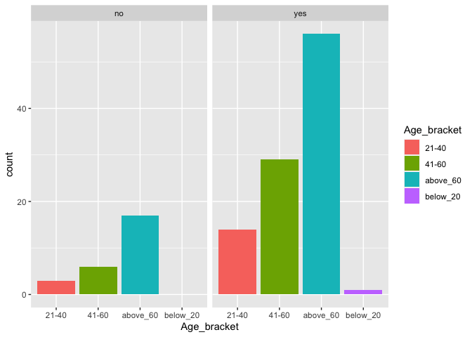<!-- -->

```r
pDat$Age_bracket <- fct_relevel(pDat$Age_bracket, c("below_20", "21-40", "41-60", "above_60"))  

#Let's now plot this distribution of our COVID patients by their age bracket

pDat %>% 
  ggplot(aes(x = Age_bracket, fill = Age_bracket)) +
  geom_bar(stat = "count") +
  theme_minimal() +
  facet_grid(~COVID) +
  labs(title = "Distribution of COVID Patients by Age Bracket")
```

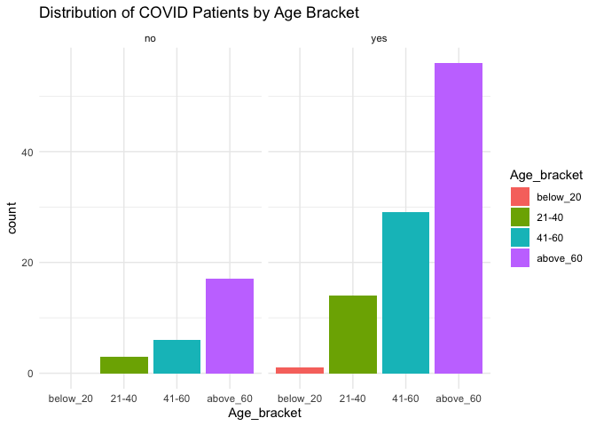<!-- -->

```r
#Now, let's check how protein levels vary by COVID status

#Making a new variable that only includes protein measurements
#'

names(pDat)
```

```
##  [1] "ID"                              "Sample"                         
##  [3] "Age"                             "Sex"                            
##  [5] "COVID"                           "ICU"                            
##  [7] "APACHEII_Score"                  "Charlson_Score"                 
##  [9] "Mechanical_Ventilation"          "Ventilator_free_days"           
## [11] "Hospital_free_days_post_45_days" "Ferritin_ng.ml"                 
## [13] "CRP_mg.l"                        "Procalcitonin_ng.ml"            
## [15] "Lactate_mmol.l"                  "Fibrinogen_mg.dL"               
## [17] "Age_bracket"
```

```r
proteins <- pDat %>% 
  dplyr::select(COVID, Ferritin_ng.ml, CRP_mg.l, Procalcitonin_ng.ml, Lactate_mmol.l, Fibrinogen_mg.dL)

#We're now going to collape this `wide` dataframe  into a `longer` one

proteins <- proteins %>% 
  pivot_longer(cols = 2:6, names_to = "protein", values_to = "measurement")

#plotting the spread of each of the proteins by COVID status:

proteins %>% 
  ggplot(aes(x = COVID, y = measurement, fill = COVID)) +
  geom_boxplot() +
  #geom_jitter(shape = 16, colour = "grey", alpha = 0.5, width = 0.2) +
  scale_fill_manual(values = c("orange", "grey")) +
  facet_wrap(~protein, scales = "free") + #scales = free allows the y-axis of each plot to have variable limits
  theme_minimal()
```

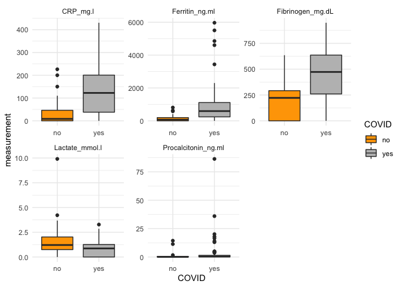<!-- -->

```r
#how about mechanical ventilation? what percentage of COVID patients needed mechanical ventilation?

# pDat %>% 
#   filter(COVID == "yes") %>% #1
#   # count(Mechanical_Ventilation) %>% #1
#   ## mutate(perc = n*100/nrow(pDat)) %>% #2
#   # mutate(perc = round(perc, digits = 0)) %>% 
#   ggplot(aes(x = Mechanical_Ventilation, fill = Mechanical_Ventilation)) +
#   # ggplot(aes(x = Mechanical_Ventilation, y = perc, fill = Mechanical_Ventilation)) +
#   geom_bar(stat = "count", width = 0.6) +
#   # geom_bar(stat = "identity", width = 0.6) +
#   ## geom_text(aes(label = perc), vjust = -0.8, colour = "#333333") + #2
#   ## scale_fill_manual(values = c("orange", "grey")) +
#   theme_minimal() +
#   labs(y = "Percentage of patients", title = "COVID Patients")
```

Let's now look at the distribution of our data 


```r
dim(eDat)
```

```
## [1] 19472   126
```

```r
#19372 126

library(reshape2) #similar functioning to pivot_longer
```

```
## 
## Attaching package: 'reshape2'
```

```
## The following object is masked from 'package:tidyr':
## 
##     smiths
```

```r
e_melt <- melt(eDat)
```

```
## No id variables; using all as measure variables
```

```r
head(e_melt)
```

```
##   variable value
## 1       C1 29.01
## 2       C1  0.00
## 3       C1 17.00
## 4       C1  3.00
## 5       C1  1.00
## 6       C1  0.00
```

```r
colnames(e_melt)[1:2] <- c("sample", "expression")

e_melt %>% 
  ggplot(aes(x = log2(expression), color = sample, fill = sample)) +
  geom_density(alpha = 0.1) + 
  theme_minimal() + 
  theme(legend.position = "none") + #has to come after specifying theme
  labs(x = "log2RPM", y = "Density", title = "Sample Distribution - Density Plot", subtitle = "Raw Counts\n")
```

```
## Warning: Removed 544485 rows containing non-finite values (stat_density).
```

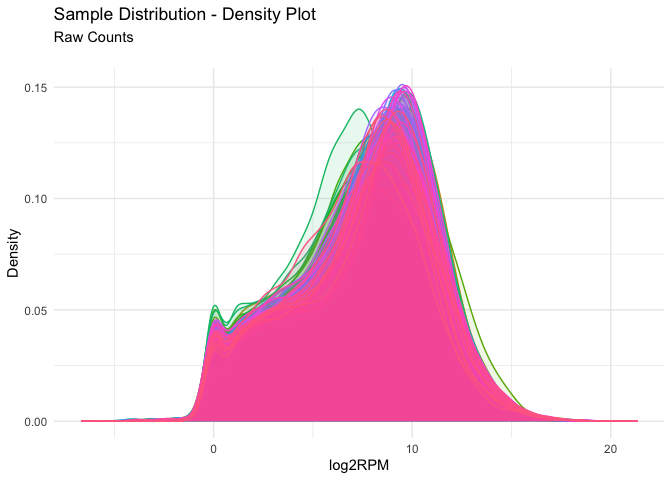<!-- -->

```r
# we get this error - Removed 544485 rows containing non-finite values (stat_density). That's because we have some genes which have an expression value of 0, which when transformed to log2 give infinity as the output as log2(0) does not exist. Hence, we will apply a log2+1 transformation which adds a unit of 1 to all log2 counts, hence converting our log2(0) expression values to 0.

e_melt <- e_melt %>% 
  mutate(log_x_1 = log2(expression + 1))
#melt is a function that condenses all of your data into only two rows - one with the character value and one with it's correspoinding numerical value

#We'll store this plot in a variable
g1 <- e_melt %>% 
  ggplot(aes(log_x_1, color = sample, fill = sample)) +
  geom_density(alpha = 0.1) + 
  theme_minimal() + 
  theme(legend.position = "none") + #has to come after specifying theme
  labs(x = "log2(x+1) RPM", y = "Density", title = "Sample Distribution - Density Plot", subtitle = "Raw Counts\n")

g1
```

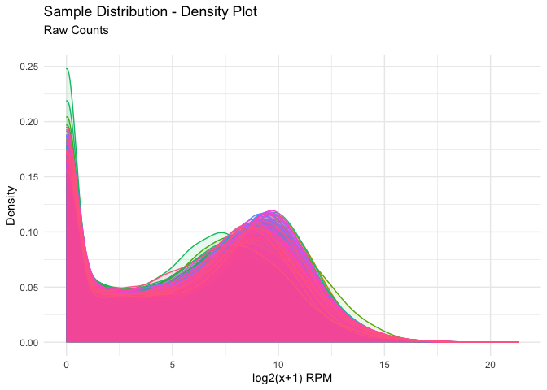<!-- -->

```r
#Okay, now we have an idea about how our expression data looks. Let's now take a look at our samples. How do they correlate with each other?
samp_cor <- cor(eDat)

head(samp_cor)
```

```
##           C1        C2        C3        C4        C5        C6        C7
## C1 1.0000000 0.9295821 0.9000072 0.8299616 0.8581691 0.6516038 0.8423849
## C2 0.9295821 1.0000000 0.8462075 0.9026128 0.8563186 0.7388906 0.9245096
## C3 0.9000072 0.8462075 1.0000000 0.6969214 0.9159993 0.6060607 0.7239140
## C4 0.8299616 0.9026128 0.6969214 1.0000000 0.7420161 0.8161387 0.9486343
## C5 0.8581691 0.8563186 0.9159993 0.7420161 1.0000000 0.6450077 0.7580317
## C6 0.6516038 0.7388906 0.6060607 0.8161387 0.6450077 1.0000000 0.8384309
##           C8        C9       C10       C11       C12       C13       C14
## C1 0.7516367 0.8018467 0.7729010 0.7366898 0.8949360 0.8972446 0.8407746
## C2 0.8309304 0.8707177 0.8629207 0.8345275 0.9280598 0.9354729 0.8486954
## C3 0.7431665 0.8112182 0.8073005 0.6008063 0.9086798 0.8487180 0.9237195
## C4 0.7783941 0.7527165 0.6838143 0.9507305 0.8095620 0.9126116 0.7338422
## C5 0.7988432 0.8111901 0.7769206 0.6602077 0.9147148 0.8887266 0.9414013
## C6 0.8930267 0.6633954 0.6681974 0.8056988 0.6811896 0.6966560 0.6262560
##          C15       C16       C17       C18       C19       C20       C21
## C1 0.7090464 0.8756402 0.8749574 0.7280420 0.8935272 0.8517515 0.8395808
## C2 0.7723882 0.9479459 0.9358690 0.7890834 0.9348584 0.8758607 0.8594683
## C3 0.7355893 0.7482305 0.8140668 0.6644872 0.8296294 0.8999810 0.9199200
## C4 0.7488418 0.9600920 0.9512778 0.7945447 0.9216559 0.7761565 0.7376438
## C5 0.7757685 0.7891324 0.8302130 0.7035275 0.8627266 0.8891499 0.9341900
## C6 0.8935755 0.7538671 0.8853147 0.9602561 0.6839004 0.6397340 0.6325398
##          C22       C23       C24       C25       C26       C27       C28
## C1 0.7704386 0.8570148 0.8527791 0.8474244 0.8764858 0.8823296 0.8427319
## C2 0.8103178 0.9032538 0.8859113 0.9466754 0.8985162 0.9191405 0.8484939
## C3 0.8557381 0.8819224 0.9095758 0.7369133 0.8949332 0.9120486 0.9161167
## C4 0.6455396 0.8022812 0.7681124 0.8257854 0.8329179 0.7521969 0.7540341
## C5 0.9022792 0.9344781 0.9017288 0.7679671 0.8892775 0.9336870 0.9056160
## C6 0.5810247 0.7682075 0.6510449 0.6392331 0.6534245 0.6520876 0.6212602
##          C29       C30       C31       C32       C33       C34       C35
## C1 0.8450746 0.3968502 0.8098055 0.6699002 0.9194911 0.3159948 0.8710797
## C2 0.8718704 0.4778248 0.8443925 0.7562388 0.9483796 0.3830771 0.9198240
## C3 0.9185097 0.3670676 0.8893497 0.6504278 0.9178583 0.2754208 0.9119688
## C4 0.7449586 0.5814014 0.6803947 0.7962750 0.8359037 0.5046960 0.7957665
## C5 0.8891225 0.4237043 0.9054974 0.6936725 0.8761817 0.3321685 0.9048927
## C6 0.6594921 0.9159801 0.6917912 0.9165142 0.7373973 0.8793825 0.7087669
##          C36       C37       C38       C39       C40       C41       C42
## C1 0.8749966 0.9050098 0.8561299 0.5233813 0.8593808 0.5488581 0.8597322
## C2 0.9075991 0.9348804 0.8750429 0.5972767 0.8780538 0.6127478 0.9144156
## C3 0.9326954 0.9237941 0.9244815 0.5495857 0.9119742 0.6025792 0.9221605
## C4 0.7685056 0.8468703 0.7813277 0.5882445 0.7632806 0.5797418 0.7732913
## C5 0.9261606 0.9368229 0.9263096 0.5828459 0.9149350 0.6080395 0.9296664
## C6 0.7122660 0.6955942 0.6587163 0.9015548 0.6230546 0.8849434 0.7314179
##          C43       C44       C45       C46       C47       C48       C49
## C1 0.7321313 0.8480273 0.8438892 0.8475796 0.8523087 0.4842839 0.7962670
## C2 0.7878217 0.8889125 0.8799901 0.9197145 0.8864508 0.5629530 0.8452711
## C3 0.8317681 0.8422329 0.9018247 0.8175050 0.9047375 0.5140041 0.8253991
## C4 0.6092168 0.8044554 0.7939457 0.8988318 0.7911916 0.5425596 0.7270767
## C5 0.8356815 0.8969816 0.9424315 0.8428658 0.9361944 0.5200536 0.7262991
## C6 0.6650386 0.7653898 0.7201531 0.8671166 0.6767235 0.8837767 0.7504924
##          C50       C51       C52       C53       C55       C56       C57
## C1 0.3226036 0.9216378 0.8863202 0.8762485 0.8348768 0.9131286 0.8160112
## C2 0.4124753 0.9691517 0.8549797 0.8944535 0.8577715 0.9147875 0.8978773
## C3 0.3382007 0.8527783 0.9777493 0.8834569 0.9155344 0.9363802 0.7007091
## C4 0.3983632 0.9089361 0.6999284 0.8630198 0.7110114 0.8232728 0.9579452
## C5 0.3938600 0.8354073 0.9252710 0.9332416 0.9269390 0.9433972 0.7172023
## C6 0.7854103 0.7594093 0.6329284 0.8084508 0.6537525 0.7695105 0.8451437
##          C58       C59       C60       C61       C62       C63       C64
## C1 0.4859916 0.6149865 0.5436028 0.8997447 0.5348666 0.9246329 0.7048357
## C2 0.5657960 0.6874890 0.6507500 0.9354423 0.5899296 0.9245708 0.7496592
## C3 0.4877951 0.5486744 0.4500087 0.8535997 0.5282939 0.9428021 0.7372244
## C4 0.5752367 0.8197371 0.7943193 0.9286706 0.6336197 0.8304042 0.7365244
## C5 0.4500163 0.6044296 0.4950106 0.8966452 0.5502961 0.9472345 0.7515919
## C6 0.8853945 0.9742282 0.9514139 0.8193399 0.9398943 0.7536754 0.9251558
##          C65       C66       C67       C68       C69       C70       C71
## C1 0.9507799 0.9129010 0.6422984 0.5683670 0.8611972 0.9690817 0.8315460
## C2 0.9371304 0.8801959 0.7105912 0.6709718 0.9102751 0.9256680 0.8759370
## C3 0.9462516 0.9214461 0.6778940 0.6580115 0.7802599 0.9136046 0.9064794
## C4 0.8140376 0.7674107 0.5925231 0.4285780 0.9292057 0.8533364 0.7290483
## C5 0.9301536 0.8114614 0.6273175 0.5899216 0.8053611 0.9083588 0.9057823
## C6 0.6589411 0.6465700 0.5289063 0.4803699 0.8524267 0.6704277 0.6859469
##          C72       C73       C74       C75       C76       C77       C78
## C1 0.8524587 0.9581799 0.4056951 0.9059924 0.6263552 0.8103391 0.9036696
## C2 0.8763791 0.9156644 0.4829729 0.8742534 0.6794399 0.8303069 0.9465178
## C3 0.7820892 0.8122160 0.3752612 0.9558069 0.6847302 0.8750397 0.8542295
## C4 0.8964152 0.8896752 0.5281186 0.7468662 0.5055653 0.7739229 0.8405206
## C5 0.7429304 0.8174561 0.4261142 0.9525357 0.7385509 0.8704495 0.9112292
## C6 0.8533851 0.6564051 0.8979955 0.6090639 0.4639333 0.8686109 0.6955561
##          C79       C80       C82       C83       C84       C85       C86
## C1 0.6932468 0.8591426 0.3907723 0.9294635 0.8774557 0.3815844 0.8432936
## C2 0.7716434 0.8415444 0.4585912 0.9252295 0.9073219 0.4446694 0.8927604
## C3 0.6544169 0.9532480 0.3553194 0.9324380 0.9117992 0.3651613 0.8177398
## C4 0.8492895 0.6624095 0.5634823 0.8106958 0.7494774 0.5272843 0.8746290
## C5 0.7041073 0.8838395 0.4077775 0.8974367 0.8862958 0.3961000 0.8222178
## C6 0.9569983 0.6560630 0.9102392 0.7537357 0.6618833 0.8972843 0.9043689
##          C87       C89       C90       C91       C92       C93       C94
## C1 0.6143840 0.3308455 0.5949180 0.4745637 0.5495821 0.8142638 0.7690723
## C2 0.6958189 0.3911059 0.6930907 0.5626666 0.6224212 0.8679284 0.8233079
## C3 0.5127885 0.2962952 0.5719803 0.4146335 0.5471811 0.8309355 0.7118224
## C4 0.7736265 0.4977355 0.7349898 0.6936885 0.6310625 0.7707742 0.8754480
## C5 0.5687791 0.3545215 0.6042598 0.4517619 0.5708697 0.7896121 0.6496420
## C6 0.9654852 0.8733349 0.9691725 0.9534312 0.9353983 0.7651662 0.7743399
##          C95       C96       C97       C98       C99      C100      C101
## C1 0.9116851 0.6900197 0.8042136 0.7251468 0.7576143 0.8492459 0.6558531
## C2 0.9444594 0.7415683 0.8155122 0.8264336 0.7968242 0.8893249 0.7612256
## C3 0.9216825 0.6541513 0.9397904 0.7357041 0.8563799 0.8802122 0.5679500
## C4 0.8282378 0.7519338 0.6414354 0.7136631 0.6576404 0.7626051 0.8341110
## C5 0.9179411 0.5782475 0.8688527 0.6784474 0.7868887 0.8484813 0.5895270
## C6 0.7492434 0.7498044 0.6458276 0.8106637 0.7055887 0.7698066 0.9572142
##         C102      C103       NC1       NC2       NC3       NC4       NC5
## C1 0.7908499 0.8048009 0.4752291 0.7542485 0.6798134 0.6650173 0.7116582
## C2 0.7871500 0.8059153 0.5556837 0.8230267 0.7269413 0.7263417 0.7505285
## C3 0.8770624 0.9111330 0.4179103 0.7693810 0.7281838 0.6631763 0.8065608
## C4 0.6120446 0.6393717 0.6470125 0.7871771 0.6817574 0.7485520 0.5785315
## C5 0.8789384 0.8735659 0.4208727 0.7654018 0.6983075 0.7010571 0.7562029
## C6 0.5656470 0.6867573 0.9101896 0.9079503 0.8920740 0.9556542 0.6297257
##          NC6       NC7       NC8       NC9      NC10      NC11      NC12
## C1 0.4108745 0.6840026 0.7492822 0.4699374 0.6549891 0.8574411 0.7930985
## C2 0.4762225 0.7689116 0.8036619 0.5488196 0.7254345 0.8943841 0.8199066
## C3 0.3359313 0.6513590 0.7954385 0.3937566 0.6348828 0.8040749 0.8723709
## C4 0.5795846 0.8242277 0.7426797 0.6928604 0.7362985 0.8974237 0.6484817
## C5 0.3541668 0.6752958 0.7555839 0.4427945 0.6703768 0.8068443 0.8980435
## C6 0.8967707 0.9680224 0.8619048 0.9474772 0.9455470 0.9074459 0.6290204
##         NC13      NC14      NC15      NC16      NC17      NC18      NC19
## C1 0.7950716 0.6459181 0.6544612 0.8400169 0.8798853 0.6905167 0.6364048
## C2 0.8471226 0.7023980 0.7271060 0.8986861 0.9157649 0.7482790 0.7003172
## C3 0.8444095 0.6909175 0.5761745 0.8709780 0.8576428 0.7312835 0.7133267
## C4 0.7343360 0.6823565 0.8304297 0.7736459 0.8698463 0.6759067 0.5664957
## C5 0.8241372 0.7205072 0.5884182 0.8358976 0.8515567 0.7208314 0.6984494
## C6 0.7780170 0.9056783 0.9572680 0.7536392 0.8669706 0.8575791 0.7274736
##         NC20      NC21      NC22      NC23      NC24      NC25      NC26
## C1 0.7512550 0.7751591 0.4078363 0.8267694 0.8384040 0.6138616 0.5443985
## C2 0.7963016 0.8464503 0.4838621 0.8426566 0.9105946 0.6715288 0.6035926
## C3 0.8148221 0.7429230 0.3914176 0.8756369 0.7499578 0.5869958 0.6425106
## C4 0.7480067 0.8403001 0.5472338 0.7249630 0.9590401 0.6680899 0.4183984
## C5 0.8189295 0.7104398 0.3983012 0.7878238 0.7490728 0.5079667 0.6342207
## C6 0.8706245 0.8697293 0.8829550 0.6922696 0.8209202 0.7121000 0.5549736
```

```r
dim(samp_cor)
```

```
## [1] 126 126
```

```r
#to visualize our correlations, we'll make a heatmap of the sample correlation values

library(pheatmap)

#dfs have to have col names and row names, where the colnames of eDat match rownames of pDat
pDat <- pDat %>%  
  column_to_rownames(var = "ID")

h1 <- samp_cor %>% 
  pheatmap(clustering_distance_cols = "euclidean", clustering_method = "complete", cluster_rows = TRUE,
           show_colnames = FALSE, show_rownames = FALSE, 
           annotation_row = pDat[c("COVID", "Sex")], annotation_col = pDat[c("COVID", "Sex")], 
           main = "Sample Correlations"
  )
```

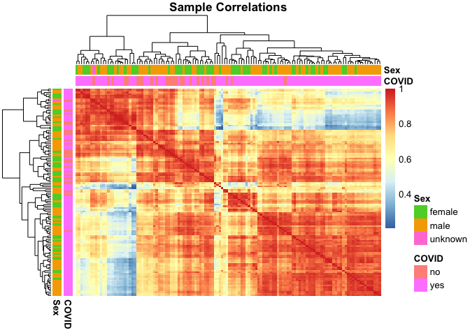<!-- -->

```r
#let's add some custom colours
annot_cols <- list(COVID = c(`yes` = "grey", `no` = "orange"), 
                   Sex = c(`male` = "sea green", `female` = "purple", `unknown` = "yellow")) 

h1 <- samp_cor %>% 
  pheatmap(clustering_distance_cols = "euclidean", clustering_method = "complete", cluster_rows = TRUE,
           show_colnames = FALSE, show_rownames = FALSE, 
           annotation_row = pDat[c("COVID", "Sex")], annotation_col = pDat[c("COVID", "Sex")], 
           annotation_colors = annot_cols,
           main = "Sample Correlations"
  )
```

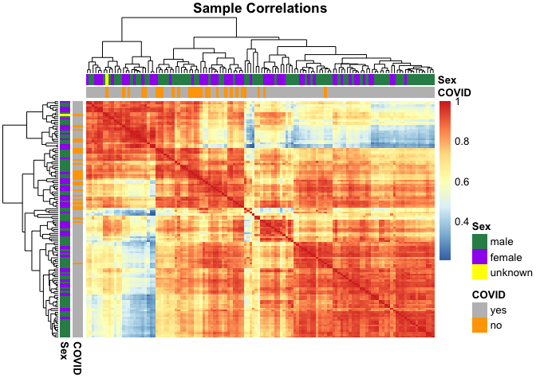<!-- -->

```r
#What do we make of this heatmap?
```

### 5.0 Quality Control  

We'll explore a few different criteria of filtering now and decide on one, and finally and normalizise our data.  


```r
dim(eDat)
```

```
## [1] 19472   126
```

```r
#removing sequences with RPM of 0 in all samples / keeping only sequences with RPM > 0 in at least 1 sample
e_fil1 <- eDat %>% 
  rownames_to_column(var = "gene") %>% 
  filter_at(vars(-gene), any_vars(. != 0)) %>% 
  column_to_rownames(var = "gene")

dim(e_fil1)
```

```
## [1] 18340   126
```

```r
19472 - 18340 
```

```
## [1] 1132
```

```r
# 1132 sequences/genes removed

melt_fil1 <- melt(e_fil1) 
```

```
## No id variables; using all as measure variables
```

```r
melt_fil1 <- melt_fil1 %>% 
  mutate(log_x_1 = log2(value + 1))

g_fil1 <- melt_fil1 %>% 
  ggplot(aes(log_x_1, color = variable, fill = variable)) +
  geom_density(alpha = 0.1) + 
  theme_minimal() + 
  theme(legend.position = "none") + #has to come after specifying theme
  labs(x = "log2(x+1) RPM", y = "Density", title = "Sample Distribution - Density Plot", subtitle = "Removing Sequences with RPM of 0 in all samples", caption = "Raw counts")

g_fil1
```

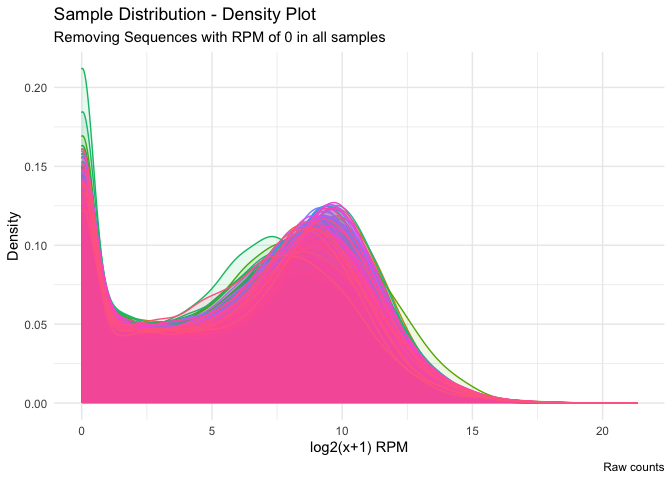<!-- -->

```r
#keeping only sequences with RPM >= 1 in all samples
e_fil2 <- eDat %>% 
  rownames_to_column(var = "gene") %>% 
  filter_at(vars(-gene), all_vars(. >= 1))  %>% 
  column_to_rownames(var = "gene")

dim(e_fil2)
```

```
## [1] 11860   126
```

```r
19472 - 11860
```

```
## [1] 7612
```

```r
#7612 sequences removed

melt_fil2 <- melt(e_fil2) 
```

```
## No id variables; using all as measure variables
```

```r
g_fil2 <- melt_fil2 %>% 
  ggplot(aes(log2(value), color = variable, fill = variable)) +
  geom_density(alpha = 0.1) + 
  theme_minimal() + 
  theme(legend.position = "none") + #has to come after specifying theme
  labs(x = "log2(x+1) RPM", y = "Density", title = "Sample Distribution - Density Plot", subtitle = "Sequences with RPM >= 1 in in all samples", caption = "Raw counts")

g_fil2
```

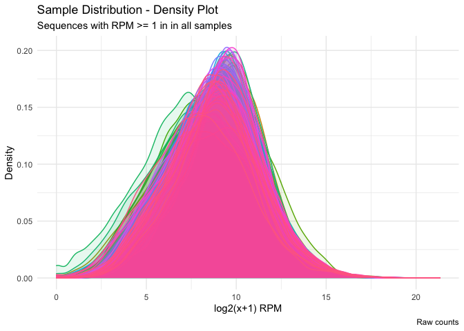<!-- -->

```r
#keeping only sequences with RPM >= 2 in all samples
e_fil3 <- eDat %>% 
  rownames_to_column(var = "gene") %>% 
  filter_at(vars(-gene), all_vars(. >= 2))  %>% 
  column_to_rownames(var = "gene")

dim(e_fil3)
```

```
## [1] 11384   126
```

```r
19472 - 11384
```

```
## [1] 8088
```

```r
#8088 sequences removed

#how many sequences are removed between e_fil2 (RPM >=1 ) and e_fil3 (RPM >= 2)
11860 - 11384
```

```
## [1] 476
```

```r
#476 sequences

melt_fil3 <- melt(e_fil3) 
```

```
## No id variables; using all as measure variables
```

```r
#now here because we already eliminated sequences with an RPM of >=1, that means we don't have any sequences having an RPM of 0. Hence, we don't need to transform it to x+1

g_fil3 <- melt_fil3 %>% 
  ggplot(aes(log2(value), color = variable, fill = variable)) +
  geom_density(alpha = 0.1) + 
  theme_minimal() + 
  theme(legend.position = "none") + #has to come after specifying theme
  labs(x = "log2RPM", y = "Density", title = "Sample Distribution - Density Plot", subtitle = "Sequences with RPM >= 2 in in all samples", caption = "Raw counts")

g_fil3
```

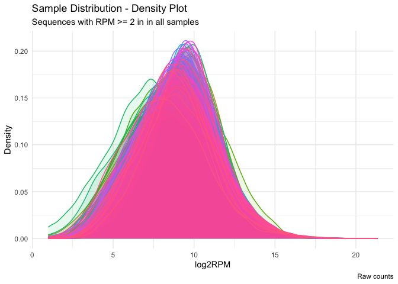<!-- -->

```r
#keeping only sequences with RPM >= 1 in 30% of samples --> depends on groups in data
(30*126)/100
```

```
## [1] 37.8
```

```r
# e_fil4 <- eDat %>%
#   filter(rowSums(across(where(is.numeric)) >= 1) > 38)


RPM_morethan1 <- eDat >= 1
#This gives you a matrix with boolean values. Now to get the sum of all the TRUEs in each sample

table(rowSums(RPM_morethan1))
```

```
## 
##     0     1     2     3     4     5     6     7     8     9    10    11    12 
##  1172   369   223   150   122   123   101    85    90    82    71    68    55 
##    13    14    15    16    17    18    19    20    21    22    23    24    25 
##    47    48    46    45    49    58    30    49    45    49    47    32    44 
##    26    27    28    29    30    31    32    33    34    35    36    37    38 
##    32    39    35    35    38    30    41    34    36    40    25    33    24 
##    39    40    41    42    43    44    45    46    47    48    49    50    51 
##    27    23    27    20    25    37    30    36    19    34    30    32    16 
##    52    53    54    55    56    57    58    59    60    61    62    63    64 
##    22    22    30    33    26    25    28    26    38    21    21    18    19 
##    65    66    67    68    69    70    71    72    73    74    75    76    77 
##    23    17    34    27    30    27    31    29    25    23    22    20    22 
##    78    79    80    81    82    83    84    85    86    87    88    89    90 
##    15    30    27    31    29    24    26    30    22    37    25    26    31 
##    91    92    93    94    95    96    97    98    99   100   101   102   103 
##    27    32    32    25    31    35    25    35    35    35    22    43    41 
##   104   105   106   107   108   109   110   111   112   113   114   115   116 
##    31    34    37    42    43    47    52    50    42    58    55    62    72 
##   117   118   119   120   121   122   123   124   125   126 
##    82    75    71    95    97   134   175   263   467 11860
```

```r
#this shows that there are 1172 sequences where all samples have a RPM of less than 1. And there are 11860 sequences which have a RPM pf >= 1 in all 126 samples --> the same number we got for e_fil2. 
#'This matching of the results/numbers is called a sanity-check, which you should be doing often i.e., making sure that the results that you are getting are indeed correct and are cross-checked by someother method.

e_fil4 <- as.data.frame(rowSums(RPM_morethan1) >= 38)
#keeping only sequences which have a total of 38 TRUE (i.e. an RPM of >= 1) values or more 

e_fil4 <- e_fil4 %>% 
  filter(.[1] == "TRUE")

e_fil4 <- eDat %>% 
  filter(rownames(eDat) %in% rownames(e_fil4))

dim(e_fil4)
```

```
## [1] 15754   126
```

```r
19472 - 15754
```

```
## [1] 3718
```

```r
#3718 sequences removed

melt_fil4 <- melt(e_fil4) 
```

```
## No id variables; using all as measure variables
```

```r
g_fil4 <- melt_fil4 %>% 
  ggplot(aes(log2(value), color = variable, fill = variable)) +
  geom_density(alpha = 0.1) + 
  theme_minimal() + 
  theme(legend.position = "none") + #has to come after specifying theme
  labs(x = "log2RPM", y = "Density", title = "Sample Distribution - Density Plot", subtitle = "Sequences with RPM >= 1 in 30% of samples", caption = "Raw counts")

g_fil4
```

```
## Warning: Removed 108857 rows containing non-finite values (stat_density).
```

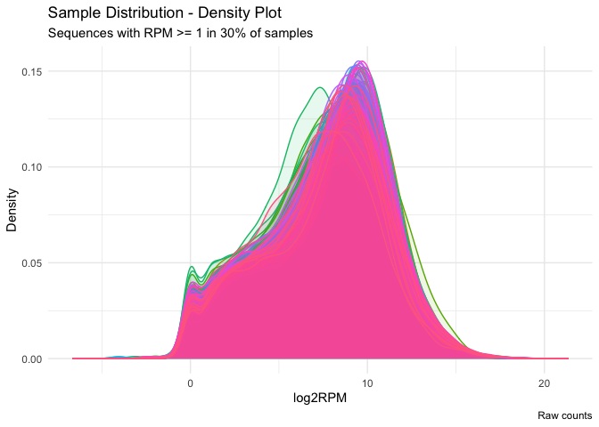<!-- -->

```r
nrow(e_fil1)
```

```
## [1] 18340
```

```r
nrow(e_fil2)
```

```
## [1] 11860
```

```r
nrow(e_fil3)
```

```
## [1] 11384
```

```r
nrow(e_fil4)
```

```
## [1] 15754
```

```r
#let's now put the total number of sequences retained after each of the filtering steps into a separate dataframe  
# seq_counts <- data.frame(nrow(eDat))
# seq_counts$fil_1 <- nrow(e_fil1)
# seq_counts$fil_2 <- nrow(e_fil2)
# seq_counts$fil_3 <- nrow(e_fil3)
# seq_counts$fil_4 <- nrow(e_fil4)
# colnames(seq_counts) <- c("All sequences", "Sequences with RPM > 0 in at least 1 sample", "Sequences with RPM >= 1 in all samples", "Sequences with RPM >= 2 in all samples", "Sequences with RPM >= 1 in 30% of samples")
# seq_counts <- as.data.frame(t(seq_counts))
# seq_counts <- seq_counts %>% 
#   rownames_to_column() 
# colnames(seq_counts)[1:2] <- c("filtering_criteria", "sequences")
# seq_counts %>% 
#   ggplot(aes(x = filtering_criteria, y = sequences, fill = filtering_criteria)) +
#   geom_bar(stat = "identity") +
#   theme_minimal()
# 
# seq_counts$filtering_criteria <- c("All sequences", "Sequences with\nRPM > 0 in atleast\n1 sample", "Sequences with\nRPM >= 1 in\nall samples", "Sequences with\nRPM >= 2 in\nall samples", "Sequences with\nRPM >= 1 in\n30% of samples")
# 
# seq_counts %>% 
#   ggplot(aes(x = filtering_criteria, y = sequences, fill = filtering_criteria)) +
#   geom_bar(stat = "identity", width = 0.6) +
#   # scale_fill_viridis_d() +
#   # geom_text(aes(label = sequences), vjust = -0.8, colour = "#333333", position = position_dodge(0.65)) +
#   # scale_y_continuous(expand = expansion(mult = c(0, .09))) +
#   theme_minimal() +
#   # theme(legend.position = "none") +
#   labs(x = "Filtering Criteria", y = "No. of Sequences", title = "No. of sequences by filtering criteria")

ggarrange(g_fil1, g_fil2, g_fil3, g_fil4)
```

```
## Warning: Removed 108857 rows containing non-finite values (stat_density).
```

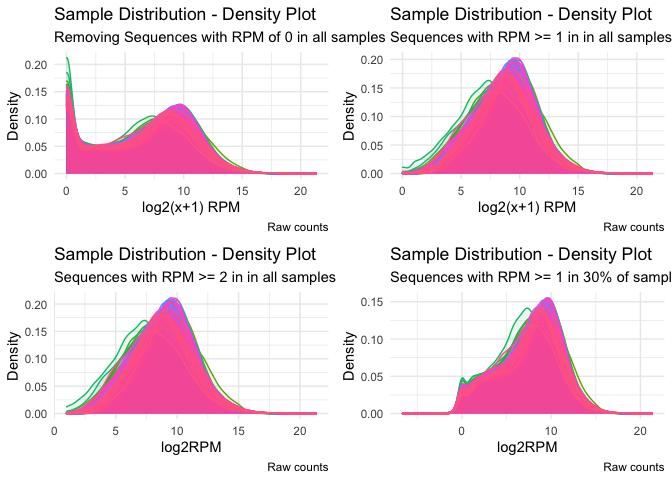<!-- -->

The filtering step you choose depends upon the question you're asking of your data:  

- Do you want to check only highly-expressed, high-confidence genes? You would then use a more stringent filtering criteria    
- Do you want to profile all possibly expressed genes? The filtering criteria would be more inclusive  

We're now going to apply the Relative-Log Expression method to normalize our data - an essential step to make sure that we curb any outliers in our data as to not overestimate highly-expressed genes and have the expression distributed normally.  
RLE accounts for between-sample variation, after which we'll scale by RPM to account for within-sample variation  


```r
library(edgeR)
```

```
## Loading required package: limma
```

```r
genes <- as.data.frame(row.names(e_fil2))
norm <- DGEList(counts = e_fil2, samples = pDat, genes = genes, group = pDat$COVID)
eNorm <- calcNormFactors(norm, method = "RLE") 
eNorm <- cpm(eNorm)
eNorm <- as.data.frame(eNorm)

melt_norm <- melt(eNorm) 
```

```
## No id variables; using all as measure variables
```

```r
melt_norm %>% 
  ggplot(aes(log2(value), color = variable, fill = variable)) +
  geom_density(alpha = 0.1) + 
  theme_minimal() + 
  theme(legend.position = "none") + #has to come after specifying theme
  labs(x = "log2 RPM", y = "Density", title = "Sample Distribution - Density Plot: RLE Normalized Counts", subtitle = "Sequences with RPM >= 1 in all samples")
```

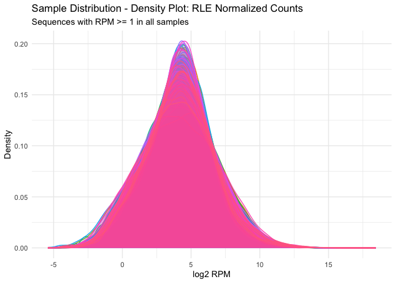<!-- -->

```r
#however, now that we normalized our data, that means that some of the expression counts might have been changed to 0, as we can very well see. We'll perform the same x+1 transformation again

melt_norm <- melt_norm %>% 
  mutate(log_x_1 = log2(value + 1))

g2 <- melt_norm %>% 
  ggplot(aes(log_x_1, color = variable, fill = variable)) +
  geom_density(alpha = 0.1) + 
  theme_minimal() + 
  theme(legend.position = "none") + #has to come after specifying theme
  labs(x = "log2 (x+1) RPM", y = "Density", title = "Sample Distribution - Density Plot: RLE Normalized Counts", subtitle = "Sequences with RPM >= 1 in all samples")

g2
```

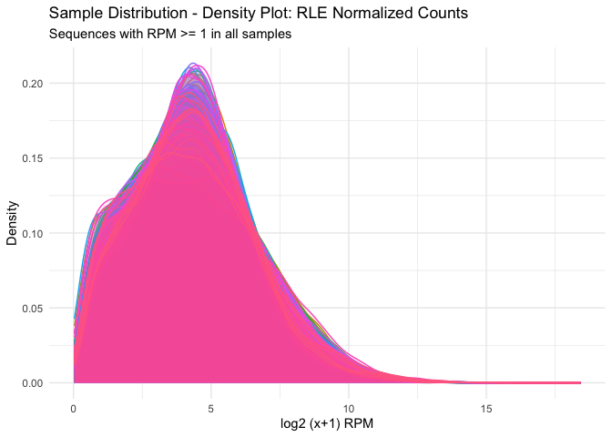<!-- -->

```r
#Raw versus normalized counts
ggarrange(g1, g2)
```

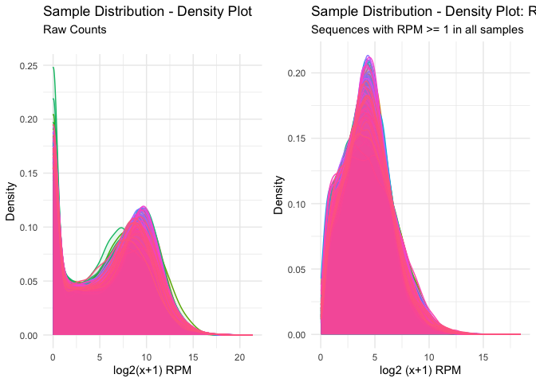<!-- -->

Let's now plot the raw and normalized expression counts of a random gene  


```r
#'I'm going to select the gene TRIM62, however, you can get a random gene by the following

#set.seed(20)

random_sample <- eDat %>% 
  sample_n(1)
row.names(random_sample)
```

```
## [1] "TARBP1"
```

```r
sample_from_eNorm <- eNorm %>% 
  rownames_to_column(var = "gene") %>% 
  filter(gene == "TRIM62") %>% 
  column_to_rownames(var = "gene")

row.names(random_sample)[1] <- "TRIM62_raw"    
row.names(sample_from_eNorm)[1] <- "TRIM62_norm" 

TRIM62 <- rbind(random_sample, sample_from_eNorm)

TRIM62 <- TRIM62 %>% 
  rownames_to_column(var = "TRIM62_value")

TRIM62 <- TRIM62 %>% 
  pivot_longer(cols = -c(TRIM62_value), names_to = "sample", values_to = "RPM")

TRIM62 %>% 
  ggplot(aes(x = sample, y = RPM, colour = TRIM62_value)) +
  geom_point(size = 2) +
  scale_colour_manual(values = c("forest green", "orange")) +
  theme_classic() + 
  theme(legend.position = "bottom") +
  labs(x = "Sample", y = "RPM", title = "Change in TRIM62 expression value before and after normalization", subtitle = "raw vs. RLE Normalized Counts")
```

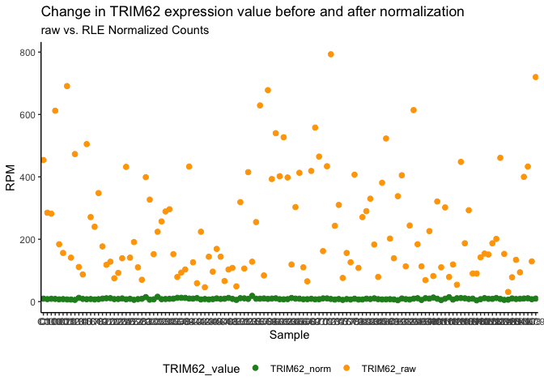<!-- -->

```r
# HOMEWORK 1: Compare the raw vs normalized counts for the methods 1.TMM, 2.Quantile, and 3.only CPM  - compare the expression count for the same random gene you got for all 4 methods. Do they differ? By how much?
```

We'll now save our processed expression dataframe as a tab-delimited text file which we can load in for Part 2.  


```r
eNorm <- eNorm %>% 
  rownames_to_column(var = "gene")
write_delim(eNorm, file = here::here("data", "eNorm.txt"), delim = "\t")
```


> End of Part 1  

***  
