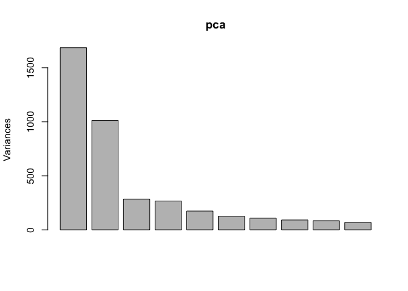
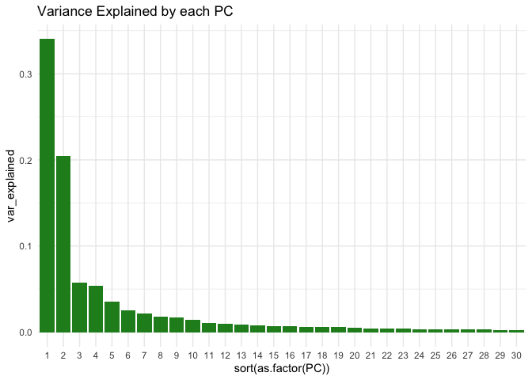
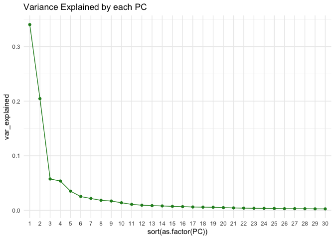
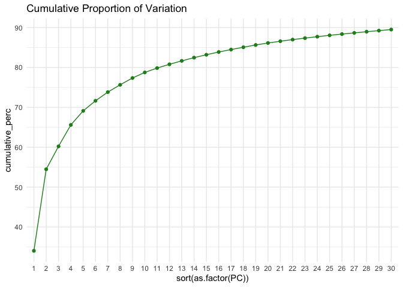
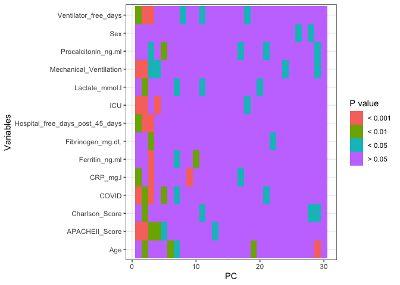
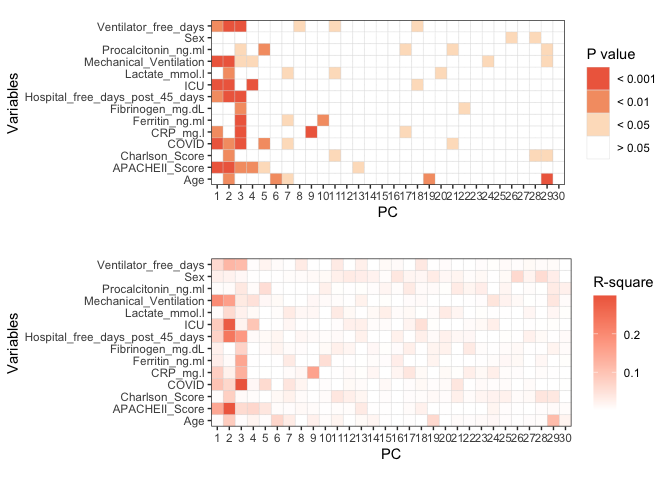
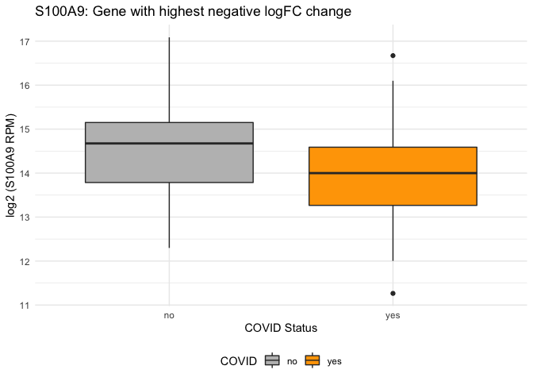
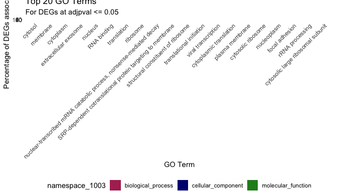

---
title: "TOG RNA-seq Workshop 2021: Part 2" 
author: Nikita Telkar 
date: July 2021
output: 
  html_document: 
    keep_md: yes 
    toc: true  
    toc_depth: 4
    toc_float: 
      collapsed: false 
      smooth_scroll: true
    theme: flatly  
    highlight: pygments 
--- 

### 0.0 Introduction

So, in Part 1 of the workshop, we worked through our raw data to make it fit for downstream analysis. *This type of data is called as processed/clean data - and is the most common data type made available through GEO.*  

**However, when submitting/releasing your data publicly, it is *always* good practice to make sure that you release both your raw and processed data, as researchers might want to apply their own analysis methods right from the start to the raw dataset. When only processed data is available, it is difficult to use it for any comparisons (e.g., with your own data or as part of a meta-analysis) as some of the upstream data cleanup steps that have already been applied might differ.**    

***  


Loading packages:


```r
library(tidyverse)
library(here) 
library(rmarkdown)
library(knitr)

#formatting packages
library(kableExtra)
library(janitor)
library(scales)
library(ggpubr)
```

Loading our processed data from Part 1:  


```r
eNorm <- read.delim(here::here("data", "eNorm.txt"), sep = "\t")
eNorm <- eNorm %>% 
  column_to_rownames(var = "gene")

pDat <- read.delim(here::here("data", "GSE157103_formatted_pDat.txt"), sep = "\t")
pDat <- pDat %>% 
  column_to_rownames(var = "ID")
```


### 6.0 PCA  

We'll start with principle component analysis (PCA) - a dimensionality reduction method that accounts for sample variation while maximizing variance.  


```r
#transforming eNorm values to log2(x)+1
e_log2 <- log2(eNorm + 1)

#transposing our log(x+1) transposed data frame, so that the columns become the rows, and the rows become columns. As we want to check the variance driven by the genes, and not the samples, we transpose the dataframe to have the columns as the samples, and the rows as the genes, as the PCA function performs column-wise applications, not row-wise.
t_log2 <- as.data.frame(t(e_log2))
# DON'T OPEN this df, as it might crash R
dim(t_log2)
```

```
## [1]   126 11860
```

```r
#As our data has already been normalized, we don't want to scale it further. We do however, want to centre it - meaning standardizing the upper and lower limits of the distribution of our values
pca <- prcomp(t_log2, scale = FALSE, center = TRUE)

summary(pca)
```

```
## Importance of components:
##                            PC1     PC2      PC3      PC4      PC5      PC6
## Standard deviation     41.0557 31.8352 16.87121 16.31509 13.18914 11.19760
## Proportion of Variance  0.3402  0.2046  0.05745  0.05373  0.03511  0.02531
## Cumulative Proportion   0.3402  0.5448  0.60224  0.65597  0.69108  0.71639
##                             PC7     PC8     PC9    PC10    PC11    PC12    PC13
## Standard deviation     10.37244 9.53338 9.19518 8.30441 7.37335 6.83398 6.53914
## Proportion of Variance  0.02172 0.01834 0.01707 0.01392 0.01097 0.00943 0.00863
## Cumulative Proportion   0.73811 0.75645 0.77352 0.78744 0.79841 0.80784 0.81647
##                           PC14    PC15    PC16    PC17    PC18    PC19   PC20
## Standard deviation     6.32803 6.00289 5.81234 5.52242 5.38500 5.27893 4.9749
## Proportion of Variance 0.00808 0.00727 0.00682 0.00616 0.00585 0.00562 0.0050
## Cumulative Proportion  0.82455 0.83182 0.83864 0.84480 0.85065 0.85628 0.8613
##                           PC21    PC22    PC23    PC24    PC25    PC26    PC27
## Standard deviation     4.70361 4.46980 4.31067 4.19950 4.13166 3.90826 3.87466
## Proportion of Variance 0.00447 0.00403 0.00375 0.00356 0.00345 0.00308 0.00303
## Cumulative Proportion  0.86574 0.86977 0.87352 0.87708 0.88053 0.88361 0.88664
##                           PC28    PC29    PC30    PC31    PC32    PC33    PC34
## Standard deviation     3.80382 3.69138 3.63825 3.55485 3.53036 3.49935 3.38607
## Proportion of Variance 0.00292 0.00275 0.00267 0.00255 0.00252 0.00247 0.00231
## Cumulative Proportion  0.88956 0.89231 0.89498 0.89753 0.90005 0.90252 0.90484
##                           PC35    PC36    PC37    PC38    PC39    PC40   PC41
## Standard deviation     3.35091 3.29705 3.26900 3.13231 3.11780 3.10250 3.0668
## Proportion of Variance 0.00227 0.00219 0.00216 0.00198 0.00196 0.00194 0.0019
## Cumulative Proportion  0.90710 0.90930 0.91145 0.91343 0.91540 0.91734 0.9192
##                           PC42    PC43   PC44    PC45    PC46    PC47    PC48
## Standard deviation     3.04679 2.99990 2.9863 2.89121 2.88019 2.83986 2.80711
## Proportion of Variance 0.00187 0.00182 0.0018 0.00169 0.00167 0.00163 0.00159
## Cumulative Proportion  0.92111 0.92293 0.9247 0.92641 0.92809 0.92972 0.93131
##                           PC49    PC50    PC51    PC52    PC53    PC54    PC55
## Standard deviation     2.76396 2.73644 2.71850 2.66955 2.64527 2.62578 2.58984
## Proportion of Variance 0.00154 0.00151 0.00149 0.00144 0.00141 0.00139 0.00135
## Cumulative Proportion  0.93285 0.93436 0.93585 0.93729 0.93870 0.94009 0.94145
##                           PC56    PC57   PC58    PC59    PC60   PC61    PC62
## Standard deviation     2.56655 2.55546 2.5405 2.51424 2.48881 2.4404 2.43117
## Proportion of Variance 0.00133 0.00132 0.0013 0.00128 0.00125 0.0012 0.00119
## Cumulative Proportion  0.94278 0.94410 0.9454 0.94667 0.94792 0.9491 0.95032
##                           PC63    PC64    PC65    PC66   PC67    PC68    PC69
## Standard deviation     2.42115 2.40518 2.37050 2.35448 2.3376 2.32644 2.31949
## Proportion of Variance 0.00118 0.00117 0.00113 0.00112 0.0011 0.00109 0.00109
## Cumulative Proportion  0.95150 0.95267 0.95380 0.95492 0.9560 0.95712 0.95821
##                           PC70    PC71    PC72    PC73    PC74    PC75    PC76
## Standard deviation     2.29092 2.27788 2.26053 2.25332 2.21967 2.20886 2.19186
## Proportion of Variance 0.00106 0.00105 0.00103 0.00102 0.00099 0.00098 0.00097
## Cumulative Proportion  0.95926 0.96031 0.96134 0.96237 0.96336 0.96435 0.96532
##                           PC77    PC78    PC79    PC80    PC81    PC82   PC83
## Standard deviation     2.18305 2.16804 2.15911 2.14584 2.14381 2.11848 2.1134
## Proportion of Variance 0.00096 0.00095 0.00094 0.00093 0.00093 0.00091 0.0009
## Cumulative Proportion  0.96628 0.96723 0.96817 0.96910 0.97003 0.97093 0.9718
##                          PC84    PC85    PC86    PC87    PC88    PC89   PC90
## Standard deviation     2.1071 2.09216 2.04671 2.03922 2.03681 2.02731 1.9933
## Proportion of Variance 0.0009 0.00088 0.00085 0.00084 0.00084 0.00083 0.0008
## Cumulative Proportion  0.9727 0.97361 0.97446 0.97530 0.97614 0.97696 0.9778
##                          PC91    PC92    PC93    PC94    PC95    PC96    PC97
## Standard deviation     1.9866 1.96442 1.95434 1.94944 1.94280 1.93121 1.91434
## Proportion of Variance 0.0008 0.00078 0.00077 0.00077 0.00076 0.00075 0.00074
## Cumulative Proportion  0.9786 0.97934 0.98011 0.98088 0.98164 0.98239 0.98313
##                           PC98    PC99   PC100  PC101   PC102   PC103   PC104
## Standard deviation     1.90260 1.88979 1.87651 1.8622 1.85251 1.85020 1.83393
## Proportion of Variance 0.00073 0.00072 0.00071 0.0007 0.00069 0.00069 0.00068
## Cumulative Proportion  0.98387 0.98459 0.98530 0.9860 0.98669 0.98738 0.98806
##                          PC105   PC106   PC107   PC108   PC109   PC110   PC111
## Standard deviation     1.82217 1.81063 1.78988 1.78016 1.76770 1.75176 1.74683
## Proportion of Variance 0.00067 0.00066 0.00065 0.00064 0.00063 0.00062 0.00062
## Cumulative Proportion  0.98873 0.98939 0.99004 0.99068 0.99131 0.99193 0.99254
##                          PC112  PC113   PC114   PC115   PC116   PC117   PC118
## Standard deviation     1.73147 1.7183 1.70072 1.69249 1.68830 1.66037 1.65790
## Proportion of Variance 0.00061 0.0006 0.00058 0.00058 0.00058 0.00056 0.00055
## Cumulative Proportion  0.99315 0.9937 0.99433 0.99491 0.99548 0.99604 0.99659
##                          PC119   PC120   PC121   PC122   PC123   PC124   PC125
## Standard deviation     1.62470 1.61169 1.59106 1.58183 1.53138 1.48186 1.43721
## Proportion of Variance 0.00053 0.00052 0.00051 0.00051 0.00047 0.00044 0.00042
## Cumulative Proportion  0.99713 0.99765 0.99816 0.99867 0.99914 0.99958 1.00000
##                           PC126
## Standard deviation     2.98e-14
## Proportion of Variance 0.00e+00
## Cumulative Proportion  1.00e+00
```

```r
screeplot(pca)
```

<!-- -->

```r
# -- COPY - PASTE --
#dataframe with all PCs, their variance, and cumulative variance of all PCs
summary <- data.frame(PC = 1:126, var_explained = (pca$sdev)^2 / sum((pca$sdev)^2), 
                      cumulative = cumsum(pca$sdev^2 / sum(pca$sdev^2))
                      )
summary <- summary %>% 
  mutate(cumulative_perc = cumulative*100)

# -- --

#usually we only consider the first 30 PCs
summary <- summary[1:30,]

#different ways to represent the same data
summary %>%
  ggplot(aes(x = sort(as.factor(PC)), y = var_explained)) +
  geom_bar(stat = "identity", fill = "forest green") +
  # geom_text(aes(label = round(var_explained, digits = 2), vjust = -0.8), size = 2) +
  theme_minimal() +
  labs(title = "Variance Explained by each PC") 
```

<!-- -->

```r
summary %>%
  ggplot(aes(x = sort(as.factor(PC)), y = var_explained))+
  geom_point(colour = "forest green") +
  geom_line(group = "PC", colour = "forest green") +
  theme_minimal() +
  labs(title = "Variance Explained by each PC") 
```

<!-- -->

```r
summary %>%
  ggplot(aes(x = sort(as.factor(PC)), y = cumulative_perc))+
  geom_point(colour = "forest green") +
  geom_line(group = "PC", colour = "forest green") +
  theme_minimal() +
  labs(title = "Cumulative Proportion of Variation") 
```

<!-- -->

```r
#separating the PCA values into its won separate df
scores <- as.data.frame(pca$x)

scores <- scores[c(1:30)]
head(scores)
```

```
##           PC1        PC2        PC3        PC4        PC5        PC6        PC7
## C1  -2.873577  31.513465   4.581241 -34.747719  15.702070 -29.361896   8.508419
## C2   1.069681  21.246050 -10.968403   8.339987  -3.260639 -17.241597  -3.523015
## C3 -21.265732 -16.398176  11.405154 -49.406015 -10.698952  -6.128537  -1.064602
## C4   8.360660  48.599969   9.782527  12.568988   2.640562  -2.135567  -3.014367
## C5 -52.264090   7.886006   7.748767 -25.925634   9.453192  15.599042  -6.826804
## C6  13.613215  29.320890  -6.705883  15.198558  -7.176141   1.188698 -10.093523
##           PC8        PC9       PC10       PC11       PC12        PC13      PC14
## C1 -10.146967 -1.7393485   8.528270 -2.4318774  1.7644941  -5.1124617  1.642345
## C2  -3.660366 -0.8253942  -1.797925 -5.2304072 -0.7391959 -15.2686948 -2.139551
## C3  -5.071375 18.4334570  14.031947 -3.2970120 -6.8373987  -0.4272142  1.500038
## C4  -2.971492 -5.1869985   1.106609  0.6095576 -5.0401862  -6.4507389  2.681354
## C5   2.492451 -2.4695017 -19.801383 -5.0695824 -6.2003436  -2.4090045 11.883342
## C6  -3.208975  2.7844656  -6.127613 -1.0578476  0.4531912 -10.9567302  3.506287
##         PC15      PC16      PC17       PC18      PC19      PC20       PC21
## C1 -8.875898  9.958008 -2.257577  0.0760982 5.0013025 -3.701882  11.100054
## C2 -1.673642 -3.371377  3.338661 -4.5877960 4.8236714 -2.603036   4.839628
## C3  1.668607  8.304741 -5.059460  6.8785575 9.3845361  3.353635   5.716499
## C4 -9.781740  3.395398  2.955598  3.5514763 4.7594520  0.723566   2.178126
## C5  3.812600 10.180299 19.058720 -4.1820518 1.2522601  6.604281 -12.063440
## C6  1.709447 -2.951148  2.932438 -2.6384673 0.2379606 -2.517254   5.712442
##          PC22       PC23       PC24      PC25       PC26       PC27      PC28
## C1 -1.1830862 -4.3701516 -6.0269453  2.487731 -3.9176775  7.2084391 -1.931781
## C2 -0.1437366 -4.0622984  0.6567662  1.469711 -3.0097441  1.4143064 -1.387003
## C3  7.6056574  1.1696635 -1.0229573  1.078533  1.9816533 -0.2157957  1.227088
## C4 -5.2577541  8.6100230  1.0761861 -0.495693  0.2191656 -0.8076055  2.522992
## C5  4.2031459  4.3432118  3.7112434  3.547634  3.0213863  4.0804927 -4.757769
## C6  2.2821878 -0.9523062 -1.6960234  2.700263  3.7529861  2.8236221 -2.476955
##          PC29        PC30
## C1  7.1364450 -1.27354936
## C2 -2.0213152 -1.19972570
## C3  7.3628155 12.38335042
## C4 -3.9418235 -0.03496177
## C5  0.7855329  0.31440811
## C6  0.1467464  0.12057683
```

```r
#making a metadata df containing all sample information data
mDat <- cbind(pDat, scores)
```

Now that we have our PC scores, we'll estimate which of our variables are the ones driving that variation in our data 


```r
#remotes::install_github("wvictor14/plomics")
library(plomics)

#here, we'll select the Pvalue metric
variable_variance <- lmmatrix(dep = scores, ind = pDat[c(2:15)], metric = "Pvalue")

head(variable_variance)
```

```
##                         PC1          PC2          PC3          PC4         PC5
## Age            4.433720e-01 1.024292e-03 5.357586e-01 0.1227241839 0.530243367
## Sex            2.270582e-01 2.730491e-01 4.905150e-01 0.9222153751 0.985665262
## COVID          3.356380e-04 3.558523e-03 3.231238e-11 0.2342246582 0.005592154
## ICU            8.607671e-04 1.152275e-10 1.203749e-01 0.0004498275 0.761884831
## APACHEII_Score 9.648283e-06 4.796524e-11 6.234301e-03 0.0039225543 0.022536445
## Charlson_Score 4.551605e-01 1.596603e-03 3.119950e-01 0.4360322298 0.847497524
##                        PC6        PC7       PC8        PC9      PC10       PC11
## Age            0.003551443 0.04887319 0.9698820 0.08404132 0.4838427 0.14276659
## Sex            0.924984016 0.74093414 0.6743761 0.53969685 0.5688295 0.21571274
## COVID          0.765978287 0.02029783 0.1465711 0.82483687 0.5066316 0.83510449
## ICU            0.698404893 0.19821494 0.6957646 0.92452028 0.9779782 0.50625488
## APACHEII_Score 0.456567963 0.51758869 0.2700249 0.37744914 0.6434340 0.47439984
## Charlson_Score 0.249114900 0.10373783 0.3765287 0.69639356 0.3802474 0.02343673
##                      PC12       PC13      PC14      PC15       PC16      PC17
## Age            0.88361422 0.29556981 0.1560049 0.6758504 0.94884057 0.6832243
## Sex            0.12288159 0.17095735 0.2707008 0.7513489 0.08798836 0.3760878
## COVID          0.28871134 0.36779251 0.8489379 0.2753187 0.89386734 0.4998182
## ICU            0.08508769 0.07605797 0.4620665 0.3548583 0.90081795 0.1395691
## APACHEII_Score 0.47503481 0.03731661 0.6887634 0.6241562 0.96863246 0.3662505
## Charlson_Score 0.06465515 0.17139990 0.8719106 0.5129812 0.90253659 0.5135770
##                      PC18        PC19      PC20       PC21      PC22      PC23
## Age            0.88442521 0.005217742 0.9607615 0.37280299 0.5185930 0.3420459
## Sex            0.43156896 0.142272226 0.4658982 0.35591767 0.7702244 0.5003367
## COVID          0.25625700 0.532989041 0.3405511 0.02320487 0.6135451 0.3112817
## ICU            0.01080291 0.583716805 0.7760423 0.79522088 0.3668543 0.2460771
## APACHEII_Score 0.09355615 0.961482917 0.7125361 0.95046979 0.9949991 0.9708908
## Charlson_Score 0.43556492 0.269060667 0.4242116 0.07719944 0.3677115 0.1525067
##                      PC24       PC25       PC26      PC27       PC28
## Age            0.23333502 0.52453069 0.71000558 0.5339782 0.45641686
## Sex            0.92204393 0.57985293 0.01979339 0.3029324 0.02703745
## COVID          0.51166564 0.38139380 0.79538660 0.3603583 0.81197760
## ICU            0.06641195 0.90489350 0.88716159 0.5934191 0.73924939
## APACHEII_Score 0.15238958 0.53764391 0.66193829 0.8974279 0.50100394
## Charlson_Score 0.11556830 0.09411374 0.38307618 0.2623510 0.02145716
##                        PC29      PC30
## Age            0.0001336431 0.1245905
## Sex            0.1733599130 0.9956886
## COVID          0.8094699294 0.7442335
## ICU            0.5637311577 0.7969355
## APACHEII_Score 0.3283939438 0.4591115
## Charlson_Score 0.0298356039 0.7890196
```

```r
vv_plot <- variable_variance %>% 
  as.data.frame() 
vv_plot <- as.data.frame(t(vv_plot))
vv_plot <- vv_plot %>% 
  mutate(Principle_Component = 1:30) %>% 
  dplyr::select(Principle_Component, everything())
head(vv_plot)
```

```
##     Principle_Component         Age       Sex        COVID          ICU
## PC1                   1 0.443372048 0.2270582 3.356380e-04 8.607671e-04
## PC2                   2 0.001024292 0.2730491 3.558523e-03 1.152275e-10
## PC3                   3 0.535758592 0.4905150 3.231238e-11 1.203749e-01
## PC4                   4 0.122724184 0.9222154 2.342247e-01 4.498275e-04
## PC5                   5 0.530243367 0.9856653 5.592154e-03 7.618848e-01
## PC6                   6 0.003551443 0.9249840 7.659783e-01 6.984049e-01
##     APACHEII_Score Charlson_Score Mechanical_Ventilation Ventilator_free_days
## PC1   9.648283e-06    0.455160547           2.035603e-07         5.407286e-03
## PC2   4.796524e-11    0.001596603           3.001057e-06         6.660971e-05
## PC3   6.234301e-03    0.311995034           3.438765e-02         1.140585e-04
## PC4   3.922554e-03    0.436032230           1.228092e-02         4.958919e-01
## PC5   2.253645e-02    0.847497524           2.315671e-01         1.297751e-01
## PC6   4.565680e-01    0.249114900           2.960095e-01         3.598802e-01
##     Hospital_free_days_post_45_days Ferritin_ng.ml     CRP_mg.l
## PC1                    2.161055e-03   5.641500e-02 0.0013990643
## PC2                    9.070318e-09   3.268577e-01 0.0870827222
## PC3                    1.276553e-06   7.301131e-06 0.0000294515
## PC4                    3.399023e-01   5.905019e-01 0.7613512673
## PC5                    3.001829e-01   8.238546e-01 0.7530516400
## PC6                    1.702699e-01   7.176295e-01 0.8095881925
##     Procalcitonin_ng.ml Lactate_mmol.l Fibrinogen_mg.dL
## PC1         0.466435480    0.359643697      0.084735902
## PC2         0.407907372    0.006193814      0.900148170
## PC3         0.029758491    0.095157140      0.002538692
## PC4         0.410411302    0.286958286      0.818851094
## PC5         0.008701715    0.821823536      0.336487280
## PC6         0.665651463    0.432498676      0.149312722
```

```r
vv_plot <- vv_plot %>% 
  pivot_longer(cols = -c(Principle_Component), names_to = "variables", values_to = "pval") 
vv_plot <- vv_plot %>% 
  mutate(pval_cat = case_when(
    pval > 0.05  ~ "> 0.05",
    pval < 0.05 & pval > 0.01 ~ "< 0.05",
    pval < 0.01 & pval > 0.001 ~ "< 0.01",
    pval < 0.001 ~ "< 0.001"
  ))

vv_plot %>% 
  ggplot(aes(x = Principle_Component, y = variables, fill = pval_cat)) +
  geom_tile() + 
  theme_bw() +
  labs(x = "PC", y = "Variables" , fill = "P value")
```

<!-- -->

```r
vv_colpal <- c("< 0.001" = "#ef6a4c", "< 0.01" = "#f59e72", "< 0.05" = "#fde0c5", "> 0.05" = "white")
vv_plot$Principle_Component <- as.factor(vv_plot$Principle_Component)

g3 <- vv_plot %>% 
  ggplot(aes(x = Principle_Component, y = variables, fill = pval_cat)) +
  geom_tile(col = "lightgrey") + 
  theme_bw() +
  scale_x_discrete(expand = c(0, 0)) +
  scale_y_discrete(expand = c(0, 0)) +
  scale_fill_manual(values = vv_colpal) +
  coord_fixed() + 
  # theme(legend.position = "bottom") +
  labs(x = "PC", y = "Variables" , fill = "P value")

# ASSIGNMENT 1: Repeat the lmmatrix function, but this time with using the Rsqaured value. Store it as a separate variable, and plot both the pval and rsquared plots one below each other. 
# Instead of using `scale_fill_manual` for the plot, use `scale_fill_gradient(low = "", high = "#")` 

rsq <- lmmatrix(dep = scores, ind = pDat[c(2:15)], metric = "Rsquared")

rsq <- rsq %>% 
  as.data.frame() 

rsq <- as.data.frame(t(rsq))

rsq <- rsq %>% 
  mutate(Principle_Component = 1:30) %>% 
  dplyr::select(Principle_Component, everything())

head(rsq)
```

```
##     Principle_Component         Age          Sex       COVID          ICU
## PC1                   1 0.004746062 0.0238182452 0.098889121 0.0859946047
## PC2                   2 0.083606593 0.0208861737 0.066481503 0.2856273580
## PC3                   3 0.003100076 0.0115152891 0.299867096 0.0193440583
## PC4                   4 0.019103990 0.0013158244 0.011392135 0.0948872854
## PC5                   5 0.003184566 0.0002347444 0.060269454 0.0007431426
## PC6                   6 0.066508892 0.0012671448 0.000717059 0.0012149315
##     APACHEII_Score Charlson_Score Mechanical_Ventilation Ventilator_free_days
## PC1     0.14660374   0.0045061211             0.19635489          0.060731067
## PC2     0.29547182   0.0775061355             0.16191424          0.120830111
## PC3     0.05877739   0.0082427650             0.03558802          0.113565869
## PC4     0.06514221   0.0049004727             0.04949967          0.003747719
## PC5     0.04126041   0.0002994187             0.01152171          0.018412669
## PC6     0.00447812   0.0106973907             0.00880372          0.006764889
##     Hospital_free_days_post_45_days Ferritin_ng.ml     CRP_mg.l
## PC1                     0.073342365   0.0290411798 0.0793220901
## PC2                     0.234656728   0.0077535666 0.0234252650
## PC3                     0.172984201   0.1502774278 0.1317808459
## PC4                     0.007347690   0.0023418570 0.0007465799
## PC5                     0.008653592   0.0004011011 0.0008011664
## PC6                     0.015111705   0.0010583402 0.0004700105
##     Procalcitonin_ng.ml Lactate_mmol.l Fibrinogen_mg.dL
## PC1         0.004285549   0.0067715297     0.0237743019
## PC2         0.005530277   0.0588667977     0.0001274707
## PC3         0.037521591   0.0222970352     0.0711267185
## PC4         0.005471633   0.0091387516     0.0004246148
## PC5         0.054207104   0.0004105611     0.0074519270
## PC6         0.001510836   0.0049762262     0.0166949341
```

```r
rsq <- rsq %>% 
  pivot_longer(cols = -c(Principle_Component), names_to = "variables", values_to = "rsq") 

rsq$Principle_Component <- as.factor(rsq$Principle_Component)

str(rsq)
```

```
## tibble [420 × 3] (S3: tbl_df/tbl/data.frame)
##  $ Principle_Component: Factor w/ 30 levels "1","2","3","4",..: 1 1 1 1 1 1 1 1 1 1 ...
##  $ variables          : chr [1:420] "Age" "Sex" "COVID" "ICU" ...
##  $ rsq                : num [1:420] 0.00475 0.02382 0.09889 0.08599 0.1466 ...
```

```r
g4 <- rsq %>% 
  ggplot(aes(x = Principle_Component, y = variables, fill = rsq)) +
  geom_tile(col = "lightgrey") + 
  theme_bw() +
  scale_x_discrete(expand = c(0, 0)) +
  scale_y_discrete(expand = c(0, 0)) +
  scale_fill_gradient(low = "white", high = "#ef6a4c") +
  coord_fixed() + 
  # theme(legend.position = "bottom") +
  labs(x = "PC", y = "Variables" , fill = "R-square")

ggarrange(g3, g4, ncol = 1, nrow = 2)
```

<!-- -->

We'll now plot the first 2 PCs with the variables that seem to be contributing to the most variance in the data.


```r
mDat %>% 
  ggplot(aes(x = PC1, y = PC2, colour = COVID)) +
  geom_point(size = 3) +
  # coord_cartesian(ylim = c(-130, 130), xlim = c(-130, 130)) +
  labs( x = "Principle Component 1", y = "Principle Component 2", title = "COVID: PC1 vs PC2") +
  scale_colour_manual(values = c("orange", "gray")) +
  theme_minimal() 
```

<!-- -->

```r
mDat %>% 
  ggplot(aes(x = PC1, y = PC2, colour = ICU)) +
  geom_point(size = 3) +
  coord_cartesian(ylim = c(-130, 130), xlim = c(-130, 130)) +
  labs( x = "Principle Component 1", y = "Principle Component 2", title = "ICU: PC1 vs PC2") +
  scale_colour_manual(values = c("grey", "blue")) +
  theme_minimal() 
```

<!-- -->

```r
mDat %>% 
  ggplot(aes(x = PC1, y = PC2, colour = Mechanical_Ventilation)) +
  geom_point(size = 3) +
  coord_cartesian(ylim = c(-130, 130), xlim = c(-130, 130)) +
  labs( x = "Principle Component 1", y = "Principle Component 2", title = "Mechanical Ventilation: PC1 vs PC2") +
  scale_colour_manual(values = c("grey", "purple")) +
  theme_minimal()
```

<!-- -->

```r
mDat %>% 
  # mutate(AP_score = case_when(
  #   APACHEII_Score <= 10 ~ "less_than_10",
  #   between(APACHEII_Score, 11, 20) ~ "eleven_to_20",
  #   between(APACHEII_Score, 21, 30) ~ "twentyone_to_30",
  #   between(APACHEII_Score, 31, 40) ~ "thirtyone_to_40",
  #   APACHEII_Score > 40 ~ "more_than_40")) %>% 
  ggplot(aes(x = PC1, y = PC2, colour = APACHEII_Score)) +
  geom_point(size = 3) +
  coord_cartesian(ylim = c(-130, 130), xlim = c(-130, 130)) +
  labs( x = "Principle Component 1", y = "Principle Component 2", title = "APACHEII_Score", subtitle = "Score of disease-severity measured upon admittance to ICU") +
  theme_minimal() 
```

<!-- -->

```r
#EXTRA - COMPARE PC2 and PC3
#PC2-3

mDat %>% 
  ggplot(aes(x = PC2, y = PC3, colour = Ventilator_free_days)) +
  geom_point(size = 3) +
  coord_cartesian(ylim = c(-100, 100), xlim = c(-100, 100)) +
  labs( x = "Principle Component 1", y = "Principle Component 2", title = "Ventilator Free Days : PC1 vs PC2") +
  #scale_colour_manual(values = c("grey", "purple")) +
  theme_minimal()
```

<!-- -->

```r
mDat %>% 
  ggplot(aes(x = PC2, y = PC3, colour = ICU)) +
  geom_point(size = 3) +
  coord_cartesian(ylim = c(-100, 100), xlim = c(-100, 100)) +
  labs( x = "Principle Component 1", y = "Principle Component 2", title = "ICU: PC1 vs PC2") +
  scale_colour_manual(values = c("grey", "blue")) +
  theme_minimal() 
```

<!-- -->

### 7.0 Differential Expression Analysis  

Okay, now moving into DE analysis: we're going to use the limma package, rather than the more popular DESeq2 or edgeR packages. There's broadly 3 steps to pulling out DE genes:  

1. Specifying your variables of interest to generate a model in the form of a matrix    
2. Fitting our data to that model
3. Applying Bayesian statistics to the results of our model


```r
library(limma)

mm_covid <- model.matrix(~COVID, pDat) 
#always better to use an intercept, as the starting value is not forced to zero

head(mm_covid)
```

```
##    (Intercept) COVIDyes
## C1           1        1
## C2           1        1
## C3           1        1
## C4           1        1
## C5           1        1
## C6           1        1
```

```r
all(rownames(pDat) == colnames(eNorm))
```

```
## [1] TRUE
```

```r
efit_COVID <- lmFit(eNorm, mm_covid)

efit_COVID <- efit_COVID %>% 
  eBayes()

#"BH", "BY" and "holm"
topTable(efit_COVID, coef = "COVIDyes", adjust.method = "fdr", p.value = 0.05)
```

```
##                logFC    AveExpr         t      P.Value    adj.P.Val        B
## GBGT1     -14.346965  13.119938 -8.608852 2.704926e-14 3.208042e-10 21.74699
## MCM6       13.006445  20.821294  8.119125 3.863965e-13 1.759204e-09 19.24480
## SLC12A9   -95.036340 100.648629 -8.092907 4.449926e-13 1.759204e-09 19.11189
## SLC15A3   -59.232204  68.814556 -7.998129 7.405414e-13 2.195705e-09 18.63245
## MAPK8IP3  -18.433847  29.398845 -7.874219 1.437384e-12 3.409474e-09 18.00811
## CDC7        3.365151   5.656738  7.711515 3.417089e-12 6.754446e-09 17.19281
## AIF1     -323.686454 472.519567 -7.566778 7.346232e-12 1.244662e-08 16.47216
## CLSPN       2.952676   4.133007  7.437656 1.448122e-11 2.146841e-08 15.83317
## PITPNM1   -16.397367  24.699942 -7.409046 1.682170e-11 2.216727e-08 15.69211
## TWF2      -84.289346 100.564424 -7.327147 2.580083e-11 3.059979e-08 15.28940
```

```r
topTable(efit_COVID, coef = "COVIDyes", adjust.method = "fdr", p.value = 0.05)
```

```
##                logFC    AveExpr         t      P.Value    adj.P.Val        B
## GBGT1     -14.346965  13.119938 -8.608852 2.704926e-14 3.208042e-10 21.74699
## MCM6       13.006445  20.821294  8.119125 3.863965e-13 1.759204e-09 19.24480
## SLC12A9   -95.036340 100.648629 -8.092907 4.449926e-13 1.759204e-09 19.11189
## SLC15A3   -59.232204  68.814556 -7.998129 7.405414e-13 2.195705e-09 18.63245
## MAPK8IP3  -18.433847  29.398845 -7.874219 1.437384e-12 3.409474e-09 18.00811
## CDC7        3.365151   5.656738  7.711515 3.417089e-12 6.754446e-09 17.19281
## AIF1     -323.686454 472.519567 -7.566778 7.346232e-12 1.244662e-08 16.47216
## CLSPN       2.952676   4.133007  7.437656 1.448122e-11 2.146841e-08 15.83317
## PITPNM1   -16.397367  24.699942 -7.409046 1.682170e-11 2.216727e-08 15.69211
## TWF2      -84.289346 100.564424 -7.327147 2.580083e-11 3.059979e-08 15.28940
```

```r
topTable(efit_COVID, coef = "COVIDyes", adjust.method = "fdr", p.value = 0.05, sort.by = "p")
```

```
##                logFC    AveExpr         t      P.Value    adj.P.Val        B
## GBGT1     -14.346965  13.119938 -8.608852 2.704926e-14 3.208042e-10 21.74699
## MCM6       13.006445  20.821294  8.119125 3.863965e-13 1.759204e-09 19.24480
## SLC12A9   -95.036340 100.648629 -8.092907 4.449926e-13 1.759204e-09 19.11189
## SLC15A3   -59.232204  68.814556 -7.998129 7.405414e-13 2.195705e-09 18.63245
## MAPK8IP3  -18.433847  29.398845 -7.874219 1.437384e-12 3.409474e-09 18.00811
## CDC7        3.365151   5.656738  7.711515 3.417089e-12 6.754446e-09 17.19281
## AIF1     -323.686454 472.519567 -7.566778 7.346232e-12 1.244662e-08 16.47216
## CLSPN       2.952676   4.133007  7.437656 1.448122e-11 2.146841e-08 15.83317
## PITPNM1   -16.397367  24.699942 -7.409046 1.682170e-11 2.216727e-08 15.69211
## TWF2      -84.289346 100.564424 -7.327147 2.580083e-11 3.059979e-08 15.28940
```

```r
topTable(efit_COVID, coef = "COVIDyes", adjust.method = "fdr", p.value = 0.05, sort.by = "logFC")
```

```
##               logFC   AveExpr         t      P.Value    adj.P.Val           B
## S100A9   -10554.113 22372.842 -2.567381 1.142823e-02 2.912609e-02 -3.14921169
## HBA2      -4627.381  2670.516 -5.072714 1.385177e-06 3.487942e-05  5.06699674
## ACTB      -4416.516  7242.785 -6.023213 1.782930e-08 1.639190e-06  9.14052918
## FTL       -4187.909  6897.358 -5.544648 1.679337e-07 7.572980e-06  7.03827981
## IFITM2    -2848.844  5357.986 -3.659910 3.710775e-04 1.980639e-03 -0.09398016
## RNA28SN1  -2740.657  2785.014 -5.705683 7.982667e-08 4.733722e-06  7.73475274
## RNA28SN4  -2351.735  1437.686 -7.147384 6.556764e-11 4.860201e-08 14.41135701
## EEF1A1    -2146.417  8071.037 -3.468840 7.182910e-04 3.236676e-03 -0.69295220
## FCGR3B     2140.546  6069.773  2.383893 1.863926e-02 4.307319e-02 -3.56958200
## HBA1      -2103.973  1667.291 -3.847665 1.893569e-04 1.225359e-03  0.51944745
```

```r
#google S100A9, GBGT1, and COVID - what do we find?
```

We know from our PCA that age doesn't seem to contribute to the variation observed. Let's check whether controlling for age in our model changes the results we obtained  


```r
mm_age <- model.matrix(~COVID + Age, pDat)

#We'll first, however, get some statistics on the quality of our model with including age
mm_age <- as.data.frame(mm_age)

#logistic requires categorical to be either yes or no
model1 <- glm(COVIDyes ~ Age, data = mm_age, family = binomial)
summary(model1)
```

```
## 
## Call:
## glm(formula = COVIDyes ~ Age, family = binomial, data = mm_age)
## 
## Deviance Residuals: 
##     Min       1Q   Median       3Q      Max  
## -1.9352   0.5739   0.6543   0.7122   0.7818  
## 
## Coefficients:
##             Estimate Std. Error z value Pr(>|z|)  
## (Intercept)  2.08533    0.88314   2.361   0.0182 *
## Age         -0.01187    0.01353  -0.877   0.3804  
## ---
## Signif. codes:  0 '***' 0.001 '**' 0.01 '*' 0.05 '.' 0.1 ' ' 1
## 
## (Dispersion parameter for binomial family taken to be 1)
## 
##     Null deviance: 128.29  on 125  degrees of freedom
## Residual deviance: 127.49  on 124  degrees of freedom
## AIC: 131.49
## 
## Number of Fisher Scoring iterations: 4
```

```r
#Here the summary shows that age does not seem to strongly correlate with COVID status, and so hence we would not expect a major change in our results on including it in our model (and so hence, we should not). However, just to test that, let's add it to out model and check the resutls.

mm_age <- model.matrix(~COVID + Age, pDat) 

efit_age <- lmFit(eNorm, mm_age) %>% 
  eBayes()

topTable(efit_age, coef = "COVIDyes", adjust.method = "fdr", p.value = 0.05, sort.by = "logFC")
```

```
##               logFC   AveExpr         t      P.Value    adj.P.Val          B
## S100A9   -10160.956 22372.842 -2.468919 1.491768e-02 3.595278e-02 -3.3784598
## HBA2      -4648.774  2670.516 -5.061858 1.465260e-06 3.794319e-05  5.0153718
## ACTB      -4316.973  7242.785 -5.916899 3.003894e-08 2.698953e-06  8.6518054
## FTL       -4089.673  6897.358 -5.436198 2.784468e-07 1.182517e-05  6.5659556
## RNA28SN1  -2764.601  2785.014 -5.723978 7.430527e-08 5.123607e-06  7.8026755
## IFITM2    -2700.867  5357.986 -3.528938 5.866230e-04 2.833951e-03 -0.5090658
## RNA28SN4  -2357.059  1437.686 -7.114010 8.004557e-11 6.328936e-08 14.2240520
## EEF1A1    -2349.765  8071.037 -4.066164 8.445041e-05 6.874275e-04  1.2600294
## FCGR3B     2193.313  6069.773  2.430801 1.650034e-02 3.894029e-02 -3.4649414
## HBA1      -2114.040  1667.291 -3.839525 1.957299e-04 1.271976e-03  0.4898601
```

```r
topTable(efit_age, coef = "COVIDyes", adjust.method = "fdr", p.value = 0.05, sort.by = "p")
```

```
##                logFC    AveExpr         t      P.Value    adj.P.Val        B
## GBGT1     -14.046860  13.119938 -8.550910 3.893914e-14 4.618182e-10 21.40403
## MCM6       12.757246  20.821294  8.034319 6.344663e-13 3.003183e-09 18.77807
## SLC12A9   -93.350898 100.648629 -8.000681 7.596584e-13 3.003183e-09 18.60857
## SLC15A3   -58.215586  68.814556 -7.902345 1.284422e-12 3.808311e-09 18.11420
## MAPK8IP3  -18.489458  29.398845 -7.844907 1.743990e-12 4.136744e-09 17.82627
## CDC7        3.324990   5.656738  7.608243 6.104652e-12 1.206686e-08 16.64678
## AIF1     -321.225164 472.519567 -7.472091 1.247953e-11 2.114389e-08 15.97360
## PITPNM1   -16.437456  24.699942 -7.376130 2.060166e-11 2.972291e-08 15.50168
## TTC9      -24.915019  19.432974 -7.350907 2.349422e-11 2.972291e-08 15.37799
## CLSPN       2.923208   4.133007  7.338497 2.506148e-11 2.972291e-08 15.31720
```

```r
#We see that when arranged by logFC and by adjusted pvalue our model with and without age shows the same ordering of the genes.
#
```

We saw that lactate concentration was contributing to PC2. Let's check if we should be adjusting for this variable. 


```r
mm_lactate <- model.matrix(~COVID + Age + Lactate_mmol.l , pDat) 

mm_lactate_df <- as.data.frame(mm_lactate) 

lactate_logres <- glm(COVIDyes ~ Lactate_mmol.l, data = mm_lactate_df, family = binomial)
summary(lactate_logres)
```

```
## 
## Call:
## glm(formula = COVIDyes ~ Lactate_mmol.l, family = binomial, data = mm_lactate_df)
## 
## Deviance Residuals: 
##     Min       1Q   Median       3Q      Max  
## -2.1839   0.4396   0.4876   0.6916   1.3768  
## 
## Coefficients:
##                Estimate Std. Error z value Pr(>|z|)    
## (Intercept)      2.2880     0.3943   5.803  6.5e-09 ***
## Lactate_mmol.l  -0.8370     0.2641  -3.170  0.00153 ** 
## ---
## Signif. codes:  0 '***' 0.001 '**' 0.01 '*' 0.05 '.' 0.1 ' ' 1
## 
## (Dispersion parameter for binomial family taken to be 1)
## 
##     Null deviance: 128.29  on 125  degrees of freedom
## Residual deviance: 114.03  on 124  degrees of freedom
## AIC: 118.03
## 
## Number of Fisher Scoring iterations: 5
```

```r
#The summary shows that lactate conc indeed does seem to be significantly associated with COVID status. Let's visualise that
mm_lactate_df %>%
  ggplot(aes(x = Lactate_mmol.l, y = COVIDyes)) +
  geom_point(alpha = 0.2, colour = "orange") +
  geom_smooth(method = "glm", method.args = list(family = "binomial"), colour = "orange") +
  theme_minimal() +
  labs(title = "Does lactate concentration inform of COVID status?", x = "Lactate (mmol/l)", y = "Probability of COVID-positive status")
```

```
## `geom_smooth()` using formula 'y ~ x'
```

<!-- -->

```r
#so now we know that there is a significant association with lactate levels and the probability of having COVID. Let's add lactate to our linear model
efit_lactate <- lmFit(eNorm, mm_lactate) %>% 
  eBayes()

topTable(efit_lactate, coef = "COVIDyes", adjust.method = "fdr", p.value = 0.05, sort.by = "logFC")
```

```
##              logFC   AveExpr         t      P.Value    adj.P.Val         B
## HBA2     -5210.007  2670.516 -5.385548 3.539048e-07 1.345292e-05  6.340548
## FTL      -4311.149  6897.358 -5.390220 3.465486e-07 1.330119e-05  6.360120
## ACTB     -4282.144  7242.785 -5.505742 2.054988e-07 9.671785e-06  6.847267
## B2M       3412.417 16010.351  2.456013 1.544921e-02 3.429982e-02 -3.380356
## RNA28SN1 -3159.340  2785.014 -6.270212 5.604685e-09 9.535513e-07 10.213496
## EEF1A1   -2693.280  8071.037 -4.421591 2.132161e-05 2.241793e-04  2.539581
## TXNIP     2553.288  6352.420  2.633243 9.545841e-03 2.326149e-02 -2.965630
## FCGR3B    2515.155  6069.773  2.625327 9.758295e-03 2.365285e-02 -2.984703
## RNA28SN4 -2484.467  1437.686 -7.066989 1.047085e-10 7.304959e-08 13.943124
## HBA1     -2333.695  1667.291 -3.995972 1.103875e-04 7.395894e-04  1.029708
```

```r
topTable(efit_lactate, coef = "COVIDyes", adjust.method = "fdr", p.value = 0.05, sort.by = "p")
```

```
##                 logFC     AveExpr         t      P.Value    adj.P.Val        B
## GBGT1      -13.963579   13.119938 -7.973972 9.113518e-13 1.080863e-08 18.39146
## MCM6        13.144090   20.821294  7.779510 2.559992e-12 1.518075e-08 17.42315
## PELI3       -3.815512    4.537970 -7.608310 6.313696e-12 2.006979e-08 16.57670
## CDC7         3.508467    5.656738  7.573188 7.592156e-12 2.006979e-08 16.40379
## MAPK8IP3   -18.953293   29.398845 -7.552521 8.461124e-12 2.006979e-08 16.30217
## SLC15A3    -58.752574   68.814556 -7.482132 1.222926e-11 2.417318e-08 15.95675
## HAAO        -3.876829    3.365732 -7.408312 1.797297e-11 3.045134e-08 15.59568
## NAPSA      -29.218496   24.012864 -7.379814 2.084582e-11 3.090392e-08 15.45663
## METRNL     -18.059601   15.634706 -7.343845 2.512911e-11 3.311459e-08 15.28138
## RNA18SN2 -1936.116600 1965.367916 -7.282163 3.459589e-11 3.419227e-08 14.98158
```

```r
# ASSIGNMENT 2: calculate if any 2 variables of your choice might have a correlation with COVID status by using the geom_smooth argument in ggplot

pDat %>% 
  mutate(covid = case_when(
    COVID == "yes" ~ 1,
    COVID == "no" ~ 0)) %>% 
  ggplot(aes(x = CRP_mg.l, y = covid)) +
  geom_point(alpha = 0.2, colour = "orange") +
  geom_smooth(method = "glm", method.args = list(family = "binomial"), colour = "orange") +
  theme_minimal() +
  labs(title = "Does CRP concentration inform of COVID status?", x = "Lactate (mmol/l)", y = "Probability of COVID-positive status")
```

```
## `geom_smooth()` using formula 'y ~ x'
```

<!-- -->

Given that we saw that the S100A9 gene showed the highest negative logFC, let's compare the expression of S100A9 between COVID positive nad negative patients.  


```r
S100A9 <- eNorm %>% 
  rownames_to_column(var = "gene") %>% 
  filter(gene == "S100A9") %>% 
  column_to_rownames(var = "gene")
  
S100A9 <- as.data.frame(t(S100A9))

S100A9 <- S100A9 %>% 
  rownames_to_column(var = "sample")

pDat <- pDat %>% 
  rownames_to_column(var = "sample")

covid <- pDat %>% 
  dplyr::select(sample, COVID)
  
S100A9 <- S100A9 %>% 
  left_join(covid, by = "sample")

S100A9 %>% 
  ggplot(aes(x = COVID, y = log2(S100A9), fill = COVID)) +
  geom_boxplot() +
  scale_fill_manual(values = c("gray", "orange")) +
  theme_minimal() + 
  theme(legend.position = "bottom") +
  labs(x = "COVID Status", y = "log2 (S100A9 RPM)", title = "S100A9: Gene with highest negative logFC change")
```

<!-- -->

```r
#The difference doesn't seem much because S100A9 was pulled out from a very simple model where we only included COVID status as a variable.
```


```r
# GBGT1 <- eNorm %>% 
#   rownames_to_column(var = "gene") %>% 
#   filter(gene == "GBGT1") %>% 
#   column_to_rownames(var = "gene")
#   
# GBGT1 <- as.data.frame(t(GBGT1))
# 
# GBGT1 <- GBGT1 %>% 
#   rownames_to_column(var = "sample")
#   
# GBGT1 <- GBGT1 %>% 
#   left_join(covid, by = "sample")
# 
# GBGT1 %>% 
#   ggplot(aes(x = COVID, y = log2(GBGT1), fill = COVID)) +
#   geom_violin() +
#   scale_fill_manual(values = c("gray", "orange")) +
#   theme_minimal() + 
#   theme(legend.position = "bottom") +
#   labs(x = "COVID Status", y = "log2 (GBGT1 RPM)", title = "GBGT1: Gene with lowest adjusted p-value with or without accounting for lactate")
# 


#ASSIGNMENT 3: do the same plots for HBA2 but use geom_violin to visualize expression and facet_wrap to separate by COVID status

HBA2 <- eNorm %>% 
  rownames_to_column(var = "gene") %>% 
  filter(gene == "HBA2") %>% 
  column_to_rownames(var = "gene")
  
HBA2 <- as.data.frame(t(HBA2))

HBA2 <- HBA2 %>% 
  rownames_to_column(var = "sample")
  
HBA2 <- HBA2 %>% 
  left_join(covid, by = "sample")

HBA2 %>% 
  ggplot(aes(x = COVID, y = log2(HBA2), fill = COVID)) +
  geom_violin() +
  geom_dotplot(binaxis = "y", stackdir = "center", dotsize = 0.7, fill = "black") +
  scale_fill_manual(values = c("gray", "orange")) +
  theme_minimal() + 
  theme(legend.position = "bottom") +
  labs(x = "COVID Status", y = "log2 (HBA2 RPM)", title = "HBA2: Gene with highest negative logFC change on including lactate concentration in the model")
```

```
## Bin width defaults to 1/30 of the range of the data. Pick better value with `binwidth`.
```

<!-- -->

```r
# HBA2 %>% 
#   ggplot(aes(x = sample, y = log2(HBA2), colour = COVID)) +
#   geom_point() +
#   scale_colour_manual(values = c("gray", "orange")) +
#   theme_minimal() + 
#   theme(legend.position = "bottom") +
#   labs(x = "COVID Status", y = "log2 (HBA2 RPM)", title = "HBA2: Gene with highest negative logFC change on including lactate concentration in the model") +
#   facet_grid(~COVID)
```

In case of wanting to measure the differences in the expression between timepoints, we'll use a function called as `makeContrasts` We're make a dummy protein to work through the process:


```r
## -- COPY - PASTE ---

set.seed(500)

#we'll call this dummy protein `unicorn`

unicorn_COVID <- pDat %>% 
  filter(COVID == "yes") %>% 
  dplyr::select(sample, COVID)

#specifying number of obvs, mean, and sd
unicorn_COVID <- unicorn_COVID %>% 
  mutate(unicorn_0days = rnorm(n = 100, mean = 1000, sd = 20), 
         unicorn_7days = rnorm(n = 100, mean = 500, sd = 20), 
         unicorn_14days = rnorm(n = 100, mean = 100, sd = 20))

unicorn_nonCOVID <- pDat %>% 
  filter(COVID == "no") %>% 
  dplyr::select(sample, COVID)

unicorn_nonCOVID <- unicorn_nonCOVID %>% 
  mutate(unicorn_0days = rnorm(n = 26, mean = 100, sd = 10), 
         unicorn_7days = rnorm(n = 26, mean = 100, sd = 10), 
         unicorn_14days = rnorm(n = 26, mean = 100, sd = 10))

pDat_unicorn <- rbind(unicorn_COVID, unicorn_nonCOVID)

pDat_unicorn <- pDat_unicorn %>% 
  dplyr::select(-COVID)

pDat <- pDat %>% 
  right_join(pDat_unicorn, by = "sample")

unicorn <- pDat %>% 
  dplyr::select(sample, COVID, unicorn_0days, unicorn_7days, unicorn_14days)

unicorn <- unicorn %>% 
  pivot_longer(cols = 3:5, names_to = "days", values_to = "measurment")

# unicorn %>% 
#   ggplot(aes(x = days, y = measurment, fill = days)) +
#   geom_boxplot() +
#   scale_fill_manual(values = c("maroon", "hotpink2", "pink")) +
#   theme_minimal() + 
#   theme(legend.position = "bottom") +
#   labs(x = "Day at Measurement", y = "Measurement (in units)", title = "Measurement of Unicorn Protein over Days") +
#   facet_wrap(~COVID)

unicorn$days <- fct_relevel(unicorn$days, c("unicorn_0days", "unicorn_7days", "unicorn_14days"))

unicorn %>% 
  ggplot(aes(x = days, y = measurment, fill = days)) +
  geom_boxplot() +
  scale_fill_manual(values = c("maroon", "hotpink2", "pink")) +
  theme_minimal() + 
  theme(legend.position = "bottom") +
  labs(x = "Day at Measurement", y = "Measurement (in units)", title = "Measurement of Unicorn Protein over Days") +
  facet_wrap(~COVID)
```

<!-- -->

```r
## ---

mm_unicorn <- model.matrix(~COVID + unicorn_0days + unicorn_7days + unicorn_14days, pDat) 

mm_unicorn <- as.data.frame(mm_unicorn)
model2 <- glm(COVIDyes ~ unicorn_0days + unicorn_7days + unicorn_14days, data = mm_unicorn, family = binomial) 
```

```
## Warning: glm.fit: algorithm did not converge
```

```r
summary(model2)
```

```
## 
## Call:
## glm(formula = COVIDyes ~ unicorn_0days + unicorn_7days + unicorn_14days, 
##     family = binomial, data = mm_unicorn)
## 
## Deviance Residuals: 
##        Min          1Q      Median          3Q         Max  
## -4.186e-06   8.033e-07   1.516e-06   2.532e-06   5.680e-06  
## 
## Coefficients:
##                  Estimate Std. Error z value Pr(>|z|)
## (Intercept)    -3.392e+01  2.253e+05       0        1
## unicorn_0days   5.102e-02  6.831e+02       0        1
## unicorn_7days   2.003e-02  1.529e+03       0        1
## unicorn_14days  1.399e-03  1.958e+03       0        1
## 
## (Dispersion parameter for binomial family taken to be 1)
## 
##     Null deviance: 1.2829e+02  on 125  degrees of freedom
## Residual deviance: 7.7308e-10  on 122  degrees of freedom
## AIC: 8
## 
## Number of Fisher Scoring iterations: 25
```

```r
#we know that there's no actual protein called `unicorn` and hence it isn't actually associated with any changed in gene expression - as we can see from our linear model summary

lmfit_unicorn <- lmFit(eNorm, mm_unicorn)

conmat_unicorns <- makeContrasts(
  day14_day7 = unicorn_14days - unicorn_7days,
  day7_day0 = unicorn_7days - unicorn_0days,
  day14_day0 = unicorn_14days - unicorn_0days,
  levels = mm_unicorn
)
```

```
## Warning in makeContrasts(day14_day7 = unicorn_14days - unicorn_7days, day7_day0
## = unicorn_7days - : Renaming (Intercept) to Intercept
```

```r
#intercept colname is different
rownames(conmat_unicorns) = colnames(mm_unicorn)

confit_unicorn <- contrasts.fit(lmfit_unicorn, conmat_unicorns) %>% 
  eBayes()

topTable(confit_unicorn)
```

```
##            day14_day7    day7_day0   day14_day0   AveExpr        F     P.Value
## LRRC8A    0.002561200  0.062942062  0.065503261 11.557255 6.048610 0.003130915
## MYEF2    -0.014294882  0.047480740  0.033185858  2.648323 4.939903 0.008655601
## USP21    -0.002046356  0.042619943  0.040573588 16.054988 4.478655 0.013280691
## FAM117A  -0.070574137  0.226868448  0.156294311 37.189514 4.318359 0.015422050
## SCML4     0.126319162 -0.042320249  0.083998913 15.793330 4.141846 0.018189310
## C1orf115  0.001111169 -0.022002369 -0.020891201  2.879542 4.134826 0.018309245
## AMACR    -0.075315442  0.084279653  0.008964211  8.528380 3.811180 0.024809081
## ANKRD37  -0.010423100  0.016829352  0.006406252  1.423163 3.785222 0.025422682
## C22orf23  0.010348718 -0.005484129  0.004864589  1.413294 3.774605 0.025678082
## SLC35E2A -0.093882790  0.285932352  0.192049562 26.112411 3.720191 0.027028550
##          adj.P.Val
## LRRC8A   0.9999595
## MYEF2    0.9999595
## USP21    0.9999595
## FAM117A  0.9999595
## SCML4    0.9999595
## C1orf115 0.9999595
## AMACR    0.9999595
## ANKRD37  0.9999595
## C22orf23 0.9999595
## SLC35E2A 0.9999595
```

```r
decideTests(confit_unicorn, adjust.method = "fdr", p.value = 0.05) %>%
  summary()
```

```
##        day14_day7 day7_day0 day14_day0
## Down            0         0          0
## NotSig      11860     11860      11860
## Up              0         0          0
```

Let's now select all of the DEG that we got when we included lactate measurement in out model  

### 8.0 Enrichment Analysis


```r
#BiocManager::install("biomaRt")

library(biomaRt)

listMarts() #gives us the list of databases available
```

```
##                biomart                version
## 1 ENSEMBL_MART_ENSEMBL      Ensembl Genes 104
## 2   ENSEMBL_MART_MOUSE      Mouse strains 104
## 3     ENSEMBL_MART_SNP  Ensembl Variation 104
## 4 ENSEMBL_MART_FUNCGEN Ensembl Regulation 104
```

```r
ensembl=useMart("ensembl")

#which all species are present from the ensembl database?
head(listDatasets(ensembl))
```

```
##                        dataset                           description
## 1 abrachyrhynchus_gene_ensembl Pink-footed goose genes (ASM259213v1)
## 2     acalliptera_gene_ensembl      Eastern happy genes (fAstCal1.2)
## 3   acarolinensis_gene_ensembl       Green anole genes (AnoCar2.0v2)
## 4    acchrysaetos_gene_ensembl       Golden eagle genes (bAquChr1.2)
## 5    acitrinellus_gene_ensembl        Midas cichlid genes (Midas_v5)
## 6    amelanoleuca_gene_ensembl       Giant panda genes (ASM200744v2)
##       version
## 1 ASM259213v1
## 2  fAstCal1.2
## 3 AnoCar2.0v2
## 4  bAquChr1.2
## 5    Midas_v5
## 6 ASM200744v2
```

```r
#let's put all of the species into one variable in order to view
biomart_dfs <- as.data.frame(listDatasets(ensembl)$dataset)
head(biomart_dfs)
```

```
##   listDatasets(ensembl)$dataset
## 1  abrachyrhynchus_gene_ensembl
## 2      acalliptera_gene_ensembl
## 3    acarolinensis_gene_ensembl
## 4     acchrysaetos_gene_ensembl
## 5     acitrinellus_gene_ensembl
## 6     amelanoleuca_gene_ensembl
```

```r
#we'll make a variable selecting the Homo sapiens dataset
mart = useMart("ensembl", dataset="hsapiens_gene_ensembl")

# Using the DEGs we got from the lactate model
genes <- topTable(efit_lactate, coef = "COVIDyes", adjust.method = "fdr", p.value = 0.05, n = Inf, sort.by = "logFC")
genes <- rownames(genes)

head(genes)
```

```
## [1] "HBA2"     "FTL"      "ACTB"     "B2M"      "RNA28SN1" "EEF1A1"
```

```r
filters <- listFilters(mart) #filters are the parameters you search by
attr <- listAttributes(mart) #attributes are the matching parameters you're wanting to search for

#we require the Entrz IDs for all functions after this step - so converting HGNC Symbols to Entrez IDs
hgnc_to_entrez <- getBM(attributes = c("hgnc_symbol", "entrezgene_id"), filters = "hgnc_symbol", values = genes, mart = mart)

head(hgnc_to_entrez)
```

```
##   hgnc_symbol entrezgene_id
## 1        AAMP            14
## 2        AATF         26574
## 3        AATK          9625
## 4       ABCA1            19
## 5      ABCA13        154664
## 6       ABCC4         10257
```

```r
#selecting attributes as the GO id, the GO term, the GO term definition, and the cell comparatment that GO term belongs to, searching by the filter/parameter HGNC symbol
go_terms <- getBM(attributes = c("hgnc_symbol", "go_id", "name_1006", "definition_1006", "namespace_1003"), filters = "hgnc_symbol", values = genes, mart = mart)

head(go_terms)
```

```
##   hgnc_symbol      go_id            name_1006
## 1        AAMP GO:0005515      protein binding
## 2        AAMP GO:0005737            cytoplasm
## 3        AAMP GO:0016020             membrane
## 4        AAMP GO:0005829              cytosol
## 5        AAMP GO:0005886      plasma membrane
## 6        AAMP GO:0045171 intercellular bridge
##                                                                                                                                                                                                                                                                                                                                 definition_1006
## 1                                                                                                                                                                               Interacting selectively and non-covalently with any protein or protein complex (a complex of two or more proteins that may include other nonprotein molecules).
## 2                                                                                                                                                                                                                          All of the contents of a cell excluding the plasma membrane and nucleus, but including other subcellular structures.
## 3                                                                                                                                                                                                                                           A lipid bilayer along with all the proteins and protein complexes embedded in it an attached to it.
## 4                                                                                                                                                                                                        The part of the cytoplasm that does not contain organelles but which does contain other particulate matter, such as protein complexes.
## 5                                                                                                                                                                                         The membrane surrounding a cell that separates the cell from its external environment. It consists of a phospholipid bilayer and associated proteins.
## 6 A direct connection between the cytoplasm of two cells that is formed following the completion of cleavage furrow ingression during cell division. They are usually present only briefly prior to completion of cytokinesis. However, in some cases, such as the bridges between germ cells during their development, they become stabilised.
##       namespace_1003
## 1 molecular_function
## 2 cellular_component
## 3 cellular_component
## 4 cellular_component
## 5 cellular_component
## 6 cellular_component
```

```r
#deleting all empty rows
go_terms <- go_terms %>% 
  mutate_all(na_if,"")
go_terms <- na.omit(go_terms)

#counting the frequency of each GO term
go_plot <- go_terms %>% 
  dplyr::count(name_1006) %>% 
  dplyr::arrange(desc(n))

#we know that the total DEGs were 5134, so let's get the percentage of how many of the genes were associated with a particular  GO Term
head(go_plot)
```

```
##         name_1006    n
## 1 protein binding 4686
## 2         nucleus 2532
## 3       cytoplasm 2521
## 4        membrane 2421
## 5         cytosol 2180
## 6     nucleoplasm 1750
```

```r
go_plot$total <- 5134
go_plot <- go_plot[-1,]
go_plot <- go_plot %>% 
  mutate(perc = (n/total)*100) %>% 
  dplyr::arrange()

head(go_plot)
```

```
##                        name_1006    n total     perc
## 1                        nucleus 2532  5134 49.31827
## 2                      cytoplasm 2521  5134 49.10401
## 3                       membrane 2421  5134 47.15621
## 4                        cytosol 2180  5134 42.46202
## 5                    nucleoplasm 1750  5134 34.08648
## 6 integral component of membrane 1287  5134 25.06817
```

```r
#for the first 20 GO Terms
go_plot[1:20,] %>% 
  ggplot(aes(x = name_1006, y = perc)) +
  geom_bar(stat = "identity", width = 0.6)
```

<!-- -->

```r
go_plot[1:20,] %>% 
  ggplot(aes(x = reorder(name_1006, -perc), y = perc)) +
  geom_bar(stat = "identity", width = 0.6) +
  coord_cartesian(y = c(0,100)) +
  theme_minimal() +
  theme(axis.text.x = element_text(angle = 45, hjust = 1)) +
  labs(title = "Top 20 GO Terms", subtitle = "For DEGs at adjpval <= 0.05", x = "GO Term", y = "Percentage of DEGs assoc. with GO Term")
```

<!-- -->

```r
#let's all add the cellular compartment to our plot
component <- go_terms %>% 
  dplyr::select(name_1006, namespace_1003) %>% 
  distinct(name_1006, .keep_all = TRUE)

head(component)
```

```
##              name_1006     namespace_1003
## 1      protein binding molecular_function
## 2            cytoplasm cellular_component
## 3             membrane cellular_component
## 4              cytosol cellular_component
## 5      plasma membrane cellular_component
## 6 intercellular bridge cellular_component
```

```r
go_plot <- go_plot %>% 
  right_join(component, by = "name_1006")

head(go_plot)
```

```
##                        name_1006    n total     perc     namespace_1003
## 1                        nucleus 2532  5134 49.31827 cellular_component
## 2                      cytoplasm 2521  5134 49.10401 cellular_component
## 3                       membrane 2421  5134 47.15621 cellular_component
## 4                        cytosol 2180  5134 42.46202 cellular_component
## 5                    nucleoplasm 1750  5134 34.08648 cellular_component
## 6 integral component of membrane 1287  5134 25.06817 cellular_component
```


```r
go_plot[1:20,] %>% 
  ggplot(aes(x = reorder(name_1006, -perc), y = perc, fill = namespace_1003)) +
  geom_bar(stat = "identity", width = 0.6) +
  scale_fill_manual(values = c("maroon", "navy", "forest green")) +
  coord_cartesian(y = c(0,100)) +
  theme_minimal() +
  theme(axis.text.x = element_text(angle = 45, hjust = 1), legend.position = "bottom") +
  scale_y_continuous(breaks = seq(0, 100, 10)) +
  labs(title = "Top 20 GO Terms", subtitle = "For DEGs at adjpval <= 0.05", x = "GO Term", y = "Percentage of DEGs assoc. with GO Term")
```

<!-- -->

Let's look at the pathways associated with our DEGs   


```r
library(clusterProfiler)
```

```
## 
```

```
## clusterProfiler v3.18.1  For help: https://guangchuangyu.github.io/software/clusterProfiler
## 
## If you use clusterProfiler in published research, please cite:
## Guangchuang Yu, Li-Gen Wang, Yanyan Han, Qing-Yu He. clusterProfiler: an R package for comparing biological themes among gene clusters. OMICS: A Journal of Integrative Biology. 2012, 16(5):284-287.
```

```
## 
## Attaching package: 'clusterProfiler'
```

```
## The following object is masked from 'package:biomaRt':
## 
##     select
```

```
## The following object is masked from 'package:purrr':
## 
##     simplify
```

```
## The following object is masked from 'package:stats':
## 
##     filter
```

```r
k <- enrichKEGG(gene = genes, organism = "hsa")
```

```
## Reading KEGG annotation online:
```

```
## Reading KEGG annotation online:
```

```
## --> No gene can be mapped....
```

```
## --> Expected input gene ID: 3906,54659,387712,2181,1892,93432
```

```
## --> return NULL...
```

```r
#aah, so when we input our genes as HGNC IDs, the function doesn't work. We'll use our Entrez IDs that we have

head(hgnc_to_entrez)
```

```
##   hgnc_symbol entrezgene_id
## 1        AAMP            14
## 2        AATF         26574
## 3        AATK          9625
## 4       ABCA1            19
## 5      ABCA13        154664
## 6       ABCC4         10257
```

```r
k <- enrichKEGG(gene = hgnc_to_entrez$entrezgene_id, organism = "hsa")
head(k)
```

```
##                ID                             Description GeneRatio  BgRatio
## hsa03010 hsa03010                                Ribosome  103/2447 158/8108
## hsa04110 hsa04110                              Cell cycle   75/2447 124/8108
## hsa05171 hsa05171          Coronavirus disease - COVID-19  119/2447 232/8108
## hsa03460 hsa03460                  Fanconi anemia pathway   35/2447  54/8108
## hsa05166 hsa05166 Human T-cell leukemia virus 1 infection  102/2447 219/8108
## hsa05161 hsa05161                             Hepatitis B   78/2447 162/8108
##                pvalue     p.adjust       qvalue
## hsa03010 5.186795e-20 1.706456e-17 1.255750e-17
## hsa04110 1.958128e-12 3.221120e-10 2.370365e-10
## hsa05171 7.752225e-12 8.501607e-10 6.256182e-10
## hsa03460 1.431251e-07 1.113522e-05 8.194210e-06
## hsa05166 1.692282e-07 1.113522e-05 8.194210e-06
## hsa05161 9.502232e-07 5.210391e-05 3.834234e-05
##                                                                                                                                                                                                                                                                                                                                                                                                                                                                                                                                                                                                                            geneID
## hsa03010                                                                  2197/65003/55052/6150/79590/10573/55168/54460/6134/4736/6135/6136/6137/23521/9045/6138/6139/6141/6142/6143/6144/6146/9349/6147/6152/6154/6155/6157/6158/6159/6122/6156/6160/6161/6164/11224/6165/25873/6173/6166/6167/6168/6169/6170/6124/6171/6125/6128/6129/6130/6132/6133/6175/6176/6181/6204/6205/6206/6207/6208/6209/6210/6217/6218/6222/6223/6187/6224/6227/6228/6229/6230/6231/6232/6233/6234/6235/6188/6189/6191/6193/6194/6201/6202/6203/3921/7311/6182/64928/54948/63875/9801/51069/9553/51073/64963/6183/51021/51373/51116/64969/64968/64965
## hsa04110                                                                                                                                                                                                                                   64682/51529/25847/472/699/894/8555/246184/996/1032/1387/8454/1869/1871/1874/2033/51343/8379/10459/4173/4175/4193/4609/5000/5111/5885/5925/5934/6500/4087/4089/8243/9126/10274/10735/7027/7040/7532/7533/29882/545/701/890/891/9133/898/991/8697/993/8318/990/8317/983/1017/1021/1022/1028/1111/10926/1875/9700/4085/4171/4172/4998/4999/23595/23594/5347/9232/5933/2810/7272/7465/7709
## hsa05171 6868/103/712/1675/1147/23586/5610/2162/2197/64135/9641/8517/3572/3654/3661/3716/5603/5595/4938/4939/4940/5290/5291/5579/6134/4736/6135/6136/6137/23521/9045/6138/6139/6141/6142/6143/6144/6146/9349/6147/6152/6154/6155/6157/6158/6159/6122/6156/6160/6161/6164/11224/6165/25873/6173/6166/6167/6168/6169/6170/6124/6171/6125/6128/6129/6130/6132/6133/6175/6176/6181/6204/6205/6206/6207/6208/6209/6210/6217/6218/6222/6223/6187/6224/6227/6228/6229/6230/6231/6232/6233/6234/6235/6188/6189/6191/6193/6194/6201/6202/6203/3921/6772/6773/6774/340061/23118/29110/7097/7297/7311/727/3725/5600/5601/4793/5296/7124/7189
## hsa03460                                                                                                                                                                                                                                                                                                                                                                                                                       2067/5980/548593/7398/57599/545/84126/641/672/675/83990/378708/201254/146956/2072/80233/91442/2177/2178/2189/55215/55120/57697/4292/80198/79728/5429/51426/5888/51455/80010/116028/9894/8940/29089
## hsa05166                                                                                                  113/207/208/64682/51529/1386/1388/472/567/581/821/894/915/916/920/246184/996/1147/1385/64764/9586/1387/200186/1869/1871/2033/2874/3108/3109/3113/3115/3117/3119/3122/3123/8517/3554/3689/3716/8850/10524/3845/3932/4055/8379/5604/5605/6416/4214/9020/5595/4609/4893/5290/5291/8498/5925/5971/293/4087/4089/6688/6722/6776/7040/706/7419/7514/29882/545/701/890/9133/898/958/991/8697/1017/1111/10488/23373/1739/2005/9700/3111/3112/3265/3725/2648/4049/4085/5601/4772/5296/9232/6908/9519/7124/115650/8295/55697/7417
## hsa05161                                                                                                                                                                                                                      207/208/317/369/1386/1388/537/581/637/673/843/836/1147/1385/64764/9586/1387/54205/1654/23586/1869/1871/2033/64135/9641/8517/3654/3661/3716/3717/3845/5604/5605/5606/6416/4214/5603/5595/4609/4893/5111/5290/5291/5579/5894/5925/4089/6654/6655/6772/6773/6774/6776/10454/23118/29110/7040/7097/7297/7419/572/332/890/898/1017/10488/1643/3265/3725/5609/5600/5601/4772/5296/148022/114609/7124/7189
##          Count
## hsa03010   103
## hsa04110    75
## hsa05171   119
## hsa03460    35
## hsa05166   102
## hsa05161    78
```

